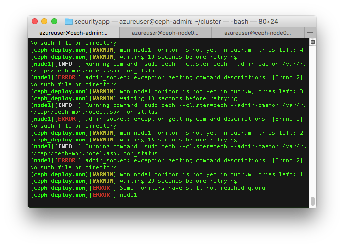
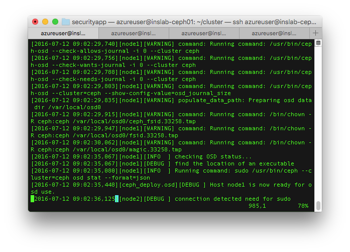
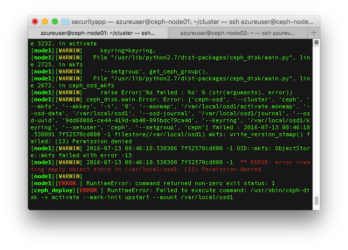
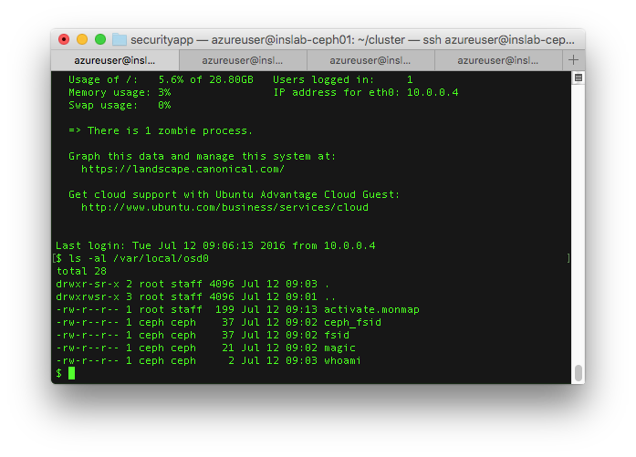

Ceph cluster 구성을 할 때 가장 중요한 요소는 ceph monitor와 osd 이다. "[Ceph 가볍게 살펴보기](http://192.168.10.23:8088/1298)"에서 기술한 것처럼 osd는 실제 object 저장을 담당하고 monitor는 node의 상태 확인이나 cluster map 정보를 담고 있기 때문. 공식 문서에 있는 설치 방법은 manual과 ceph-deploy라는 자동화 스크립트를 이용하는 방법으로 나뉘어 있는데 ceph-deploy를 사용해 보기로 했다. 공식 문서에 누락된 내용도 있고 ceph-deploy 스크립트 자체에 문제도 있는 것 같아서 함께 기술할 생각이다.

참고 : [ceph-deploy를 사용한 Ceph 설치 공식문서](http://docs.ceph.com/docs/master/start/quick-ceph-deploy/)

 

#### 1\. 준비

(1) VM

실제 꼭 필요한 것은 아니지만 ceph-deploy로 각 node를 관리하기 위한 ceph-admin과 cluster를 구성할 ceph-node01, ceph-node02 총 3대의 VM (Ubuntu 14.04)을 준비했다.

(2) SSH / hosts 설정

편의를 위해 ~/.ssh/config에 각 node의 Hostname, User 등록.

ceph-deploy가 일부 설정에서 각 node의 실제 hostname을 가지고 파일을 생성하거나 처리하는 경우가 있고 host 인식을 위해 /etc/hosts에 실제 cluster node의 hostname과 IP를 등록해둔다. 아래는 ceph-admin에서 지정한 hostname이 실제 node의 hostname과 달라서 생기는 오류 (admin node에서 하위 node의 hostname을 node1이라고 지정했을 때 ceph-deploy가 ceph-mon.node1.asok 파일을 찾으려고 하지만 실제 그 경로에 가보면 ceph-mon-ceph-node01.asok 파일이 생성되어 있었다)

#### 2\. ceph-deploy 설치

ceph-admin에서 아래의 command로 설치하면 되는데 hammer (ceph release name)라고 지정해도 이후 ceph 설치과정에서 ceph-deploy가 repository를 자동으로 최신인 jewel로 변경해버린다.

\[bash\]

wget -q -O- 'https://download.ceph.com/keys/release.asc' | sudo apt-key add -

echo deb [http://download.ceph.com/debian-hammer/](http://download.ceph.com/debian-hammer/) $(lsb\_release -sc) main | sudo tee /etc/apt/sources.list.d/ceph.list

sudo apt-get update && sudo apt-get install ceph-deploy

\[/bash\]

 

#### 3\. ntp / openssh-server 설치

Ubuntu 14.04 설치했을 때 이미 ntp와 openssh-server가 설치된 상태였지만 혹시 설치되지 않은 상태라면 설치해둔다. (NTP는 각 node간 시간 동기를 위해 필요하다고 가이드 하고있음)

 

#### 4\. Ceph user 추가

공식문서에는 ceph 설치와 관리를 위한 별도 user를 생성하라고 되어 있고 보안 및 기타 이유로 ceph이라는 이름은 사용하지 말라고 명시되어 있어서 cephuser라는 이름으로 사용자를 생성하고 sudoer로 등록했으나 실제 파일 생성 등의 작업은 ceph이라는 사용자로 진행이 되는 것으로 보인다.  아래의 command를 이용하거나 별도의 방법으로 모든 node에서 user 추가 (home 디렉토리는 추가되어야 함)

\[bash\]

sudo useradd -d /home/cephuser -m cephuser

sudo passwd cephuser

\# set password

 

echo "cephuser ALL = (root) NOPASSWD:ALL" | sudo tee /etc/sudoers.d/cephuser

sudo chmod 440 /etc/sudoers.d/cephuser

\[/bash\]

 

#### 5\. SSH keygen / 공개키 복사

ceph-deploy가 사용할 때가 있으므로 ceph-admin의 ssh keypair를 생성하고 각 node에 복사해준다.

\[bash\]

ssh-keygen

ssh-copy-id cephuser@ceph-node01

ssh-copy-id cephuser@ceph-node02

\[/bash\]

 

#### 6\. Network / firewall 설정 (Optional)

Public network, cluster (internal) network으로 분리해서 설정하는 내용이 문서에 있으나 내부 IP로만 연결할 생각이어서 별도 조치없이 넘어감

 

#### 7\. ceph-deploy가 사용할 디렉토리 생성

현재의 working directory에서 ceph-deploy가 필요한 파일들을 생성하고 가져오므로 별도 디렉토리를 만들고 그 안에서 ceph-deploy를 실행하는게 좋다.

\[bash\]

mkdir cluster && cd cluster

\[/bash\]

 

#### 8\. Monitor node 생성 / pool size 설정

Monitor가 돌아갈 node를 지정하는 내용으로 편의상 ceph-node01만 지정 (나중에 추가도 가능)

\[bash\]

ceph-deploy new ceph-node01

\[/bash\]

이 과정을 거치면 working directory에 ceph.conf 파일이 생성되는데 osd pool 크기를 지정해줘야 한다. osd 하나에 파일을 저장하고 하나는 replicate 용도로 사용할거라 2로 지정

\[bash\]

\# add this in global section of ceph.conf

osd pool default size = 2

\[/bash\]

 

#### 9\. Ceph 설치

이제 ceph과 관련된 것들을 설치하는 과정을 수행하면 된다. Admin node에서 설치할 node를 지정할 수 있는데 아래처럼 admin node 포함 전체 node에 설치하도록 했다. (이 과정인지 다른 과정에서 자동으로 ceph repository가 최신인 jewel로 변경되는데 release 등의 option이 있어서 다른 버전 설치가 가능한 것처럼 보이지만 실제 option을 줘서 hammer로 강제 설정한 결과 오류 발생)

\[bash\]

ceph-deploy install ceph-admin ceph-node01 ceph-node02

\[/bash\]

 

#### 10\. Monitor 초기화

Ceph까지 설치했으면 monitor 초기화를 해야 한다.

\[bash\]

ceph-deploy mon create-initial

\[/bash\]

 

#### 11\. OSD 설정

(1) OSD가 사용할 경로 추가

OSD가 돌아갈 각 node에서  osd가 사용할 경로를 추가해준다. 여기서 중요한게 뒤에 있는 숫자를 임의의 숫자로 변경하면 나중에 activate 과정에서 오류가 발생한다. Manual 설치 과정을 잠깐 봤을 때 osd node 각각에 순서대로 숫자를 부여해서 그 숫자를 이용해 내부적으로 뭔가 작업을 하는 것 같은데 잘 이해가 안되는 부분이다.

\[bash\]

\# in ceph-node01

sudo mkdir /var/local/osd0

 

\# in ceph-node02

sudo mkdir /var/local/osd1

\[/bash\]

(2) Prepare osd

이제 osd를 준비하는 초기화 과정인데 ceph-admin에서 아래의 command를 실행한 후 메세지를 유심히 보면 생성하는 몇 개 파일의 owner를 변경하는 과정을 확인할 수 있다.

\[bash\]

ceph-deploy osd prepare ceph-node01:/var/local/osd0 ceph-node02:/var/local/osd1

\[/bash\]

(3) Activate osd

(Activate 하기 전에 각 osd path의 owner, group을 ceph으로 변경해주어야 함)

\[bash\]

\# in nodes

sudo chown -R ceph:ceph /var/local/osdX

\[/bash\]

위 그림처럼 일부 파일의 owner 설정과정을 언급한 이유는 activate 과정에서 오류가 발생하기 때문인데

재미있는게 아래 그림에서처럼 ceph-deploy가 몇 개 파일만 owner 지정을 자동으로 하고 디렉토리 자체는 생성했을 때의 사용자 소유로 그대로 두고 있어서 권한 문제가 발생할 수 밖에 없다. (공식 문서에서 누락된 내용이기도 하고 스크립트 자체가 문제가 있다고 보여짐)

그렇기 때문에 사전에 osd가 사용할 경로의 owner를 변경해주는게 꼭 필요하다. Activate은 아래의 command 실행

\[bash\]

ceph-deploy osd activate ceph-node01:/var/local/osd0 ceph-node02:/var/local/osd1

\[/bash\]

 

#### 12\. Node 설정 및 keyring 파일 복사

ceph-admin에서 아래의 command를 실행하면 각 설정 및 keyring 등 필요한 파일이 /etc/ceph 경로에 복사되는데 그 후에 keyring 파일의 읽기 권한을 추가해줘야 한다.

\[bash\]

ceph-deploy admin ceph-admin ceph-node01 ceph-node02

sudo chmod +r /etc/ceph/ceph.client.admin.keyring

\[/bash\]

 

#### 13\. Health check

기본 설정은 다 완료된 것이므로 각 node와 osd가 정상인지 ceph-admin에서 확인해본다. HEALTH\_OK가 나오면 정상.

\[bash\]

ceph health

\[/bash\]

 

#### 14\. 결론

ceph-deploy를 사용한 설치는 몇가지 문제가 있는 것으로 보이기 때문에 이후에 manual로 설치를 다시 해서 과정이나 기타 내용들을 좀 더 깊게 살펴본 후에 가능한 자동화까지 진행해보는게 좋을 것 같다. 또 확장이 용이한지 문제가 발생했을 때 복구 같은 것들은 어떻게 할 수 있는지 performance 측면에서 쓸만한지 등의 내용도 검토해볼 필요가 있겠다.
