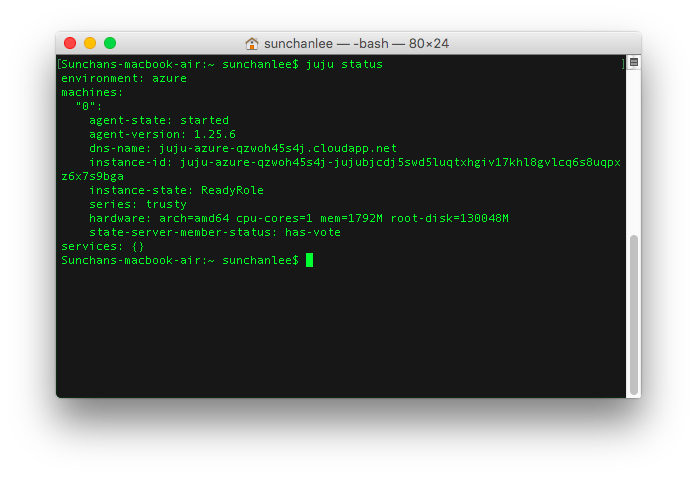
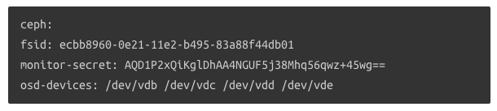
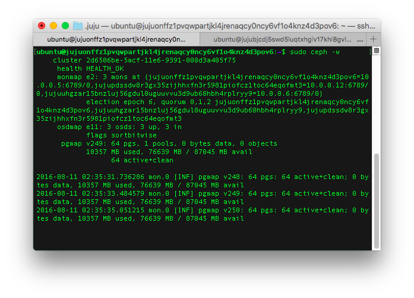
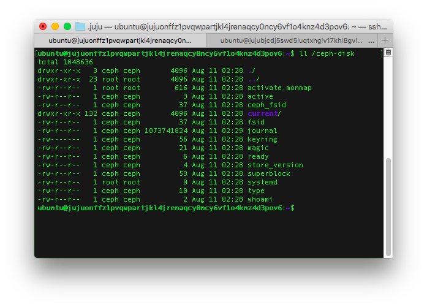
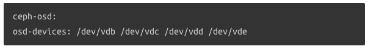
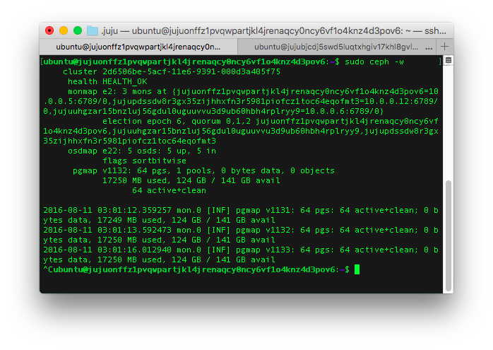
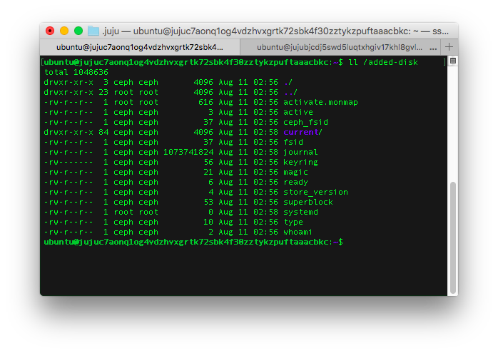

Ceph의 manual deploy를 진행해봤으나 앞서 "[Ceph을 설치해보자](http://192.168.10.23:8088/1311)"에서 기술한 것처럼 ceph-deploy를 사용하는 방법만큼 공식 문서에 문제가 있어서 포기하고 juju로 해보기로 했다.

 

#### 1\. 준비

**(1) Bootstrap**

Juju로 deploy 하기 위해서는 사전에 bootstrap이 진행되어 있어야 한다. Juju version 1.25 기준 인프라로 AWS, Azure, VMWare, GCE, Joyent, Manual 등을 지원하는데 Azure에서 해보기로 했다. Bootstrap을 완료하고 status를 확인하면 아래 그림처럼 status server가 하나 보인다.

[](https://blurblah.net/wp-content/uploads/2016/08/ceph-juju-status.png)**(2) yaml 준비**

Ceph charm 문서를 보면 배포하기 전에 설정파일 안에 fsid와 monitor-secret 값을 필수로 넣으라고 명시되어 있다.

[](https://blurblah.net/wp-content/uploads/2016/08/ceph-yaml.png)

\<출처 : [https://jujucharms.com/ceph/xenial/3](https://jujucharms.com/ceph/xenial/3)\>

fsid는 uuid나 uuidgen을 실행하면(없으면 설치) 생성 가능하고 monitor-secret 값은 아래의 명령으로 생성할 수 있는데 cluster 공통으로 사용할 것이라 배포될 ceph node 안에서 생성되는게 맞을 것 같지만 배포 전이므로 임의의 장비에서 생성해봤다. (결론은 문제는 없는데 ceph-common가 설치되어 있어야 monitor-secret 값 생성이 가능해서 좀 이해가 안되는 부분)

```bash
# generate monitor-secret
ceph-authtool /dev/stdout --name=mon. --gen-key
```

Charm 문서에는 osd-devices 라는 항목에 대해서도 기술되어 있는데 굳이 설정파일에 넣을 필요는 없고 나중에 juju set 명령으로 설정하는게 가능하다. osd-devices는 실제 osd가 사용할 경로로 mount 된 disk 이거나 일반 directory를 지정하면 되는데 존재하지 않는 경로라면 생성 후 권한 설정까지 알아서 진행된다. 나중에 설정할거라면 배포 후에 아래의 명령을 사용한다.

```bash
juju set ceph osd-devices=path_for_osd
```
 

 

#### 2\. Ceph 배포

Ceph 배포는 간단하게 아래 명령으로 완료된다. 1-(2)에서 ceph.yaml 이란 이름으로 파일을 생성해서 그 파일을 설정파일로 지정했고 3개 instance에 배포하라고 해놨다. 배포를 시작하면 instance를 추가해서 ceph 설정까지 알아서 진행되고 완료되면 서비스가 active 상태로 변경된다.

```bash
juju deploy -n 3 --config ceph.yaml ceph
```

배포는 되었어도 아직은 ceph이 외부와 연결된게 없으므로 3개 중 하나의 instance에 접속해서 sudo ceph -w (ceph-deploy를 사용할 때와는 다르게 root 권한이 필요) 를 실행해보면 아래 그림처럼 상태를 확인할 수 있고 sudo ceph osd tree 명령으로 osd가 모두 정상인 것도 확인 가능하다.[](https://blurblah.net/wp-content/uploads/2016/08/ceph-healthy.png)

설정했던 osd-devices가 어떻게 되어있는지 확인해보니 위에서 언급했던 것처럼 경로 생성부터 권한 설정까지 모두 완전하게 처리되어 있었다.

[](https://blurblah.net/wp-content/uploads/2016/08/ceph-ls.png)

#### 3\. OSD 확장

실제 ceph을 활용할 때 확장할 가능성이 높기 때문에 확장이 잘 되는지 살펴보기로 했다. 역시 간편하게 아래의 두가지 명령만 실행하면 확장은 끝난다. 단, 사전에 ceph-osd charm이 사용할 설정 파일을 만들어줘야 하는데 이미 존재하는 ceph cluster에 붙일 것이기 때문에 fsid 등이 필요하지는 않고 osd가 사용할 osd-devices 만 지정해주면 된다. 2에서 cluster 구성을 할 때에는 osd-devices로 /ceph-disk 라는 경로를 설정했는데 확장시 어떻게 되는지 살펴보기 위해 이번에는 /added-disk라고 설정했다.

[](https://blurblah.net/wp-content/uploads/2016/08/ceph-osd-yaml.png)

\<출처 : [https://jujucharms.com/ceph-osd/xenial/3](https://jujucharms.com/ceph-osd/xenial/3)\>

```bash
# deploy ceph-osd to two instances
juju deploy -n 2 --config osd.yaml ceph-osd

# add relation
juju add-relation ceph-osd ceph
```

ceph-osd deploy가 완료된 후에 최초 cluster가 구성된 node 중 하나에 접속해서 상태를 보면 아래의 그림처럼 모두 5개의 osd가 올라와있음을 확인할 수 있고 사용 가능한 storage 용량도 증가되었음을 알 수 있다. (약 76GB => 124GB)

[](https://blurblah.net/wp-content/uploads/2016/08/ceph-healthy-after-expand.png)

마지막으로 확장된 osd에만 다르게 적용했던 osd-devices 경로는 어떻게 되어있는지 확인해보니 이전에 구성된 cluster에는 변화가 없고 추가된 osd만 지정한 경로(/added-disk)를 사용함을 알 수 있었다.
[](https://blurblah.net/wp-content/uploads/2016/08/ceph-ls-after-expand.png)

#### 4\. 결론

ceph-deploy를 사용하면서 경험했던 문제들은 charm을 만든 사람이 개선했는지 전혀 나타나지 않았고 너무 간편하게 배포할 수 있었다. 아마 이미 존재하는 instance에 배포할 때를 위해 준비해둔 것이 아닌가 싶은데, 초기에 cluster 구성하면서 설정했던 fsid, monitor-secret은 별도 지정하지 않는 이상 charm 내부에서 생성해서 설정하도록 되어 있으면 더 좋았을 것 같다. 이제 deploy는 가볍게 해결할 수 있으니 실제 활용 측면에서 어떤지 살펴볼 생각이다.

 

#### 5\. 참고

(1) [Ceph charm](https://jujucharms.com/ceph/xenial/3)

(2) [Ceph osd charm](https://jujucharms.com/ceph-osd/xenial/3)

(3) [Juju commands](https://jujucharms.com/docs/1.25/commands)
