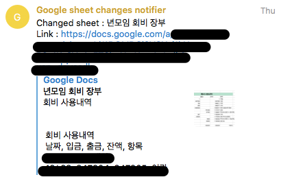
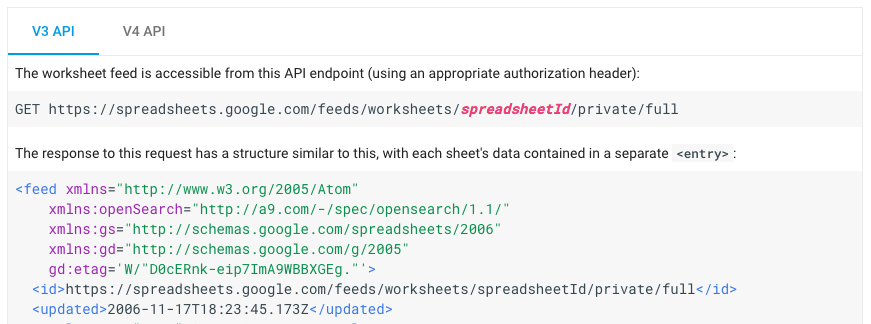
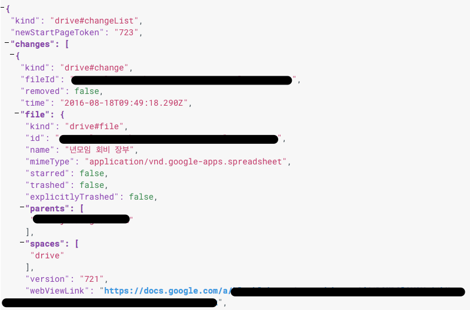

친구들과의 모임 하나는 매월 회비를 걷는다. 한 녀석이 총무를 하다가 내가 넘겨받게 되었는데 회비 입금과 사용내역을 Google spreadsheet으로 관리하고 있다. 가끔 수정하게 되는 문서이다보니 나도 링크를 별도로 보관하고 있지도 않고 친구들도 마찬가지. 따로 수정하고 링크 보내주는 것도 귀찮고 해서 문서 수정시에 그 친구들과 함께 사용하는 telegram 그룹으로 메세지를 날리는 봇을 만들어보기로 했다. 결국은 내가 총무를 하는 기간 동안 수행하게 될 '링크 복사 + 텔레그램 실행 + 그룹 선택 + 링크 붙여넣기' 시간의 총합보다 더 많은 시간이 든 것 같지만...젠장...귀찮음이 줄었다는 데 만족하기로 했다. 이제 회비 문서를 수정하면 아래 이미지처럼 그룹 채팅에 초대한 bot이 수정된 문서 이름과 링크를 보내준다.

 

#### 1\. 어떻게 만들어볼까?

Telegram bot은 예전에 구현했던 걸 활용하기로 하고 python으로 가볍게 처리해보기로 했다. 처음엔 Flask 써서 REST API 구현한 후 내가 원하는 걸 컨트롤할까 했었는데 어차피 telegram bot으로 원하는 기능은 가능하니 패스. 문서 변경사항은 push notification이 가능하면 좋겠다고 생각했는데 없으면 없는대로 polling으로 가보자고 생각했다.

 

#### 2\. Google sheets API 검토

문서 변경사항을 감지하는게 중요하니 어떻게 알 수 있는지 조사를 해봤다. Spreadsheet이니 sheets API부터 검토. Python용 api client가 있어서 설치한 후 아래 링크에 나온 샘플을 약간 변경해서 실행했는데 변경사항을 알 수 있는 부분이 없었다. (API v4)

[https://developers.google.com/sheets/quickstart/python](https://developers.google.com/sheets/quickstart/python)

재밌는게 v3 버전에서 v4 버전으로의 migration은 어떻게 하는지에 대한 문서를 보니 아래 그림처럼 sheets API v3에는 updated 항목이 있어서 수정날짜를 알 수 있다.(v4에는 사라진건지)

v3 API를 사용해 updated 시간만 비교해 어떻게 해볼까 생각했는데 언제 deprecated 될지 알 수가 없어서 다른 방법을 더 찾아보기로 했다.

 

#### 3\. Google drive API로 push notification 시도

Spreadsheet이나 docs 모두 Google drive에 올라가기 때문에 drive API에 쓸만한게 있는지 살펴보니 원하는게 떡하니 문서로 되어있다. ([Receive Push Notifications](https://developers.google.com/drive/v3/web/push)) Google drive 내에 있는 모든 파일 혹은 지정한 파일의 변경사항을 push로 받는 방법이 기술되어 있는데 아래와 같은 과정을 거쳐야 한다.

**(1) Domain 등록**

Push notification이 날라오면 받을 곳이 필요한데 http로 날라오므로 web server 등의 위에 callback이 구현되어 있어야 한다. 이런건 익숙한 과정이지만 아무데나 막 보내지는 않겠다는 의지인지 사전에 google에 등록된 domain이어야 한단다. Google에서 인지하고 있는 domain인지 판단하는 기준은 몇가지가 있는 것 같은데 인증용 html 문서로 google에서 제공한 파일을 web server에 올려서 처리했다. 그냥 단순히 되는지 여부만 알려고 했을 뿐인데 상당히 귀찮았음. Domain 등록이 되면 Google API Console '사용자 인증 정보' 메뉴에서 확인이 가능하다.

**(2) SSL 설정**

Domain 등록까지 완료되었으니 문제없을 줄 알고 push notification 받을 web application (python flask로 대충 만들어놓고)을 실행해보니 notification 대신 오류가 날라오는데 내용이 SSL이 아니라서 안된단다. 그래서 self sign한 key와 인증서 만들어서 적용한 후에 해보니 이번엔 무반응. 문서를 여러번 수정해도 push가 없었다. 내가 찾지 못한 것인지 제공되지 않는 건지 모르겠지만 Google API Console에서는 API 호출 횟수와 성공 실패 여부, 반응 속도 등은 표시되는데 실패한 경우 왜 실패했는지에 대한 로그나 내용을 확인할 수 없었다. 대신 stackoverflow에서 찾은게 self sign 인증서로는 받을 수 없다는 내용. ([http://stackoverflow.com/questions/17831828/not-getting-google-drive-push-notifications](http://stackoverflow.com/questions/17831828/not-getting-google-drive-push-notifications)) 내가 직접 파악한 내용이 아니기 때문에 저 내용이 맞는지는 검증을 해봐야 아는 문제이지만 이미 충분히 귀찮아진 상태여서 push는 포기.

 

Push notification 문서를 보면서 인증과 관련된 내용을 함께 살펴보게 되었는데 유용했다. Google api client 사용하면서 OAuth 2.0 인증시 사용자가 요청된 권한을 확인한 후 허가하는 부분이 거의 필수로 들어가 있었는데, (서버 측에서 활용할 경우를 위해) service account를 만들어서 전체 service에 대해 권한을 위임하는 방식을 사용하면 저 과정이 필요없었음.

[https://developers.google.com/drive/v3/web/about-auth](https://developers.google.com/drive/v3/web/about-auth)

[https://developers.google.com/identity/protocols/OAuth2ServiceAccount](https://developers.google.com/identity/protocols/OAuth2ServiceAccount)

 

#### 4\. 다시 Polling

Push 받는 건 귀찮아서 포기했고 sheets API를 사용하면 변경 여부를 확인하기 어려우니 drive API를 더 살펴보기로 했다. 다행스럽게도 push는 아니지만 변경사항을 알 수 있는 API가 있어서 사용하기로 결정.([https://developers.google.com/drive/v3/web/manage-changes](https://developers.google.com/drive/v3/web/manage-changes)) 아래와 같은 방식으로 API를 사용해야 한다.

(1) 최초에 startPageToken 가져오기 (changes.getStartPageToken)

(2) (1)의 token을 pageToken으로 해서 변경사항 가져오기 (changes.list)

(3) (2)에서 변경사항이 생기면 response에 newStartPageToken이 있으므로 그 값을 새로운 pageToken으로 update

(4) (2)~(3) 과정 반복

아래처럼 넘어오는 response를 parsing해서 처리하면 된다.

 

#### 5\. telepot 변경사항

오랜만에 telegram bot python library인 telepot 사용해보니 그 사이 변경사항이 있어서 과거에 구현했던 telegram bot을 그대로 사용할 수 없었다. 내가 사용하던 기능과 관련된 변경사항은 아래 두 가지.

(1) notifyOnMessage 함수 변경 => message\_loop

(2) glance2 제거됨 => 대신 glance 사용

상세 변경사항은 [change log](https://changelogs.net/telepot/) 참조.

 

#### 6\. 결론

모든 파일의 변경사항을 알 필요는 없었기 때문에 telegram bot에 문서 id 등록 기능을 추가해서 변경사항이 발생하면 등록 여부를 간단히 판단해서 등록된 문서일 경우에만 메세지를 보내도록 처리했다.

Google drive API의 변경사항 가져오는 API를 반복적으로 테스트 해봤는데 모든 변경사항을 잡는 것은 아닌 것 같다. 뭔가 규칙이 있는 것 같기도 했는데 몇 분 이내에 반복적으로 발생하는 모든 변경사항을 수정이라 인지하지는 않는다. Google drive에서 직접 파일 속성 같은 걸 확인해봐도 마찬가지여서 정책이 아닌가 싶다. (셀 하나하나 수정한다고 모두 각각의 변경사항이라고 판단해도 문제일 듯) 혹시 이런 것 때문에 push가 날라오지 않은건가 싶어서 나중에 다시 시도해볼 생각.
