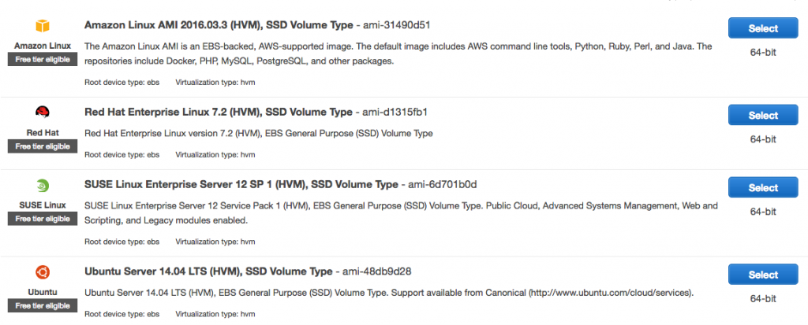
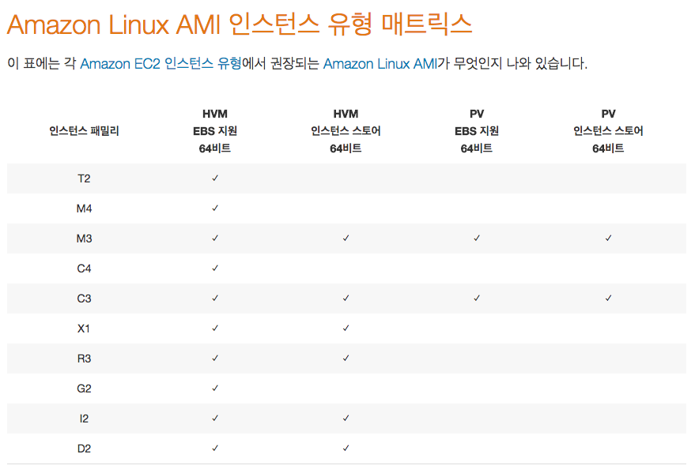

최근 다시 AWS를 이용하게 되면서 AMI 선택하는데 눈에 띄는 변화를 목격했다.

아래 그림처럼 이미지 대부분이 HVM으로 바뀐 것인데 정확히는 PV가 사라진 것.

그림에는 다 나오지 않았지만 사용중인 region에서 Ubuntu의 경우 HVM 이미지만 제공하고 있다.

 

먼저 PV(Para Virtualization)와 HVM (Hardware Virtual Machine)의 차이부터 정리할 필요가 있겠는데,

PV는 반가상화로 guest os가 hypervisor를 통해 hardware를 제어하고 가볍기 때문에 퍼포먼스가 좋지만 guest os에 수정이 필요하다. 반면에 HVM은 전가상화로 보면 되는데 다른 guest와 완전히 독립되고 os 수정없이 그대로 사용가능하다는 이점이 있지만 hardware 자체가 전가상화 기능(CPU의 VT)을 지원해야 하기 때문에 이것이 부담이 되어 퍼포먼스가 PV에 비해 떨어진다고 알려져 왔었다.

 

AWS는 Xen 기반이지만 PV, HVM 모두 제공해왔고 위에서처럼 초기부터 PV 성능이 더 좋다고 알려져왔기 때문에 HVM을 선택할 일은 없었는데 왜 이렇게 바뀐 것인지 찾다가 재미있는 글을 보게 되었다.

[AWS in 2015: Why You Need to Switch from PV to HVM](https://www.opswat.com/blog/aws-2015-why-you-need-switch-pv-hvm)

이 글을 보면,

PV가 HVM보다 성능이 좋기는 했지만 그 차이가 크지 않았고 AWS가 발전하면서 퍼포먼스 차이가 더 줄어들었거나 어떤 경우는 HVM이 더 좋은 성능을 내는 경우도 있다고 한다. 또 이렇게 된 이유로 Xen 자체의 기술 향상, 새로운 세대의 CPU 도입, EC2 driver의 향상 등을 들고 있다.

그리고 이번에 직접 목격한대로 AWS는 PV => HVM으로 점차 바꾸고 있는 중인 것 같고 최신 instance type들은 HVM으로만 제공하는 것으로 보인다. AMI matrix를 살펴보니 이제 PV 지원하는 instance type은 거의 없다.

 

 

위 링크에서 본 것중에 또 하나 재미있는 것은 T2 instance type에 대한 것이었는데,

CPU의 20~40%를 baseline으로 긋고 CPU 사용량이 그 이하가 되면 token을 적립하고 baseline을 초과하면 적립된 token을 소모하는 방식이라고 한다. PyCON APAC 2016에서도 잠깐 들었던 것 같은데 token이 정확히 어떤 단위인지 모르지만 과금과 관련된 얘기였던 것으로 기억된다. 어느 회사에선가 instance를 잘게 쪼개고 저녁엔 shutdown 해서 token 적립하고 아침엔 다시 올려서 적립된 token 쓰며 거의 공짜로 이용하고 있다던데. T2도 한 번 알아볼 생각.
