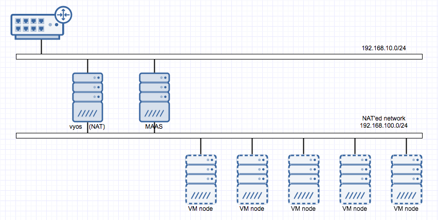
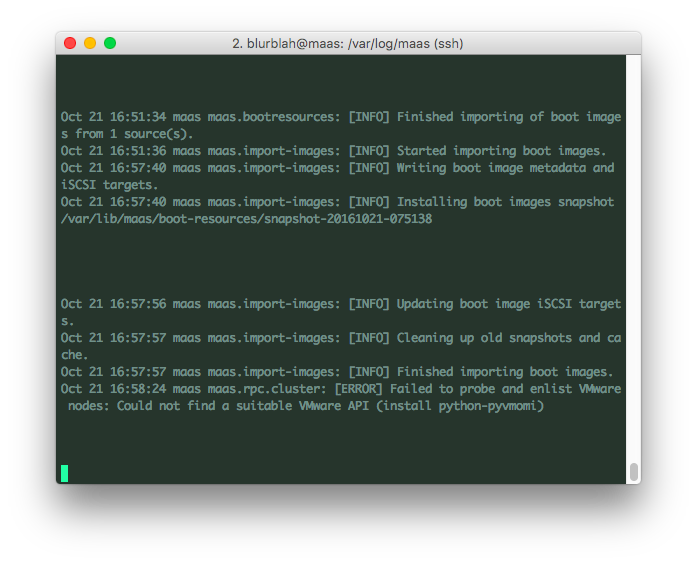
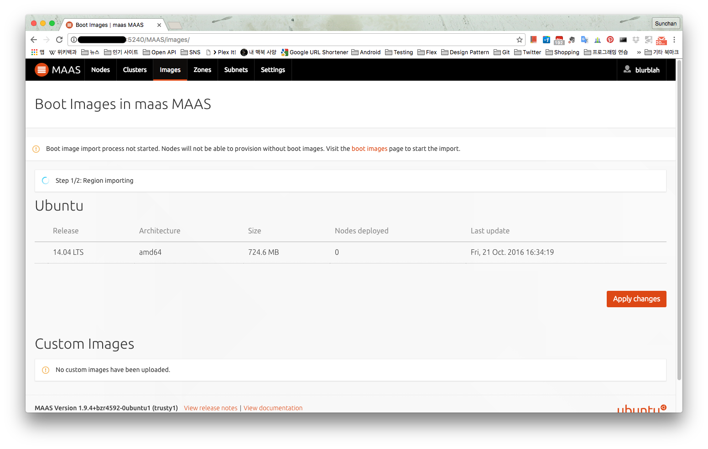
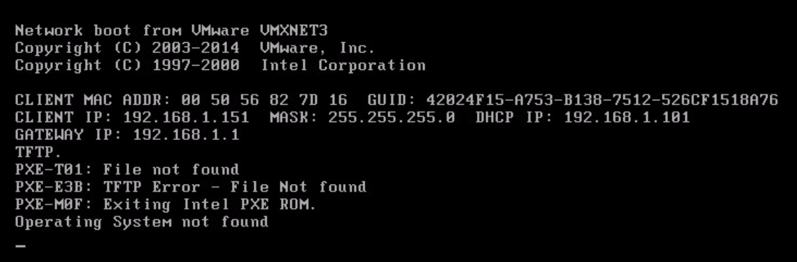
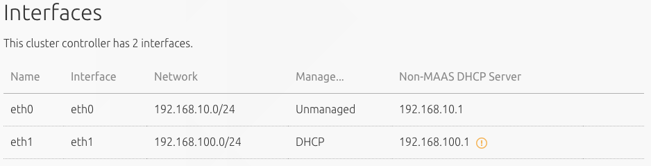
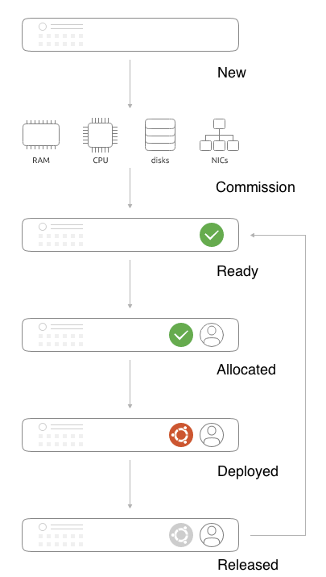
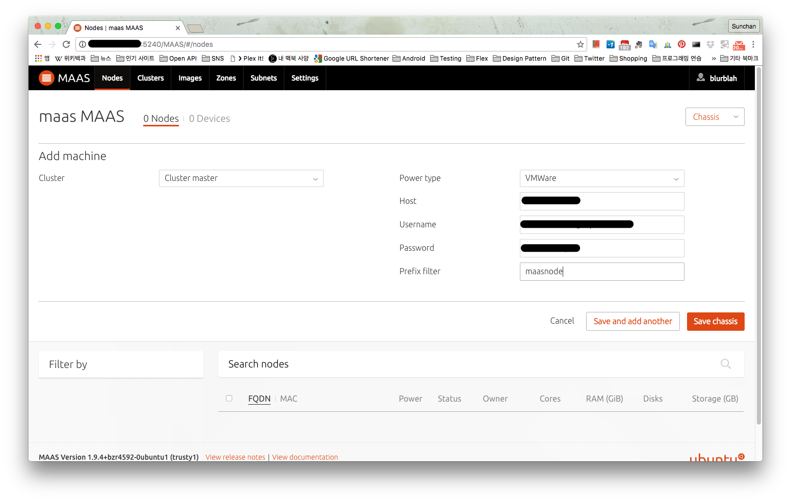
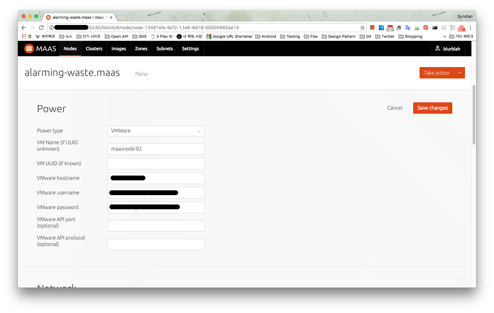
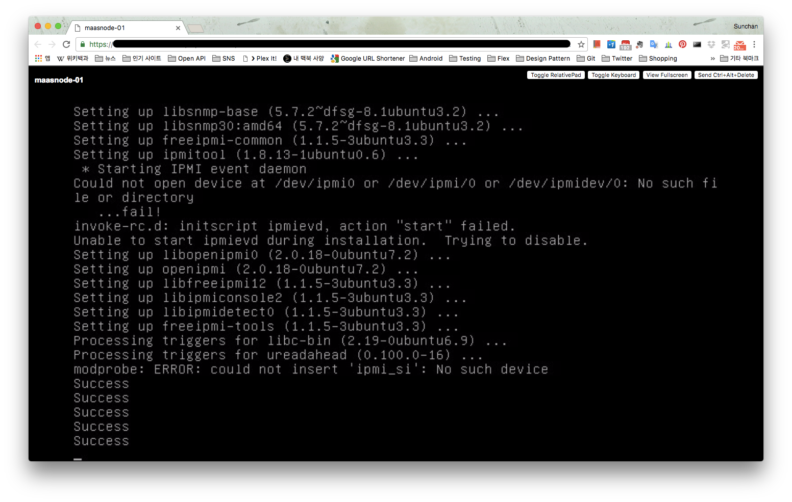
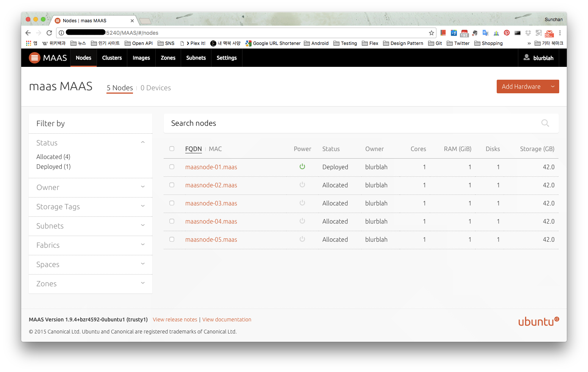

MAAS는 Metal As A Service의 약자로 물리적인 서버들을 관리하기 위한 용도로 사용된다. OS가 설치되지 않은 베어메탈 장비들을 단순히 같은 네트웍 대역에 두는 것만으로 등록부터 프로비저닝까지 손쉬운 관리가 가능하다.

 

### 1\. MAAS가 왜 필요했나?

결론적으로는 자동화 때문에 MAAS가 필요했는데 juju를 사용하기 위함이었다. 과거에는 클라우드 서비스를 사용하고 있었기 때문에 사용하던 클라우드 인프라 위에서 어렵지 않게 juju state machine을 만들고 사용하는게 가능했는데, 몇가지 이유때문에 클라우드 이용에 제약이 생기고 동시에 집 안에 장비를 들이면서 MAAS 위에서 자동화하는게 낫겠다 생각했다. 또, 가상화 환경에서 VM 생성 후에 OS 설치 등의 과정을 거치는게 좀 귀찮았는데 MAAS 컨셉과는 조금 다르더라도 VM을 MAAS에 등록하고 사용하면 좀 덜 귀찮아질 것 같았다.

 

### 2\. MAAS network

MAAS 구축 전에 준비할 것들이 몇가지 있는데 그 중에 가장 중요한 것은 MAAS cluster network 분리이다. MAAS가 사용할 네트웍을 분리하지 않더라도 구축과 사용에 문제가 발생하는 것은 아니지만 MAAS에 등록하게 될 network interface와 동일한 네트웍 대역에서 생성되는 VM은 PXE로 부팅되면서 자동으로 MAAS에 등록하는 과정을 거치게 되기 때문에 의도와는 다르게 진행될 수 있다.

아래 그림처럼 나의 경우에는 공유기에서 관리하는 192.168.10.0/24 대역이외에 가상 스위치를 하나 더 생성했고 vyos를 써서 가상 스위치에 연결될 네트웍을 NAT 되게 함으로써 vyos가 관리할 192.168.100.0/24 네트웍 대역을 하나 더 만들고 192.168.10.0/24와는 분리시켰다. (vyos를 이용한 네트웍 설정은 다른 글에서 다룰 예정 [VyOS를 이용한 NAT network 구성](http://13.125.231.217/1423) 참조)

[](http://13.125.231.217/wp-content/uploads/2016/10/maas-network.png)

MAAS는 기존 공유기에서 관리되는 네트웍 대역을 통해 접근할거라 network interface를 2개 (eth0, eth1)를 만들어서 양쪽에 연결했고 MAAS에서 eth1에 대해 설정할 것이라 eth1이 연결된 네트웍 대역 192.168.100.0/24에 붙는 VM들은 모두 MAAS에 등록될 것이다. 이렇게 되면 192.168.10.0/24에 어떤 VM이나 서버가 붙는다고 해도 MAAS가 관여하는 일은 없을 것이다.

 

### 3\. Install MAAS

MAAS 설치는 상당히 간단한데 아직 불안정한 요소들은 있는 것 같다. Ubuntu 14.04 버전에서 진행했을 때 아래의 command로 기본 설치는 완료된다.

```bash
sudo add-apt-repository ppa:maas/stable
sudo apt-get update
sudo apt-get install -y maas
```

설치 과정에서 bind9도 설치하고 로딩하게 되는 것 같은데 처음엔 실패하지만 다른 작업을 거치고 나중엔 정상적으로 처리되는 것으로 보인다. 설치 이후에는 관리자 계정을 만들어주어야 한다. 관리자 계정 생성 명령은 버전별로 약간 다른 것 같은데 Ubuntu 14.04에서 설치한 경우라면 아래의 command가 유효하다.

```bash
sudo maas-region-admin createadmin
```

관리자 계정 생성까지 완료되면 브라우저에서 web ui에 접근해 생성한 계정 정보로 로그인해서 나머지 과정을 진행하면 되는데 만약 연결할 VM이 VMware의 가상화 솔루션 ESXi 위에서 만들어진 것이라면 나중에 문제가 생길 수 있으니 하나의 python package를 추가로 설치해주어야 한다. 설치하지 않으면 node 등록시 아래와 같은 오류가 발생하는데 web ui에서는 특별한 반응이 없으므로 문제를 인지하기 어려울 수 있다.

[](http://13.125.231.217/wp-content/uploads/2016/10/maas-pyvmomi.png)

아래의 명령으로 python-pyvmomi까지 설치하고 나면 이제 web ui에서 설정하는 일만 남았다.

```bash
sudo apt-get install python-pyvmomi
```

브라우저에서 `http://{maas_host}:5240/MAAS` 로 접속.

 

### 4\. Node 추가 전에 설정할 것들

**(1) Import images**

Images 메뉴로 가서 import 할 image를 선택해서 import를 해야 한다. 이 image들은 MAAS에 연결될 VM이나 베어메탈에 실제 설치될 OS들이다. 상황에 따라서 몇 분에서 몇 시간이 걸릴 수도 있는데 import 시작만 해두는 것으로도 일부 작업은 가능하지만 결국은 import가 완료되어야 원하는 모든 작업을 처리할 수 있다.

[](http://13.125.231.217/wp-content/uploads/2016/10/maas-importing-images.png)

만약 image import가 완료되지 않은 상태에서 VM 생성 후 등록을 위해 부팅해보면 아래 그림처럼 PXE 부팅 과정에서 OS image를 가져오지 못해서 MAAS에 등록이 안되기 때문에 결국 image import 과정이 완료될 때 까지 기다려야 한다.

[](http://13.125.231.217/wp-content/uploads/2016/10/maas-boot-without-image.png)

**(2) Network interface 설정**

Clusters > Cluster master > Interfaces 메뉴로 진입해서 MAAS에 연결될 VM들이 사용할 interface 설정을 해야한다. 나의 경우엔 eht1을 MAAS cluster network으로 사용할거라 eth1을 수정했다. Network interfaces 설정은 크게 네 가지로 나눌 수 있는데 Management 항목에서 DHCP / DHCP and DNS을 선택해야 하고, gateway / subnet mask 등의 일반적인 네트웍 설정, dynamic ip range, static ip range 설정이다. 이 중 dynamic ip와 static ip는 range가 겹치면 안되는데 dynamic ip는 MAAS에서 commission 까지의 과정에서 사용하는 ip로 보이고 사용자에게 allocate 되고 사용자가 원하는 OS가 deploy 될 때 static ip를 사용하는 것 같다. Network interface 설정이 완료되면 아래 그림처럼 설정한 eht1이 DHCP로 MAAS에 의해 관리되는 상태로 변경된다.

[](http://13.125.231.217/wp-content/uploads/2016/10/maas-interfaces.png)

 

### 5\. MAAS node lifecycle

단순히 VM (node)이 등록되면 자동으로 프로비저닝이 되어서 여러가지 제어가 가능할 것으로 생각했는데 MAAS에서는 단계별로 node의 상태를 분류하고 있고 상태마다 제어 가능한 기능들이 다르기 때문에 lifecycle을 알고 넘어갈 필요가 있다.

[](http://13.125.231.217/wp-content/uploads/2016/10/maas-node-lifecycle.png)
\<그림 : [http://maas.io/how-it-works](http://maas.io/how-it-works)\>

**(1) New**

MAAS가 관리하는 네트웍에 VM을 생성하고 부팅을 하면 PXE로 부팅이 되면서 MAAS에 등록이 되면 VM은 자동으로 종료된다. MAAS에 등록되면 MAAS node list에 VM이 표시되고 상태는 New가 된다. 이 상태에서 VM의 리소스 (CPU, RAM, ...) 정보는 제대로 표시되지 않는다.

**(2) Commission => Ready**

등록된 node를 commission 하게 되면 VM의 정보들을 수집해서 제어할 준비를 마치게 된다. Commission이 완료되면 node 상태는 Ready로 변경되며 가지고 있는 리소스 정보도 제대로 표시된다.

**(3) Acquire => Allocated**

Acquire는 사용자에게 node의 권한을 넘기는 과정으로 이 과정을 거치면 특정 사용자에게 allocated된 상태로 변경이 되며 사용자가 제어할 수 있는 권한을 갖게 된다.

**(4) Deployed**

권한을 가진 사용자가 deploy를 하면 deploy할 OS를 선택하게 되는데 OS 선택까지 마치게 되면 선택한 OS가 node에 자동으로 배포된다. 배포가 완료되면 Deployed 상태로 변경된다.

**(5) Released**

Release는 사용자가 node에 대한 사용권한을 반납하는 과정으로 release 이후에는 다시 처음의 ready 상태로 변경된다.

 

### 6\. Add hardware

MAAS에서의 lifecycle을 살펴봤으니 실제 node를 추가해야 한다. Node를 추가하는 방법은 크게 세가지로 볼 수 있다.

**(1) Add chassis**

VM이나 베어메탈 장비들이 배치되어 있는 chassis를 통째로 등록하는 방법으로 같은 유형의 장비들을 일괄 등록하는게 가능하다. 이 경우 이미 VM들은 생성된 상태여야 node list에 표시된다. 나의 경우엔 VMware 가상화 환경을 이용하고 있어서 아래의 그림처럼 적당한 정보를 입력했는데 prefix filter는 VM이나 장비의 이름을 거르기 위한 filter이므로 MAAS로 관리할 VM들의 이름을 보고 입력해둔다. 아예 공란으로 두면 모든 VM이 등록되므로 그 이후에 필요없는 것들을 node list에서 제거하는 것도 가능하다.

[](http://13.125.231.217/wp-content/uploads/2016/10/maas-add-chassis.png)

**(2) Add machine**

Add machine은 chassis 등록 과정과 거의 유사한데 machine 하나를 개별적으로 등록할 때 사용한다고 보면 될 것 같다.

**(3) PXE boot / Power 설정**

(1), (2) 과정을 거치지 않고 MAAS가 설치된 이후 MAAS cluster network에 VM을 생성해서 부팅을 하면 자동으로 PXE boot이 되며 MAAS에 등록이 된다. 이 경우에는 VM의 이름이 node list에 표시되지 않고 MAAS가 임의로 붙인 이름으로 표시되는데 (아래 그림에서 alarming-waste.mass), node 이름을 클릭해서 상세 정보를 보면 power 정보가 비어있는 것을 볼 수 있다. Power on / off를 제어해야 하기 때문에 power 정보를 입력해줘야 사용이 가능하다. 여기에서 power 정보라는 것은 어차피 API로 제어하는 것이기 때문에 chassis 추가할 때와 같은 정보를 입력해주면 된다.

[](http://13.125.231.217/wp-content/uploads/2016/10/maas-power-setting.png)

 

### 7. Take actions

위의 과정까지 다 마치면 node가 등록만 되었기 때문에 new 상태로 표시된다. Lifecycle 부분에 기술한대로 node의 리소스 정보는 제대로 표시되지 않는 상태. Node를 선택하면 수행할 수 있는 작업들이 Take action이라는 메뉴에 표시되고 대표적인 기능에 대한 내용은 아래와 같다.

**(1) Commission**

Commission은 등록된 node를 사용할 준비를 하는 것이므로 new 상태인 node가 필수적으로 수행해야 하는 과정이다. Commission 과정에서 node를 자동으로 부팅하게 되고 commission 실행시 옵션 선택에 따라 작업 완료 후 node의 전원을 끄거나 그대로 유지한다. Commission 과정을 거치고 나면 node의 power on / off도 가능한 것처럼 메뉴에 표시되지만 실제로 power on은 불가능했다. VMware와의 연동 문제일 수도 있을 것 같은데 commission 수행시에 VM 부팅로그를 보면 아래 그림처럼 IMPI 관련 기능에 오류가 발생함을 알 수 있다. (IMPI는 power on / off를 위해 필요한 인터페이스. [IMPI](https://en.wikipedia.org/wiki/Intelligent_Platform_Management_Interface) 참조)

[](http://13.125.231.217/wp-content/uploads/2016/10/maas-ipmi-fail.png)

**(2) Acquire**

Commission 과정까지 거친 node는 ready가 되고 이 상태에서 다른 사용자에게 권한을 넘길 수 있다. 원하는 사용자가 로그인해서 원하는 node를 선택하고 acquire를 하면 권한이 넘어가고 node의 상태는 allocated로 변경된다.

**(3) Deploy**

Allocated 상태에서 node의 권한을 가진 사용자가 deploy를 클릭하면 배포 가능한 OS를 선택할 수 있게 되어있고 OS까지 선택하면 선택된 OS를 node에 자동으로 배포한다. 이 과정을 거치면 위에서 network interface 설정에서 사용했던 static ip 대역 중 하나의 ip가 할당되고 사용자가 접속 가능한 상태가 된다. 나의 경우엔 deployed 상태가 되어서야 power on/off가 자유롭게 가능해졌다.

[](http://13.125.231.217/wp-content/uploads/2016/10/maas-node-deployed.png)

### 8\. 간단하게 node 추가하기

위의 과정들은 언뜻 보기에 복잡할 수 있는데 여러가지 살펴보면서 기술한 것이라 그렇고 실제 사용시 가장 간단한 방법은 이렇다.

(1) OS 설치 없이 VM만 여러개 추가

(2) Add chassis

(3) Node 일괄 선택 후 commission => acquire => deploy

실제 사용자 선택에 의한 power on은 deployed 상태에서만 가능했지만 commission 과정에서도 알아서 부팅하므로 큰 문제는 아닌 것 같다.

 

### \# 참고

[http://maas.io/get-started](http://maas.io/get-started)

[http://maas.io/how-it-works](http://maas.io/how-it-works)

[https://en.wikipedia.org/wiki/Intelligent\_Platform\_Management\_Interface](https://en.wikipedia.org/wiki/Intelligent_Platform_Management_Interface)
