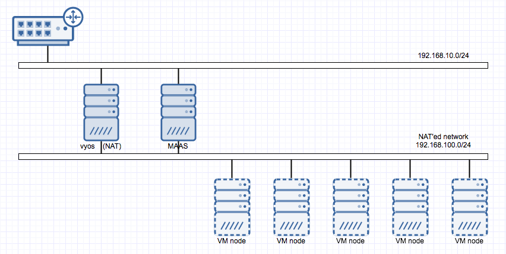

VyOS는 소프트웨어 라우터, VPN, 방화벽 등의 기능을 제공하는 Vyatta의 community fork 버전으로 라우터, 방화벽 등을 소프트웨어로 구현해서 설정 가능한 network 전용 OS라고 보면 된다. 가벼운 서버나 PC 같은 장비에 VyOS를 올리면 공유기를 대체해서 사용하는 것도 가능하다. (물론 LAN port 확장을 위해 랜카드가 추가로 필요하겠지만) 리눅스 기반이기 때문에 ssh 접속부터 일반적인 command 사용이 가능하고 network 전용 OS 답게 기능 설정을 위한 별도의 command set도 제공된다.

어디까지나 MAAS 구축을 위해 필요에 의해서 진행한 내용이고 ([MAAS 구축하기](http://13.125.231.217/1405) 참조) 사실 network 분리, NAT 구성은 여러가지 방법이 있을 수 있지만 공부 혹은 연습을 위한 것이라 비효율적으로 보일 수 있겠다는 생각도 든다.

 

### 1\. vSwitch / Port group 추가를 통한 network 분리 준비

ESXi 기준으로 보면 단순히 하나의 vSwitch에 port group만 추가해서 설정해도 network 분리는 가능할 것 같다. 아래 그림처럼 기본으로 존재하는 vSwitch0에 기존에 사용하는 VM Network 이란 port group이 있는 상태에서 maas-cluster-switch라는 vSwitch를 추가했다. 다시 maas-cluster-switch에는 VM 연결을 위한 maas-network이라는 port group을 추가했는데 vSwitch0와 달리 물리 어댑터에 연결된 상태가 아니기 때문에 maas-network에 붙은 VM들은 기본적으로 외부 인터넷과의 통신이 불가능하다.

단절된 maas-network이 외부 인터넷과의 통신을 가능하게 하기 위해 [NAT (Network Address Translation)](https://ko.wikipedia.org/wiki/%EB%84%A4%ED%8A%B8%EC%9B%8C%ED%81%AC_%EC%A3%BC%EC%86%8C_%EB%B3%80%ED%99%98) 가 필요하다.

 

### 2\. 설치

VyOS 설치를 위해 VM을 하나 생성하고 [VyOS user guide](http://wiki.vyos.net/wiki/User_Guide)에 기술된 대로 진행하면 설치는 간단하게 끝낼 수 있다. (설치에 필요한 ISO image는 [VyOS wiki main](http://wiki.vyos.net/wiki/Main_Page)에 링크되어 있음) 단, 설치 전이나 후에 VyOS VM에 VM Network과 maas-network과 연결하는 NIC 2개를 붙여주어야 한다.

 

### 3\. NAT 구성

사실 user guide에 다 기술되어 있는 내용이지만 부분별로 나누어서 봤을 때 우선 interface 기본 설정을 해야 한다. Configuration mode로 진입해서 아래의 command를 입력한다. (eth0가 VM Network에 연결된 interface이고 eth1이 maas-network에 연결된 interface인 경우를 가정)

\[bash\]

set interfaces ethernet eth0 address dhcp

set interfaces ethernet eth0 description 'PUBLIC'

 

set interfaces ethernet eth1 address '192.168.100.1/24'

set interfaces ethernet eth1 description 'PRIVATE'

\[/bash\]

eth0는 공유기의 DHCP가 할당한 ip를 사용하기 때문에 dhcp를 지정했고 eht1의 경우에는 VyOS에서 dhcp로 할당할 ip 대역(192.168.100.0/24를 사용할 예정)의 gateway가 될 것이기 때문에 위와 같이 지정했다.

다음으로 NAT 구성을 위해 아래의 command를 입력한다.

\[bash\]

set nat source rule 100 outbound-interface 'eth0'

set nat source rule 100 source address '192.168.100.0/24'

set nat source rule 100 translation address masquerade

\[/bash\]

매우 간단하다. 여기까지 진행된 후에 commit을 입력하면 수정내용이 반영되고 save 명령을 실행하면 영구 저장된다.

 

### 4\. DHCP 구성

maas-network에 연결될 VM들이 ip를 할당받아야 하기 때문에 dhcp 구성이 필요하다. 역시 아래의 command로 간단하게 처리할 수 있다.

\[bash\]

set service dhcp-server disabled 'false'

set service dhcp-server shared-network-name LAN subnet 192.168.100.0/24 default-router '192.168.100.1'

set service dhcp-server shared-network-name LAN subnet 192.168.100.0/24 dns-server '192.168.100.1'

set service dhcp-server shared-network-name LAN subnet 192.168.100.0/24 domain-name 'internal-network'

set service dhcp-server shared-network-name LAN subnet 192.168.100.0/24 lease '86400'

set service dhcp-server shared-network-name LAN subnet 192.168.100.0/24 start '192.168.100.10' stop '192.168.100.254'

\[/bash\]

다음은 DNS forwarder 설정.

\[bash\]

set service dns forwarding cache-size '0'

set service dns forwarding listen-on 'eth1'

set service dns forwarding name-server '8.8.8.8'

set service dns forwarding name-server '8.8.4.4'

\[/bash\]

위 command 들은 dhcp를 활성화시킨 후 dns, lease time 등의 기본적인 설정을 진행한 것인데 필요하다면 lease time, dhcp 할당 범위 등을 적당히 조절해서 설정하면 되겠다. 역시 저장을 위해 commit, save 명령을 실행하고 exit 명령으로 configuration mode를 빠져나오면 완료. VyOS user guide에서는 방화벽 등의 추가 설정을 하도록 되어있으니 필요한 경우 별도로 진행하면 될 것 같다.

 

### 5\. 결과

간단하게 VyOS에서 몇가지 설정만 하는 것으로 결과적으로 내가 원하는 이런 그림이 되었는데, VyOS가 192.168.100.0/24 대역을 DHCP로 만들어주고, 물리적으로는 단절된 해당 네트웍 대역이 외부로 나가기 위해 192.168.10.0/24 대역에 연결된 NIC을 NAT로 거치게 됨으로써 이제 외부 인터넷과의 통신이 가능해졌다.

