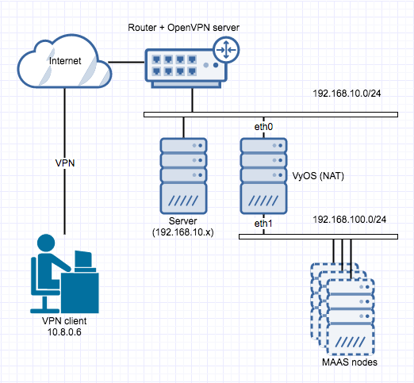
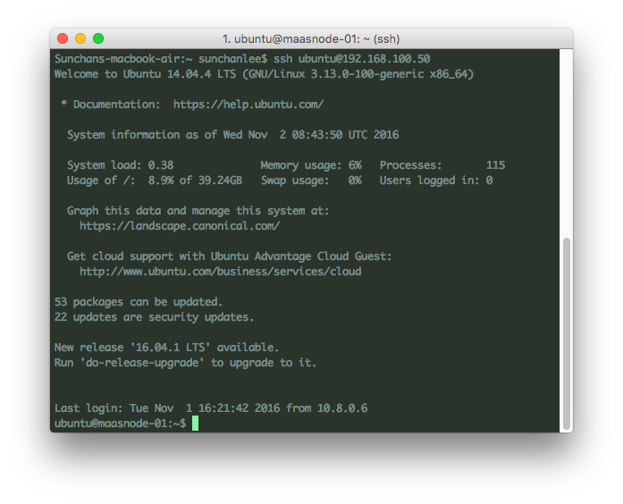

"MAAS 구축하기"를 통해 MAAS를 위한 network 설정,  구축 등을 해봤는데 정작 생성된 MAAS node에 바로 접근하는게 불가능하다. MAAS network이 NAT되어 MAAS network 내부에 있는 VM들이 외부 인터넷과 연결되는 것은 가능하지만 MAAS network으로 통하는 경로를 지정하지 않았기 때문인데 간단히 route 설정으로 처리한 방법을 정리해봤다.

 

### 1\. Network 구성

현재 상태의 network 구성을 그려보면 아래 그림과 같다. (뭐든 그려봐야 명확해진다)

 

정리를 해보면 192.168.100.0/24의 정체를 알고 있는 것은 NAT를 구성하고 있는 VyOS  하나 뿐인데, 집에서 사용하고 있는 공유기는 VyOS가 가지고 있는 두 개의 NIC 중 하나만 관리하고 있고 VyOS가 무엇을 하는 놈인지 관심도 없고 모르는 상태. 그렇기 때문에 공유기로부터 ip를 할당받아 내외부와 통신하고 있는 192.168.10.0/24 대역의 모든 장비도 192.168.100.0/24에 접근할 수가 없다. 단, "VyOS를 이용한 NAT network 구성"에서 설정했던 것처럼 192.168.10.0/24 대역에 있는 장비가 maas-network과 연결할 수 있는 NIC을 추가로 달고 있으면 VyOS에 의해 DHCP로 192.168.100.0/24 대역의 ip를 할당받을 수 있으니 접근이 가능하다. 하지만 연결하고자 하는 모든 장비에 NIC을 추가하는 것도 이상하고 더 나아가 VPN으로 연결된 외부에 있는 장비의 경우엔 내부망에 소프트웨어적으로 구성되어 있는 NIC을 다는 것은 불가능한 일이다. 이런 경우 MAAS node에 어떻게 연결되게 할 수 있을까?

 

### 2\. Route to MAAS network

공유기 아래에 있는 192.168.10.0/24 대역의 장비들은 공유기를 gateway로 하고 있으니 공유기 라우팅 테이블에 설정해보기로 했다. Destination은 192.168.100.0, subnet mask는 255.255.255.0  (결국 192.168.100.0/24에 대한 요청)  을 가지는 LAN 내부에서의 트래픽이 VyOS의 eth0가 할당받은 ip를 gateway로 해서 흘러가게 설정했더니 끝. 192.168.10.x를 ip로 갖는 장비들에서 ping을 날려보니 정상 응답들이 넘어온다.

 

### 3\. VPN route

공유기 내부에서의 접근은 공유기 라우팅 테이블에 하나 추가함으로써 문제는 해결이 되었는데 VPN은 약간 상황이 다르다. OpenVPN 서버 기능이 포함된 공유기를 사용하고 있는데, 기본 설정만으로 VPN client가 할당받는 10.8.0.0/24 대역의 ip에서 공유기 내부의 192.168.10.0/24 대역의 장비들이 보이는 상태였으나(원래는 별도로 설정을 추가해야  가능) 10.8.0.0/24에서는 192.168.100.0/24로 가는 길을 모르는 상태. 상황은 2와 약간 다르지만 어차피 경로만 추가하면 될 일이다. OpenVPN 설정에 아래 라우트 설정을 추가해서 해결할 수 있었다.

\[bash\]

push "route 192.168.100.0 255.255.255.0"

\[/bash\]

 

### 4\. MAAS node에 연결

MAAS 구축시 ssh key (public)를 등록해두었기 때문에 MAAS node 배포시 등록한 public key도 함께 배포된다. 그렇기 때문에 node에 별도로 설정을 추가하지 않는 이상 이미 배포되어 있는 public key와 쌍을 이루는 private key를 가지고 있어야만 ssh 접속이 가능하다.  Network 대역이 달랐기 때문에 처음엔 접근 자체가 되지 않았지만 3까지의 과정까지 진행한 후 VPN으로 연결된 장비(private key를 가지고 있는)에서 ssh 접근을 시도하니 성공.

