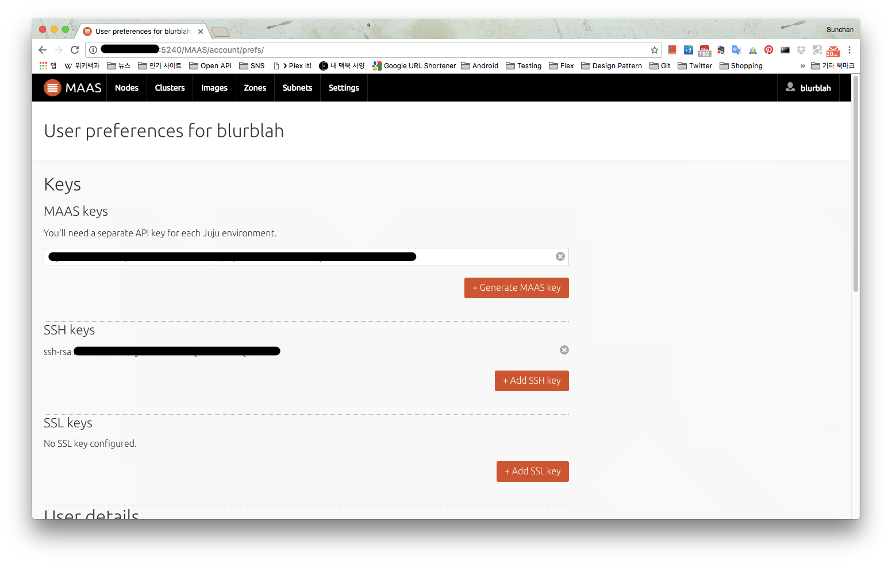
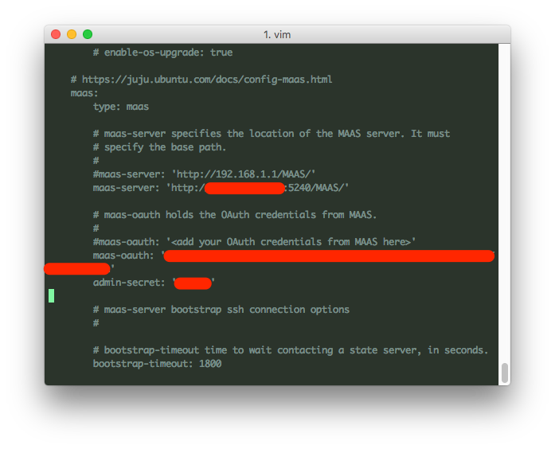
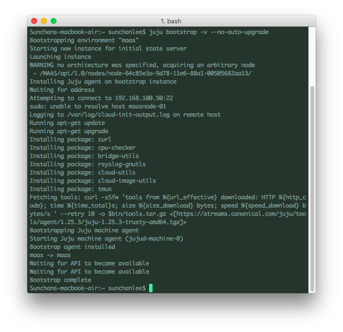
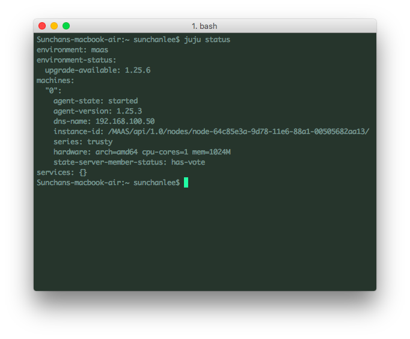

[MAAS 구축하기](http://13.125.231.217/1405)를 통해 만들어진 node 들을 사용자들이 acquire 해서 각자의 용도에 맞게 사용할 수도 있지만 juju를 이용하면 자동 배포 및 관리도 가능하다. MAAS를 사용하게 된 이유 중 하나가 ceph을 더 살펴보기 위해서인데 ([Juju로 Ceph을 deploy 해보자](http://13.125.231.217/1329) 참조) 어찌보면 배보다 배꼽이 더 큰 경우일 수도 있겠지만 어디까지나 재미로 혹은 공부한다 생각하니 효율적이지 못해도 괜찮다고 본다.

 

### 1\. Prerequisites

Juju를 먼저 설치해야 한다. ([getting-started 문서](https://jujucharms.com/docs/stable/getting-started) 참조) 나의 경우엔 예전에 설치해 둔 상태라 1.25.3 버전이 설치되어 있는데 현재 최신 버전은 2.0이고 각 버전별로 기능 차이가 있으니(버그도...) 주의가 필요하다. MAAS에 접속해서 사전에 MAAS key를 복사해 두어야 한다.

MAAS에 로그인 후 계정 이름을 클릭해서 Account 메뉴를 선택하면 위 그림과 같은 화면이 표시되는데 기본으로 생성되어 있는 MAAS key를 복사해둔다. 없으면 생성. 또, 이미 MAAS 구축할 때 ssh key 등록을 해놨지만 안해두었다면 본인이 사용하는 host의 ssh public key를 등록해둔다.

 

### 2\. environments.yaml 파일 수정

Juju를 설치하면 ~/.juju 경로가 몇개의 파일과 함께 자동 생성된다. 만약 없다면 juju init 명령을 실행하면 생성된다. Juju는 yaml로 각 환경에 대한 설정을 사전에 정의해서 사용하기 때문에 ~/.juju/environments.yaml 파일을 수정해야 한다. 아래 그림처럼 maas 항목을 찾아서 세부 설정을 해주면 된다.

필수 설정 항목을 정리하면 아래와 같다.

maas-server : MAAS 접근 url

maas-oauth : 과정 1에서 미리 복사해 둔 maas-key를 입력

admin-secret : 문서에 의하면 random pass-phrase라고 하는데 어디에 사용되는지는 모르겠지만 없으면 bootstrap이 진행되지 않으니 임의의 값을 입력해준다.

위의 3개 값은 필수이니 설정하고 저장하면 완료.

 

### 3\. Bootstrap with no-auto-upgrade option

**(1) Switch environment**

environments.yaml 파일을 대충 봤으면 알겠지만 여러가지 환경에 대한 설정을 한 파일에 모두 정의하도록 되어있는데 상황에 따라 선택적으로 환경을 지정할 수 있게 되어있다. 현재 juju가 사용하는 환경으로 지정된 것은 ~/.juju/current-environment 파일에 저장된다. 만약 maas가 기본으로 지정되어 있지 않다면 아래의 command를 실행해야 한다. (environments.yaml 파일에 maas라는 이름을 변경하지 않은 경우. 만약 변경했다면 변경된 이름으로 switch)

\[bash\]

juju switch maas

\[/bash\]

**(2) Ready node**

Juju가 MAAS 대상으로 bootstrap 가능한 node는 ready 상태의 node이다. 당연하겠지만 다른 사용자의 소유로 되어있거나 (allocated) OS가 deploy된 상태인 node에는 이미 다른 용도로 사용중이거나 예정인 것이므로 juju가 관여하지 않고 ready로 남아있는 node 중에 하나를 무작위로 골라서 bootstrap을 하게 되므로 주의해야 한다.

**(3) Bootstrap**

이제 bootstrap만 하면 되는데 juju 1.25.3에서 진행해보니 거의 마지막 과정에서 Waiting for API to become available이 여러번 반복되며 부분적으로만 bootstrap이 성공한 것으로 완료되는 문제가 있어서 [bug report](https://bugs.launchpad.net/juju-core/+bug/1509097)를 찾아봤다. 문서 내용에 의하면 newer version이 필요한 상태로 client에 기록되고 그 정보가 bootstrap machine (juju state server가 될 장비)에 넘어가서 bootstrap machine에서 newer version과의 연결을 계속 시도하는 것 같다. 개선될 bug로 보이는데 어찌되었든 1.25.3에서 그런 문제를 방지하려면 아래처럼 no-auto-upgrade option을 추가해준다. (v option은 verbose.혹시 더 많은 로그를 보고 싶으면 v 대신 debug 옵션을 주면 되겠다.)

\[bash\]

juju bootstrap -v --no-auto-upgrade

\[/bash\]

아래 그림과 비슷한 내용이 표시되고 완료된다.

bootstrap이 정상으로 완료되고 juju status 명령을 입력해보면 아래 그림처럼 현재 상태가 표시되고,

 

혹시 ssh로 접속하고 싶다면 아래의 command를 입력하면 간단히 접속된다.

\[bash\]

\# connect to juju machine number '0'

juju ssh 0

\[/bash\]
