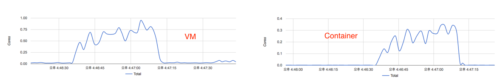

Docker container의 부하 분산과 auto scaling을 고민해야 하는 상황인데 부하 분산을 하기 위해서는 부하 테스트를 어떻게 할지부터 생각해봐야한다. 또 어느 정도의 stress에서 성능이 얼마나 떨어지는지 알아야 하기 때문에 모니터링도.

 

### 1\. Environments

며칠 고민하고 검토해서 현재는 아래와 같은 상태로 만들어둔 상태인데 서비스 오케스트레이션을 위해 Apache Mesos와 Marathon framework을 사용하다보니 편한 것도 있는데 고민해야할 요소들도 많아진 것 같다. 단지 부하를 가하고 모니터링이 되는지 정도만 확인할거라 테스트 대상이 되는 web container는 python으로 hello world만 뿌려주는 간단한 [웹앱](https://hub.docker.com/r/training/webapp/)을 사용했고 container 자체에는 cpu 0.5 core, memory 256MB만 할당. Load balancer는 marathon에서 제공하는 marathon-lb인데 0.5 core / 128MB만 할당해 두었다.

[](http://13.125.231.217/wp-content/uploads/2016/11/container-load-environment.png)

 

### 2\. Stress는 ngrinder로

Stress를 어떻게 줄까 고민하다가 Apache JMeter를 처음에 고려했는데 사용에 번거로운 요소들이 조금 있고 맥에서는 UI가 별로라 ngrinder를 시도해보게 되었다. 눈에 띄는 버그가 있긴 했지만 단순히 부하만 가하고 싶을 때 간편하게 할 수 있고 확장이 쉬워보이는게 장점인 것 같다.

**(1) Agent, controller 사이의 통신 문제**

ngrinder에서는 agent 하나에서 생성하는 process의 thread 하나를 가상 유저로 취급하는 것으로 보이는데 agent가 동작하는 환경을 고려했을 때 process와 thread의 수가 높으면 controller와의 통신에 문제가 생긴다. 찾아보니 이 문제는 이미 보고된 내용인 것 같고 현재는 적당히 수치를 조절하면서 사용해야 할 것 같다. 실제로 문제가 발생하는 process, thread 수보다 적게 설정해서 테스트를 해보니 agent가 돌아가는 vm의 cpu usage가 거의 full이었는데 agent가 돌아가는 환경에 대한 문제로 인식해야 할 것 같음.

**(2) Agent 추가를 통한 stress 범위 확장과 클러스터링**

더 많은 stress를 가하고 싶다면 agent를 확장하는 방법도 있는데, 비현실적이지만 단순히 부하만 가하기 위해서 처음에 vm 10대에서 agent를 돌리다가 현재는 5대로 줄여놓은 상태. 나중에 script를 추가하거나 변경하게 되었을 때 필요하면 다시 늘리면 된다. 아직 해보지는 않았지만 문서 상으로는 ngrinder controller의 경우 clustering이 가능한 것 같다.

**(3) Test script로 다양한 시뮬레이션 가능**

비현실적인 가상의 stress를 테스트하는 거지만 script 추가, 수정으로 조금 더 현실적인 테스트가 가능하게 되어있다. 예를 들어 가상 유저의 think time을 고려하고 싶다면 script에 sleep을 넣는 식으로 구현이 가능.

**(4) Monitor의 한계**

Target이 되는 시스템 모니터 용으로 사용할 수 있는 모듈이 controller에 들어있어서 다운로드 후에 target에 넣고 돌릴 수 있게 되어있는데 target의 ip와 port를 설정파일에 넣고 바인딩하도록 되어있다. 이 방식은 container에서 사용하기 어렵거나 가능하더라도 번거로워질 것 같다. Marathon framework에서는 container 별로 가상 ip를 부여하는 방식을 지원하려고 하는 것 같은데 아직 완전하지 않고 ip를 굳이 할당하고 싶다면 별도로 vip를 부여할 수 있도록 구성해줘야 한다.

 

### 3\. 모니터링을 위해 cAdvisor를 사용해보자

ngrinder의 monitor도 사용하기 어렵고 일반적인 모니터링 도구인 zabbix, cacti, nagios 등도 container에는 적합하지 않다는 생각을 했는데 이유는 아래와 같다.

**(1) Target에 binding 되는 형태**

모니터링 지표들을 agent 형태의 모듈들이 직접 중앙으로 쏴주는 형태라면 괜찮을거라고 생각하는데 거꾸로 중앙에서 각 container에 접근해야 하는 형태라면 혹은 그렇지 않더라도 위에서처럼 target 각각의 ip나 hostname으로 바인딩해야 한다면 번거로워질 것 같다.

**(2) Host와 container를 함께 관리하기 어렵다**

(1)의 문제를 갖고 있지 않더라도 일반적인 tool로는 container와 host 모두를 함께 확인하기 어렵다. 각각을 다른 모니터링 대상으로 보고 따로 관리하면 가능할텐데 한 host에 어떤 container들이 올라가 있고 각각의 container가 어떤 상태인지, 부하가 가해졌을 때 host는 어떻게 되는지를 함께 확인할 수 있어야 더 유용하다고 본다.

**(3) Container 이중화의 문제**

부하를 분산하기 위해, 또는 다른 이유로 하나의 container를 이중화 하거나 여러개로 분산하는 경우 분산된 container들 각각의 상태와 또 하나의 서비스 관점에서 통합된 지표를 확인할 필요가 있을 것 같다.

이 내용들을 정리하자면 일반적인 모니터링 도구들은 물리적인 서버나 vm에 초점을 맞추고 있다는 생각이고 그 위에서 동작하는 container의 모니터링은 조금 다른 관점에서 접근할 필요가 있다고 본다. 그래서 docker 모니터링 도구들이 있는지 확인해보게 되었는데 아래의 글을 보고 우선은 cAdvisor를 검토해보기로 했다.

http://rancher.com/comparing-monitoring-options-for-docker-deployments/

 

우선은 Marathon framework으로 mesos slave node 각각에 deploy를 했다. 아래의 json을 curl로 날리면 끝. 아니면 직접 marathon ui에서 생성해도 된다. 최근의 marathon은 constraints 설정으로 각 node에 container가 하나씩만 배포할 수 있는 기능을 제공하고 있다. 또, network을 HOST 모드로 지정하면 BRIDGE 모드에서처럼 container와 host의 port를 각각 매핑하지 않아도 되고 marathon의 service port가 임의로 붙지 않아서 편하다.

```
{
  "id": "cadvisor",
  "cmd": null,
  "cpus": 0.5,
  "mem": 256,
  "disk": 0,
  "instances": 4,
  "container": {
    "docker": {
      "image": "google/cadvisor",
      "network": "HOST",
      "privileged": true,
      "parameters": []
    },
    "type": "DOCKER",
    "volumes": [
      {
        "hostPath": "/",
        "containerPath": "/rootfs",
        "mode": "RO"
      },
      {
        "hostPath": "/var/run",
        "containerPath": "/var/run",
        "mode": "RW"
      },
      {
        "hostPath": "/sys",
        "containerPath": "/sys",
        "mode": "RO"
      },
      {
        "hostPath": "/var/lib/docker",
        "containerPath": "/var/lib/docker",
        "mode": "RO"
      }
    ]
  },
  "portDefinitions": [
    {
      "port": 8080,
      "protocol": "tcp",
      "name": null,
      "labels": null
    }
  ],
  "env": {},
  "labels": {},
  "healthChecks": [],
  "constraints": [
    [
      "hostname",
      "UNIQUE"
    ]
  ]
}
```

cAdvisor까지 배포된 후 ngrinder로 간단하게 부하를 발생시켜봤다. Script 등은 그대로 두고 agent는 하나만 사용하는 것으로 해서 테스트를 해보니 아래 그림처럼 cAdvisor의 그래프가 변화한다. 우선은 CPU만 확인해봤는데 container 내부에서는 대략 80% 이하로 cpu를 점유하는 것 같고 동작중인 host 전체에서는 50% 정도의 사용량을 찍었다. 여기서 host의 50% 점유율은 테스트 대상이 되는 container가 단독으로 만들어낸 사용량은 아니지만 (LB 등도 돌아가고 있으므로) container의 사용량이 올라갈수록 container가 동작중인 host에도 많은 부하가 걸림을 알 수 있다.

[](http://13.125.231.217/wp-content/uploads/2016/11/edited-ngrinder-normal.png)

[](http://13.125.231.217/wp-content/uploads/2016/11/edited-cpu-normal-1.png)

 

### 4\. Container와 host에 걸리는 부하

간단한 부하테스트와 모니터링이 가능한 것은 확인했는데 auto scaling을 구현하는게 어찌보면 최종 목표이기 때문에 단일 container가 감당하지 못할 정도의 부하를 줄 수 있는지 확인해보기로 했다. 그래서 ngrinder agent를 5개로 늘려 가상 사용자를 2500으로 만들어서 다시 테스트.

[](http://13.125.231.217/wp-content/uploads/2016/11/edited-ngrinder-high.png)

위 그림처럼 테스트 도중에 TPS가 0으로 떨어지고 이미지는 첨부하지 않았지만 그 시점부터 error가 발생한다. 이 때 container와 host의 상태는 어떨까? 아래 그림처럼 container는 본인에게 할당된 core 이상을 점유하는 경우가 발생하고, host (2core 짜리 VM)도 거의 100%에 가까운 사용량을 보이다가 줄어든다.

[](http://13.125.231.217/wp-content/uploads/2016/11/edited-cpu-high.png)

테스트 후에 웹앱에 접근해보니 안되길래 container 내부의 로그를 확인해보니 아래 이미지처럼 SocketServer에서 오류가 발생해서 더 이상 서비스가 안된다. 오류 발생 이후에 접근이 안되는데도 200이 찍히는건 이해가 안되지만 일단 서비스가 죽을 정도의 부하를 발생시킬 수 있다는 걸 알았고 그걸 모니터링 할 수 있으니 성공.

[](http://13.125.231.217/wp-content/uploads/2016/11/container-error.png)

### 5\. Load balancing

부하를 걸어서 서비스를 죽여는 봤으니 load balancing을 하면 어떻게 될지 궁금해졌다. 당연히 개선되겠지만 auto scaling을 구현했을 때 그 기능이 유효할지는 알아야 하니까. 부하는 동일하게, 테스트 대상인 웹앱의 instance를 2개로 늘려서 다시 테스트. 이 때 ngrinder가 가리키는 url은 LB가 된다. (instance가 하나일때도 동일했음) LB가 request를 2개의 container에 적당히 알아서 분배해야할테니 죽더라도 어느 정도 개선된 지표가 확인되어야만 한다.

[](http://13.125.231.217/wp-content/uploads/2016/11/edited-ngrinder-lb.png)

위 그림처럼 ngrinder에서 테스트 오류가 발생하지 않았고 TPS는 container가 하나일 때에는 최대 1400 정도였던 것이 1860까지 올라갔다. 이 때 부하를 받은 2개의 container와 VM의 cpu 사용량 상태는 아래와 같았다. (container는 각각 다른 VM에 올라가도록하고 해당 VM에는 테스트용 container, cAdvisor 이외에는 아무것도 없는 상태)

[](http://13.125.231.217/wp-content/uploads/2016/11/edited-cpu-lb.png)

두개의 container 모두 할당된 core 이상의 점유율을 보이긴 했지만 서비스가 죽지는 않았고 그 상태에서 VM의 cpu 사용량은 50%를 넘지는 않았다. 추가로 LB가 올라가있는 VM의 점유율이 상당히 높아진 것도 확인.

 

### 6\. cAdvisor의 장단점

**(1) 장점**

위에 링크된 비교 페이지에서처럼 cAdvisor는 구축이 무척 간단하다. 또 VM과 container의 상태 확인이 가능하다는 것도 도움이 된다.

**(2) 단점**

특정 시점의 상태를 다시 확인할 수가 없고 정확한 결과값이 아니라 그래프로만 표시되어서 정확한 분석이 어렵다. REST API를 제공하는 것으로 봐서는 내부에서는 data를 쌓을 것 같기도 한데 UI로는 확인할 수가 없었다. REST API를 호출해야봐야 알겠지만 API로 제공하는 data도 그 순간의 data 뿐일수도 있다. 또, host와 container의 상태를 확인할 수는 있지만 한 화면에서 보는 것은 불가능해서 상당히 불편했는데 측정된 지표들이 시간에 따라 계속 흘러가기 때문에 동시에 확인하는 것이 힘들고 각 host에 설치되어야 하지만 클러스터링이 지원되지 않아 host 별로 따로 접속해서 확인해야 한다. Mesos, marathon과 엮어서 생각해봤을 때에는 mesos 내부에서 관리하는 container의 id와 marathon에서의 application 이름(예를 들면 simple-webapp 같은 사람이 인지할 수 있는 이름)이 매칭이 어려운데 cAdvisor에서 표시하는 container는 marathon에서의 application 이름이 아닌 것도 문제.

 

### 7\. 더 고민할 것들

Auto scaling을 위해서는 scaling 시점을 결정해야 하기 때문에 container와 VM의 상태에 대한 data를 얻을 수 있어야만 한다. 더 확인해봐야 하겠지만 cAdvisor의 data를 InfluxDB나 Redis 등에 전송한 후에 그 곳에서 쌓이는 data를 가지고 처리하는 방법도 있을 것 같고 아예 다른 모니터링 도구를 활용하는 방법도 생각해봐야겠다.
