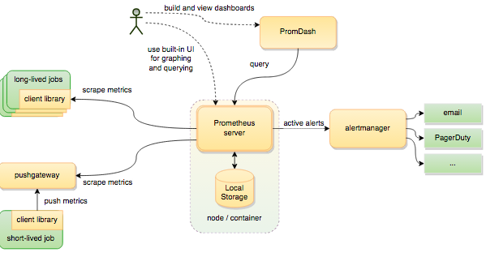
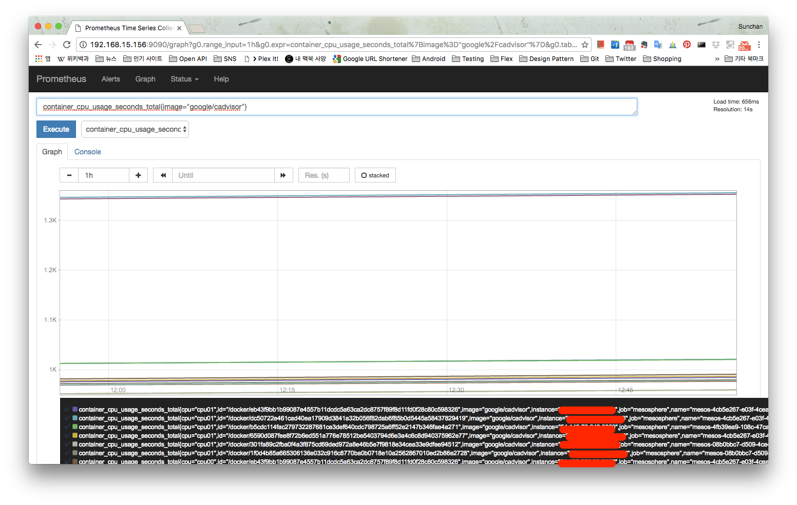
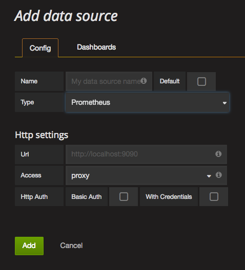
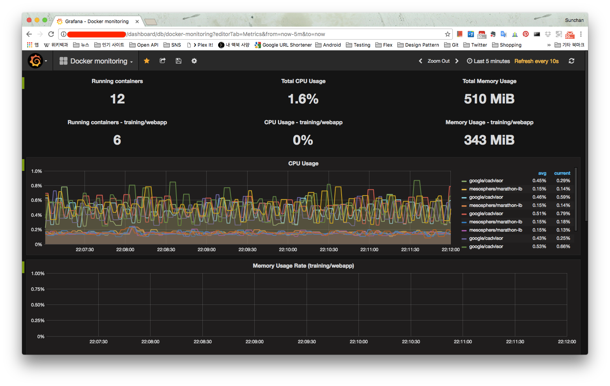

[이전 글](http://13.125.231.217/1450)에서 docker monitoring을 하기 위해서 cAdvisor를 사용해봤는데 몇가지 단점들 때문에 바로 monitoring에 사용하기에는 문제가 있었다. 그래서 많이 사용한다는 prometheus를 사용해보기로 했다.

 

### 1\. cAdvisor 정리

Prometheus를 사용하기 전에 먼저 cAdvisor를 정리해보면 아래와 같다.

(1) Container가 동작중인 host 각각에 설치 (클러스터링 안됨)

(2) Host와 container의 지표 모두 수집

(3) 수집된 지표들은 /metrics 경로에서 확인 가능

 

### 2\. Prometheus

Prometheus는 docker container, VM 등을 모니터링할 수 있는 툴로 수집되는 지표들을 내부에 DB로 보관하는데 수집된 지표들을 확인하기 위해 PromQL이라는 쿼리를 제공하며 대략적인 구조는 아래 그림과 같다. Alert도 가능하다.

[](http://13.125.231.217/wp-content/uploads/2016/11/prom_architecture.png)
\<출처 : [https://www.ctl.io/developers/blog/post/monitoring-docker-services-with-prometheus](https://www.ctl.io/developers/blog/post/monitoring-docker-services-with-prometheus)\>

Prometheus에서 중요하게 본 것은 그림에서의 "scrape metrics"를 어떻게 할 것이냐였는데 다행히 cAdvisor와의 연동은 prometheus 설정 파일에 cAdvisor의 metrics 경로를 지정해 주는 것으로 간단히 가능하고 별도로 [container-exporter](https://hub.docker.com/r/prom/container-exporter/)도 제공되고 있다. Container exporter를 사용할 경우 cAdvisor처럼 container로 올려줘야 하는데 Mesos, Marathon을 사용중이라면 Marathon으로 간단히 올려주면 되겠다. Container exporter는 cAdvisor와 유사하게 측정 지표들을 수집해서 /metrics 경로로 export 할 수 있는데 cAdvisor처럼 자체적으로 monitoring UI를 제공하지는 않는 것 같다. cAdvisor와는 수집하는 지표들이 차이가 있다. Prometheus 입장에서는 cAdvisor, container exporter 둘 중에 무엇이든 /metrics 경로에 접근해서 수집된 데이터들을 내부에 보관한다.

 

### 3\. Prometheus 설치와 설정

**(1) Install**

[Installing 페이지](https://prometheus.io/docs/introduction/install/)에 기술된 내용을 보면 release 된 파일을 다운로드해서 압축을 풀거나 source를 빌드해서 사용하거나 docker로 올리면 된다. 나의 경우엔 별도의 VM에 파일을 다운로드해서 사용했는데 linux 배포판 별로 버젼이 따로 없으므로 그냥 linux 용으로 되어있는 파일을 사용하면 된다. (macOS는 darwin)

**(2) Configuration**

문서들을 보면 설정파일(prometheus.yml)에서 다양한 설정을 지원하고 있는데 가볍게 cAdvisor와의 연동만을 해보고 싶다면 아래처럼 scape\_configs section의 static\_configs > targets 부분만 설정해도 가능하다. targets에는 cAdvisor가 동작중인 host와 port 정보만 넣어주면 prometheus는 yml 파일에 명시된대로 기본으로 /metrics 경로에 접근해서 측정된 지표를 가져온다. cAdvisor가 아니라 container exporter를 사용하고자 한다면 targets 부분만 변경해주면 되고 두가지 모두 사용해도 무방하지만 중복되는 지표가 많고 cAdvisor가 더 다양한 지표를 수집한다.

```
scrape_configs:
  # The job name is added as a label `job=<job_name>` to any timeseries scraped from this config.
  - job_name: 'mesosphere'

    # Override the global default and scrape targets from this job every 5 seconds.
    scrape_interval: 5s

    # metrics_path defaults to '/metrics'
    # scheme defaults to 'http'.

    static_configs:
      - targets: [
        'cAdvisor_host1:port1',
        'cAdvisor_host2:port2',
        '...',
        '...'
      ]
```

 

### 4\. Prometheus UI

Prometheus 설정을 마치고 prometheus 파일을 실행하면 브라우저에서 UI를 확인할 수 있는데 cAdvisor에서 제공하는 지표들을 선택하고 PromQL을 사용해서 적절히 쿼리해야 한다.

[](http://13.125.231.217/wp-content/uploads/2016/11/prom_ui.png)

시간 간격을 조절할 수 있고 원하는 그래프를 계속 추가해서 확인할 수는 있지만 그래프가 단순하고 cAdvisor처럼 바로 사용하기에는 뭔가 부족하다. 위 그림에는 제대로 표현되지 않았지만 cAdvisor가 수집하는 데이터 중 CPU usage의 경우 CPU core 별로 (cpu00, cpu01 등) 사용량을 수집하고 있어서 데이터를 가공할 필요가 있는데 이것은 PromQL로 해결해야 한다.

 

### 5\. Grafana

Grafana는 단순히 dashboard를 편하게 만들고 관리할 수 있는 툴인데 data source 중 하나로 prometheus를 지원하고 있다. Prometheus에서 제공하는 [grafana 설치 문서](https://prometheus.io/docs/visualization/grafana/)를 참고해서 설치한 후에 실행하고, 아래 그림처럼 data source 추가하는 부분에서 prometheus의 경로를 추가하면 된다.

[](http://13.125.231.217/wp-content/uploads/2016/11/grafana_datasource.png)

Dashboard를 생성하면 빈 페이지가 나오는데 다양한 graph를 추가하고 설정할 때 graph를 그리기 위한 data는 prometheus에서 가져오게 되므로 PromQL을 적절히 사용해줘야 한다. ([PromQL 문서](https://prometheus.io/docs/querying/basics/) 참조)

 

### 6\. Grafana dashboard

Dashboard를 만들고 수정해보니 cAdvisor와 prometheus의 모니터링 측면에서의 부족한 부분들을 grafana가 모두 보완할 수 있다는 생각이 든다. Host와 container의 상태를 비교해보기도 좋고 시간 간격을 다양하게 변경할 수 있으며 훨씬 다양한 그래프를 사용하거나 아래 그림처럼 숫자만으로 혹은 테이블로 표시할 수도 있다.

[](http://13.125.231.217/wp-content/uploads/2016/11/granfana.png)
