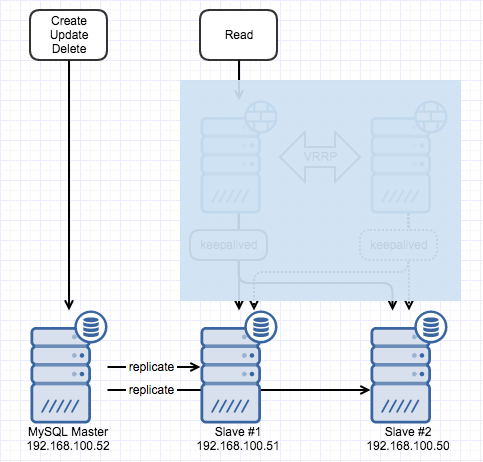
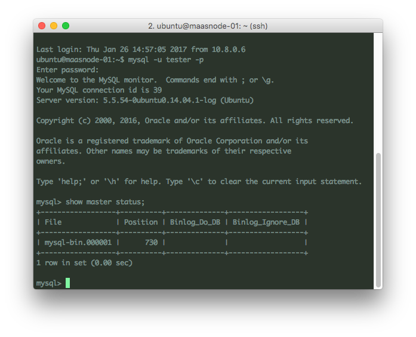

DBA는 아니지만 나중에 필요할 것 같기도 하고 실무 관점에서 직접 구성해보는게 좋을 것 같다는 생각에 DB 이중화를 해보기로 했다. 연습용 DB를 대상으로 하다보니 이중화 구성이 생각보다 간단했고 실제 운영을 하면서 마주칠 수 있는 복잡한 사례와 트러블슈팅을 통해 얻을 수 있는 노하우가 중요할 것 같다. 구성하고자 하는 최종 형태는 아래 그림과 같은 모습인데

[](http://13.125.231.217/wp-content/uploads/2017/01/db_replication.png)

 

우선 DB만 master과 slave로 분리하려면 작업을 크게 네가지 정도로 나눌 수 있을 것 같다.

(설정과 관련된 내용은 [MySQL 5.5 공식문서](https://dev.mysql.com/doc/refman/5.5/en/replication-howto.html)에서 참고함)

 

#### 1\. Master / slave 설정 변경

설정파일인 my.cnf에서 공통으로 변경해야 하는 내용은 server-id이다. Replication 구성할 master와 slave 들간의 server-id가 중복되어서는 안된다. 추가로 master에서는 log-bin 설정이 필요한데 바이너리 로그파일의 경로나 파일명을 지정하는 설정이다. 바이너리 로그는 DB에 가해지는 변경사항(CUD) 기록이 별도로 저장되는 파일을 의미하는데 master에서만 생성하도록 하는게 일반적이고 slave는 바이너리 로그를 받아와서 릴레이 로그로 저장하게 된다. Slave 입장에서 replication은 두 개의 thread로 동작되는데 하나는 바이너리 로그를 받아와서 릴레이 로그로 저장만 하는 I/O thread이고, 두번째는 릴레이 로그를 DB에 직접 반영하는 작업을 수행하는 SQL thread 이다. my.cnf 파일에서 추가된 내용은 아래와 같다.

```
# Master
[mysqld]
server-id = 1
log-bin = mysql-bin

# Slave1
[mysqld]
server-id = 2
```

바이너리 로그로 mysql-bin을 설정하면서 경로를 지정하지 않았기 때문에 실제 DB 파일이 저장되는 경로 (Ubuntu 14.04의 경우 /var/lib/mysql)에 mysql-bin.00000x 형태의 파일로 저장되게 된다.

 

#### 2\. Replication 권한 추가

실제 replication을 수행할 계정이 필요한데 기존에 존재하는 계정을 이용한다면 권한만 추가해도 무방하고 신규 계정을 만들어서 처리해도 되겠다. 나의 경우엔 repl이라는 계정을 생성하기로 했다.

```
GRANT REPLICATION SLAVE ON *.* TO 'repl'@'192.168.100.0/ 255.255.255.0' IDENTIFIED BY 'test';
```

MySQL master에 접속해서 위와 같이 입력하면 192.168.100.0/24 대역에서 repl이라는 계정이 접근해 replication을 수행할 수 있다. 이미 있는 계정을 이용한다면 REPLICATION SLAVE 권한만 부여하면 되겠다.

 

#### 3\. DB dump / 적용

Replication을 시작하기 전에 master와 slave를 동일한 상태로 만들어줘야 하기 때문에 master의 dump를 떠서 slave에 적용해야 한다. 실제 DB 파일을 그대로 복사하는 방법도 있는데 별도로 dump 파일을 만들기로 했다. 이 때 중요한게 dump 파일을 만든 이후에 master에 변경사항이 생기면 안되기 때문에 변경이 발생하지 않도록 조치해두어야 한다. MySQL 서비스를 중단하는 방법도 있지만 테이블에 lock을 거는 방법도 있길래 시도해봤다.

```
FLUSH TABLES WITH READ LOCK;
```

MySQL master에 접속해서 위의 쿼리를 실행하면 lock이 걸리는데 이후에 다른 세션에서 데이터를 변경하고 commit을 수행하면 pending 상태로 유지되기 때문에 실제 DB에는 변경이 발생하지 않는다. (DB 엔진 종류에 따라 다르다는 얘기도 있는데 InnoDB에서는 가능) 위의 쿼리를 실행한 세션을 종료하면 lock이 풀린다고 공식문서에 나와있어서 저 세션은 그대로 둔 상태로 dump를 뜬다. (root 계정을 사용했음)

```
mysqldump -u root -p --all-databases > dump.db
```

\--master-data 옵션을 사용하면 slave가 연결할 master 정보까지 dump에 반영해서 적용시 자동으로 지정가능하다고는 하는데 직접 master 지정까지 해보기 위해 사용하지는 않았다. 생성된 dump가 어느 지점까지의 데이터인지 알아야하기 때문에 master에서 추가로 아래의 쿼리를 수행한다.

```
SHOW MASTER STATUS;
```

이 쿼리를 실행하면 사용중인 바이너리 로그와 마지막 position 값을 얻을 수 있다. (아래 그림 참조)

[](http://13.125.231.217/wp-content/uploads/2017/01/show_master_status.png)

Slave에서 사용해야 하므로 별도로 기록해두고 lock을 푼다.

```
UNLOCK TABLES;
```

이제 master는 동작하던대로 계속 작업을 수행하게 될테니 dump를 slave에 복사하고 dump를 적용하면 세번째 과정은 완료된다.

```
mysql -u root -p < dump.db
```

 

#### 4\. Master 지정과 replication 시작

Master와 slave가 동일한 상태가 되었으므로 (master에 변경사항이 발생하고 있더라도 어느 지점까지 가져왔는지 이미 기록해두었기 때문에 문제가 없다) slave에서 replication 작업을 수행할 master를 지정하고 replication 작업을 시작하는 일만 남았다. Slave에 접속해서 아래의 쿼리를 수행하면 master가 지정된다.

```
CHANGE MASTER TO
master_host = '192.168.100.52',
master_user = 'repl',
master_password = 'test',
master_log_file = 'mysql-bin.000001',
master_log_pos = 730;
```

Master 접근에 대한 기본 정보와 과정3에서 별도로 기록해둔 바이너리 로그 파일을 master\_log\_file에 position을 master\_log\_pos 항목에 지정하면 되겠다. 이 과정까지 문제없이 진행되었다면 아래의 쿼리로 replication을 시작할 수 있다.

```
START SLAVE;
```

Slave가 정상적으로 실행되었는지 여부는 slave status에서 Slave\_IO\_Running과 Slave\_SQL\_Running 항목이 Yes인지 Last\_Errno 등의 오류 정보 필드에 유효한 내용이 있는지를 보고 판단할 수 있다.
