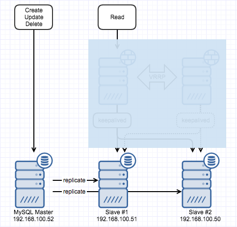

[지난 글](http://13.125.231.217/1490)에 이어서 이번엔 약간 다른 내용을 정리.

 

#### 1\. Slave 추가

이전 그림을 다시 꺼내보면 slave는 2개인데 지난번에는 slave를 하나만 만들어두고 replication 하도록 해두었었다.

[](http://13.125.231.217/wp-content/uploads/2017/01/db_replication.png)

Slave를 추가하려면 어떻게 해야할까? 처음 slave#1을 구성할 때에는 snapshot 적용을 위해서 master를 일시적으로 중단하거나 lock을 걸고 dump를 떠야했는데 이미 존재하는 slave가 있으니 master는 건드릴 필요는 없다. 아래의 순서대로 진행.

**(1) Slave #1의 mysql에 접속 후 아래의 쿼리 실행하고 mysql 중지**

```
STOP SLAVE;
```

Replication 하고 있던 slave #1에 존재하는 data의 snapshot을 만들기 위해 필요하다.

**(2) DB datafile 복사**

DB file이 모여있는 디렉토리에 보면 master.info 파일이 있는데 master 접속 정보나 마지막 replication 했던 position 정보가 포함되어 있다. 모든 파일들을 slave #2의 db file 경로로 복사한다.

**(3) Slave #1의 mysql을** **시작하고 아래의 쿼리 실행**

```
START SLAVE;
```

**(4) Slave #2에서 my.cnf 파일의 server-id 변경**

Master의 server-id를 1, slave #1은 2로 했기 때문에 slave #2는 3으로 지정했다.

**(5) Slave #2에서 (3)과 동일하게 slave 시작 쿼리를 실행**

 

정리하면 snapshot을 slave #1에서 가져오는데 master.info에 position 정보까지 들어있으니 단순히 start slave만 해주면 마지막 position 이후부터 replication을 진행하게 된다. Slave #2가 정상적으로 replication 하는지 여부는 [지난 글](http://13.125.231.217/1490)에 기술했던 방법으로 확인할 수 있다.

 

#### 2\. Slave => master 변경을 위한 준비

Master에 문제가 발생한 경우 replication 하고 있던 slave를 master로 변경해야 할 필요가 있을 수 있다. 이 때를 위해 slave #1에 log-slave-updates 옵션을 적용해두었다. [공식문서](https://dev.mysql.com/doc/refman/5.5/en/replication-options-slave.html#option_mysqld_log-slave-updates)를 보면 slave가 바이너리 로그를 생성하라고 알려주는 옵션이고 log-bin과 함께 사용해야 한다고 되어있는데 slave가 SQL thread가 실행될 때의 변경사항들을 기록하는 역할을 하도록 한다. 이제 log-slave-updates, log-bin 옵션이 적용된 slave #1은 master이자 동시에 slave로 동작한다.

 

#### 3\. 더 생각해 볼 문제들

**(1) Master 변경시엔 어떻게?**

아직 slave 상단에 로드밸런서를 두는 내용을 적지는 않았지만 slave 두 개를 로드밸런싱 하고 있는 상태에서 master에 문제가 생겨 slave #1을 master로 변경할 경우 어떻게 처리를 할지 고민해 봐야 할 것 같다. 상단에 Read와 CUD 요청을 분기하는 방법에 대해서도 살펴봐야 할 것 같다.

**(2) Replication lag**

Replication 과정이 지연되는 경우들이 발생하는 것 같은데 master와 slave 사이의 간격이 넓어질수록 좋지 않을 것 같다. 프로덕션 레벨에서 경험할 수 있는 내용이 아닌가 싶기도 하지만 어떤 상황에서 발생할 수 있는지 어떻게 줄일 수 있는지 정도를 알아두면 좋을 것 같다.

**(3) 자동화 관점에서**

위 그림대로 세 개의 mysql instance 구축은 ansible로 간단하게 가능했는데 replication을 위한 dump나 설정 변경, 또 master 변경시에 조치되어야 하는 내용들을 자동화 할 수 있는지 살펴봐야겠다.
