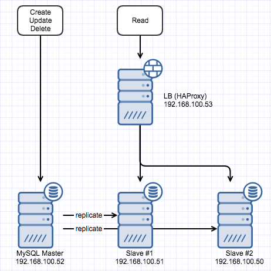
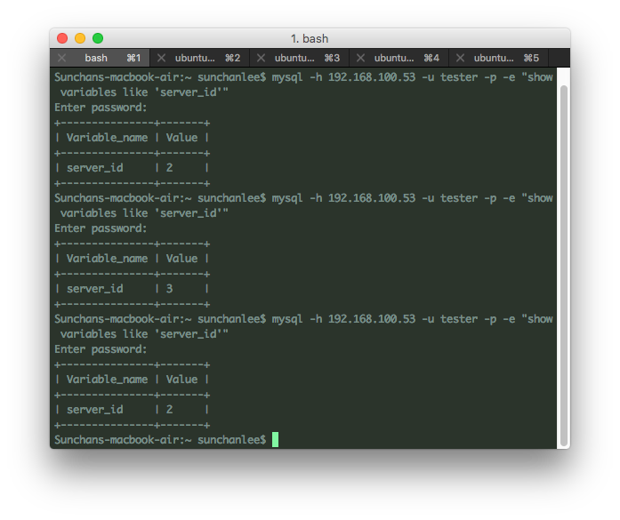
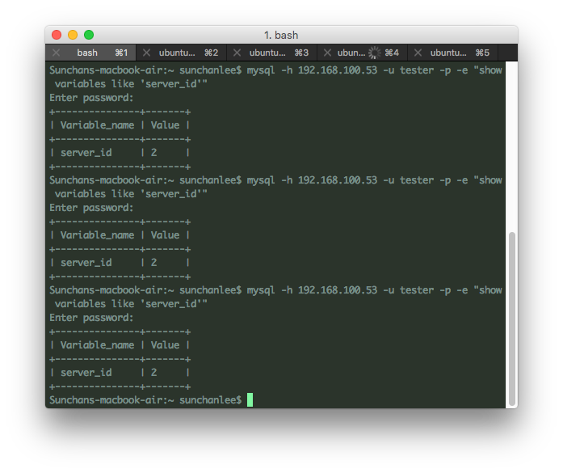

[지난번](http://13.125.231.217/1500)에 이어서 구축한 MySQL slave 2개를 로드밸런싱 해보기로 했다. 로드밸런서로 가용한게 몇가지 있지만 그 중 HAProxy를 이용해서 아래 그림과 같은 모양으로 만들 생각이다. LB의 IP는 192.168.100.53 이고 로드밸런싱 대상은 각각 192.168.100.51, 192.168.100.50

[](http://13.125.231.217/wp-content/uploads/2017/02/db_loadbalancing.png)

 

#### 1\. Status check를 위한 user 추가

HAProxy가 mysql 상태 확인을 위해 접근하는 사용자 계정이 추가되어야 한다. 다른 방식으로 status check 하는게 가능하다면 사용자 계정이 필요없을 수도 있으나 [option mysql-check](https://cbonte.github.io/haproxy-dconv/configuration-1.4.html#option%20mysql-check)을 사용한다면 mysql에 사용자가 추가되어 있어야 한다. Master (위 그림에서는 192.168.100.52)에서 아래의 쿼리로 사용자를 추가한다.

```
INSERT INTO mysql.user(host, user) VALUES('192.168.100.53', 'haproxy_check');
FLUSH PRIVILEGES;
```

나중에는 변경되겠지만 우선 haproxy가 설치될 vm의 ip (192.168.100.53)와 임의의 사용자 계정 (여기서는 haproxy\_check)을 넣어두었다. Slave에만 접근할 거지만 slave에 직접 insert를 하면 데이터들이 달라지게 되므로 master에만 집어넣는다. 그렇게해도 이미 검토한대로 slave에 그대로 replication 될 것이다.

 

#### 2\. HAProxy 설치와 init script 등록

LB로 사용할 haproxy를 192.168.100.53에 설치한다. Ubuntu라면 아래의 command를 실행했을 때 1.4 버전이 설치된다.

```
sudo apt-get install haproxy
```

설치 후에 service 시작을 하면 반응이 없는데 init script로 등록해서 관리할거라면 /etc/default/haproxy 파일을 열어서 수정해줘야 한다. ENABLED=0으로 되어있는 부분의 값을 1로 바꿔주자.

 

#### 3\. HAProxy 설정과 확인

HAProxy의 설정파일인 /etc/haproxy/haproxy.cfg가 기본값으로 그대로 있기 때문에 /etc/default/haproxy 파일을 수정했더라도 시작할 수 없다. (listen 항목이 없음) /etc/haproxy/haproxy.cfg 파일 하단에 아래와 같은 형태로 상태 확인할 mysql 정보와 확인 방법 등을 넣어준다.

```
listen mysql-slaves
    bind *:3306
    mode tcp
    option mysql-check user haproxy_check
    balance roundrobin
    server mysql1 192.168.100.51:3306 check
    server mysql2 192.168.100.50:3306 check
```

tcp 모드로 haproxy\_check라는 계정을 이용해 mysql1, mysql2의 상태를 확인하고 round robin 방식으로 로드밸런싱을 하는데 haproxy는 3306 포트로 바인딩한다는 내용이 되겠다. 이런 형태로 haproxy 설정파일을 수정한 후에 기본으로 들어있는 defaults의 option httplog, option dontlognull 항목은 지워준다. 여기서는 사용하지 않는 내용이라 포함된 상태로 서비스를 시작할 경우 warning 메세지가 뜨기 때문. 여기까지 진행하고 아래의 command로 서비스를 시작하면 끝이다. 간단하다.

```
sudo service haproxy start
```

이제 로드밸런싱이 되는지를 확인할 차례인데 mysql master, slave 모두 고유의 server\_id를 가지고 있으므로 간단히 server\_id를 쿼리해보면 아래의 그림처럼 매번 2와 3으로 번갈아 바뀌는 걸 볼 수 있다.

[](http://13.125.231.217/wp-content/uploads/2017/02/db_roundrobin.png)여기에 weight 같은 것을 주면 slave 각각에 연결되는 빈도가 달라지게 되겠지만 여기까지 확인하고, slave 하나가 죽었을 경우를 가정해보기로 했다. Slave #2에 접근해서 mysql service를 중지시키고나서 다시 쿼리를 날리면 아래 그림처럼 한쪽으로만 연결되는 걸 볼 수 있다. (HAProxy가 상태 검사하는 내용은 haproxy 로그나 syslog에서도 확인 가능)

[](http://13.125.231.217/wp-content/uploads/2017/02/db_stopped_instance.png)

 

#### 4\. 자동화

계속 사용해보고 있는 ansible로 위 과정을 자동화해보기로 했다. [Github](https://github.com/blurblah/ansible-role-mysql-lb)에 위의 내용으로 간단히 role을 정의한 내용을 넣어두었는데 playbook 하위에 roles를 디렉토리를 만들고 적당한 이름으로 clone한 후에 playbook에서 호출하도록 하면 되겠다. Playbook을 만들 때에는 아래처럼 mysql\_instances variable을 정의하면서 slave 정보(name, host, port)를 넣어줘야 한다.

```
---
- name: Install and configure haproxy for load balancers
  hosts: maasnode04
  become: yes
  roles:
    - common
    - role: mysql-lb
      mysql_instances:
        - { name: mysql1, host: 192.168.100.51, port: 3306 }
        - { name: mysql2, host: 192.168.100.50, port: 3306 }
```

Role을 만들기 전에 ansible module 중에 [haproxy module](http://docs.ansible.com/ansible/haproxy_module.html)이 있어서 검토를 해봤는데 이미 존재하는 haproxy의 backend에 특정 host를 enable, disable 하는 정도의 기능만 수행하도록 되어있는 것 같았다. listen 항목을 추가하거나 초기 설정, 또 상세한 설정은 안되는 걸로 보여서 그냥 template을 만들어서 입력되는 variable로 내용을 채우도록 구성.
