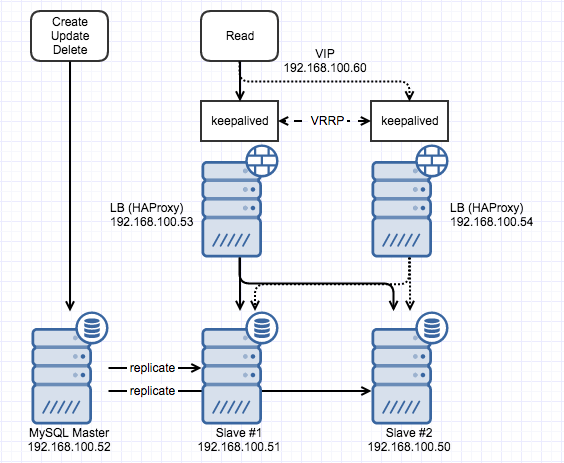

LB 이중화에 대해서 정리하는 것을 미루고 있다가 아예 이중화 구축을 자동화하는 것까지 해보기로 했다. [지난번](http://13.125.231.217/1505)에는 HAProxy를 하나만 두었었는데 다른 VM (192.168.100.54)에 동일한 설정으로 HAProxy를 올리고 VRRP를 위해 keepalived를 사용했고 keepalived 설치에 대해서는 '믿고 보는' [Digital Ocean의 문서](https://www.digitalocean.com/community/tutorials/how-to-set-up-highly-available-haproxy-servers-with-keepalived-and-floating-ips-on-ubuntu-14-04)를 참조했음. 아래의 그림처럼 만들어봤다.

[](http://13.125.231.217/wp-content/uploads/2017/03/mysql-lb-ha.png)

(두 개의 VM에 공통으로 설정할 내용이 있고 각각 다르게 해야 하는 부분이 있어서 아래 소제목에 공통으로 적용해야 하는 내용들만 별도 표기함)

 

### 1\. haproxy\_check 계정 수정

지난번에는 하나의 HAProxy에서 로드밸런싱을 했기 때문에 MySQL에 연결되는지 확인할 계정 (haproxy\_check)을 MySQL에 추가할 때 host로 192.168.100.53을 지정했는데 192.168.100.54에서도 접근해야 하므로 미리 다른 host에 대한 계정을 추가하거나 host를 192.168.100.0/24 255.255.255.0 수정하는 등의 작업을 해두어야 한다.

 

### 2\. keepalived 설치 (공통)

keepalived는 최신 버전(현재 1.3.4)을 다운받아서 빌드해 설치했다. 빌드에 필요한 package 들을 사전에 설치해 두어야 한다.

```
sudo apt-get install build-essential libssl-dev
```

아래 경로로 최신 버전을 다운받아 압축을 풀고 아래의 명령으로 빌드해서 설치하면 완료된다.

[http://keepalived.org/software/keepalived-1.3.4.tar.gz](http://keepalived.org/software/keepalived-1.3.4.tar.gz)

```
./configure
make
sudo make install
```

 

### 3\. keepalived upstart script (공통)

빌드해서 설치한 경우 ubuntu에 service로 등록되어있지 않기 때문에 upstart script를 만들어줘야만 한다. /etc/init/keepalived.conf 파일을 생성해서 아래의 내용으로 채워준다. 어떤 경우에 시작할지, 서비스 시작은 어떻게 할지 등을 결정하는 내용이다.

```
description "load-balancing and high-availability service"

start on runlevel [2345]
stop on runlevel [!2345]

respawn

exec /usr/local/sbin/keepalived --dont-fork
```

 

### 4\. keepalived 설정

이제 중요한 keepalived 설정을 할 순서인데 무엇을 어떻게 감시할 것인지 failover시 backup instance가 인계하거나 master가 가지고 있을 VIP 설정을 해야 한다. Master 역할을 할 첫번째 LB (지난번에 설치한)가 있는 VM에 가서 우선은 /etc/keepalived 디렉토리가 없으므로 생성해둔다. 그리고 /etc/keepalived/keepalived.conf 파일을 아래와 같은 형태로 만든다.

```
vrrp_script chk_haproxy {
    script "pidof haproxy"
    interval 2
}

vrrp_instance VI {
    state MASTER
    interface eth0
    virtual_router_id 100
    priority 200

    virtual_ipaddress {
        192.168.100.60
    }

    track_script {
        chk_haproxy
    }
}
```

vrrp\_script에는 감시할 내용을 기술하면 되는데 HAProxy가 제대로 떠있는지를 확인하면 되기 때문에 단순하게 pidof를 이용해 pid만 확인하기로 한다. 상황에 따라 다른 방식으로 기술될 수도 있을 것 같고 다양한 방법이 있을 것 같다. vrrp\_instance는 VRRP에 대한 설정이라고 보면 되는데 keepalived를 어떻게 동작시킬 것인지에 대한 내용. Master로 사용할 내용이므로 state는 MASTER, eth0로 통신하니 interface는 eth0로 지정하고 virtual\_router\_id는 임의로 100을 지정했다. virtual\_router\_id는 다른 keepalived와 중복되지만 않으면 되니 임의의 수를 입력한다. priority는 여러개의 keepalived가 있는 상태에서 failover를 할 때 어떤 instance가 인계할 것인지를 결정하는 수치인데 높은 값일수록 인계할 가능성이 높다. virtual\_ipaddress에는 보유하고 있는 VIP를 지정해준다.

Backup instance로 동작할 VM (192.168.100.54)에도 동일한 경로에 아래와 같은 형태로 설정 파일을 만들어준다.

```
vrrp_script chk_haproxy {
    script "pidof haproxy"
    interval 2
}

vrrp_instance VI {
    state BACKUP
    interface eth0
    virtual_router_id 200
    priority 100

    virtual_ipaddress {
        192.168.100.60
    }

    track_script {
        chk_haproxy
    }
}
```

문제가 발생했는지 여부를 검사할 내용이나 VIP 설정 등은 동일한데 state와 virtual\_router\_id, priority 가 다르다. state는 BACKUP으로 지정하고 앞서 기술했듯이 virtual\_router\_id는 master와 다르게 지정하고 priority는 election에 관여하는 내용이니 master보다 낮은 값을 입력해준다.

 

### 5\. 서비스 시작과 확인

Master, backup instance 모두에서 keepalived service를 시작하고 문제없이 시작되었다면 예전과 비슷한 방식으로 이중화가 제대로 되는지 확인해본다.

```
mysql -h 192.168.100.60 -u tester -p -e "show variables like 'server_id'"
```

[지난번](http://13.125.231.217/1505)에는 HAProxy 하나에서 round robin으로 로드밸런싱을 했기 때문에 HAProxy가 있는 VM의 ip (192.168.100.53)로 연결해서 server\_id가 변경되는지 확인했었는데 이번에는 HAProxy도 이중화를 했기 때문에 위에서 설정한 VIP (192.168.100.60)를 통해 server\_id를 확인할 수 있다. Master가 정상동작중인 상태이므로 master instance가 VIP에 연결된 상태일텐데 이 상태에서 이중화가 제대로 되고 있는지 확인하려면 master의 haproxy service를 중단시키고 위와 동일한 command로 server\_id를 확인해보면 되겠다. VRRP에 의해 backup instance가 인계하는 내용은 syslog에서도 확인 가능하다.

 

### 6\. 자동화

Ansible을 사용해서 HAProxy로 mysql을 로드밸런싱 하는 내용은 만들어둔 상태였는데 keepalived 설치와 설정하는 내용도 추가해봤다. 또 여러개의 instance를 한 번에 설정할 수 있도록 수정했는데 실제 OS만 올려져 있는 VM 몇 개를 두고 playbook 실행만으로 귀찮은 반복작업이 줄어들어 너무 편해졌음. 상세 내용은 아래 저장소 참조.

[https://github.com/blurblah/ansible-role-mysql-lb](https://github.com/blurblah/ansible-role-mysql-lb)
