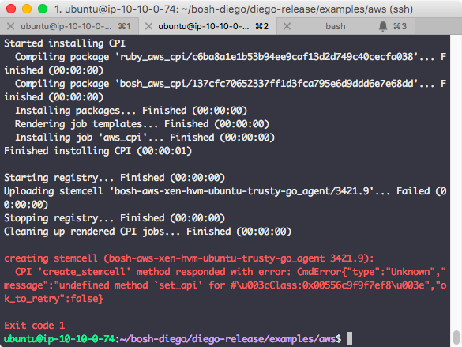
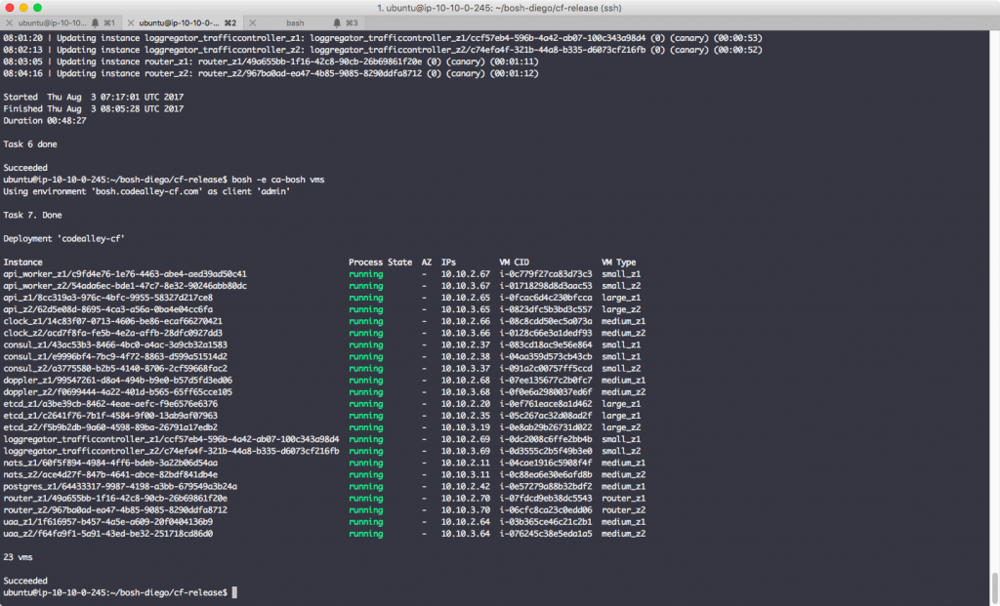
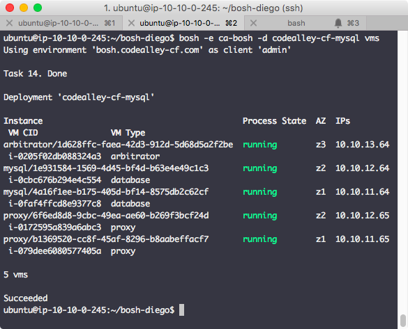
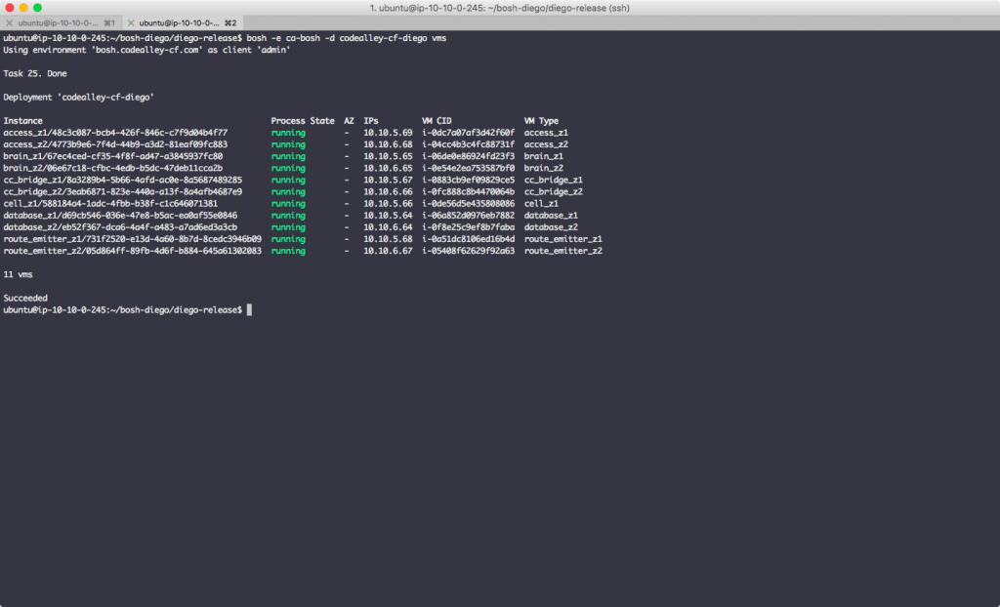
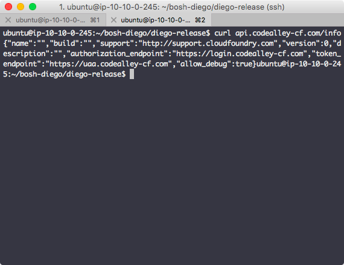
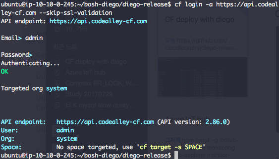
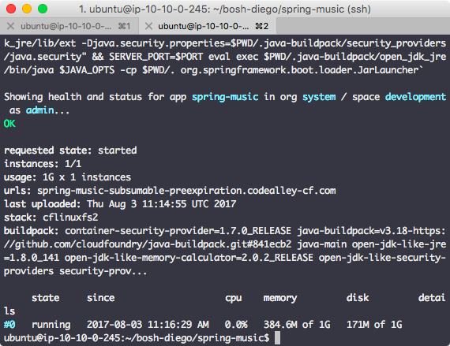
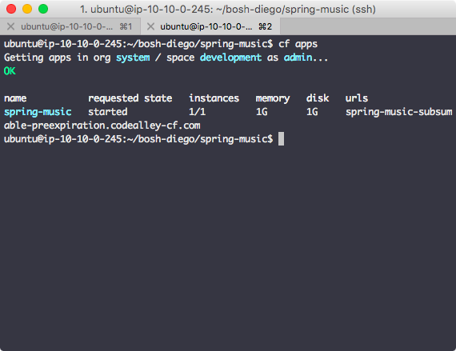
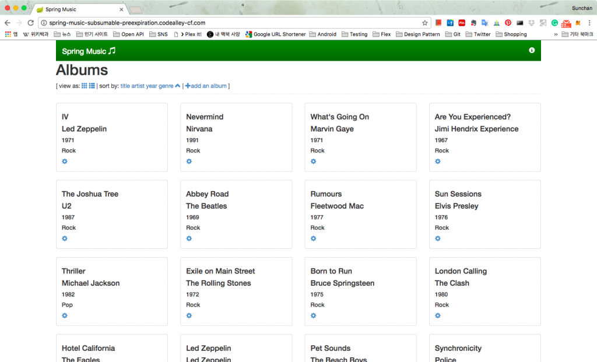
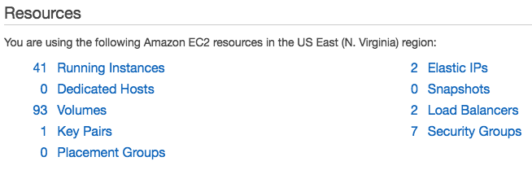

다 정리하고보니 CF 배포는 각 component 들의 기능이나 정의, component 사이의 관계와 manifest의 설정내용을 세세하게 알아야만 하는 것이 아닌가라는 생각이 든다.

* * *

Cloud foundry (CF)를 배포해보면서 오픈소스는 무료가 아니라는 것을 다시 느낀다. 배포 과정도 쉽지 않은데 운영시 발생할 문제들까지 고려하면 오랫동안 공을 들여야만 할 것 같다. 오픈소스 cf를 배포하면서 여러번의 삽질을 하게 된 이유가 무엇일까를 생각해보니 대략 이렇다.

**(1) 사용되는 BOSH cli version의 혼재**

BOSH cli는 현재 major version이 v2인데 공식문서의 특정 링크와 저장소별 README에 v1 기준으로 설명되어 있는 경우가 많다. v1, v2의 명령어가 다르기 때문에 문서에 기술된 내용을 수행하기 위해 명령어를 비교해보고 적합한 명령으로 변경해야 했고, 어떤 버전의 cli를 쓰는게 나을지 고민해보기도... (결국은 v2로)

**(2) 공식문서와 다르게 누락된 부분들**

아래의 링크가 AWS에 cf를 배포하기 위한 공식문서.  Manifest 파일을 generation 하기 위해 만들어야 하는 stub 파일 설정내용에는 포함되어 있지만 복사해서 쓰라고 명시된 stub 파일(skeleton)에는 빠져있어서 그냥 진행한 적이 있었다. 결국 오류가 생겨서 다시 처음부터 진행했었고 일부 설정에 대한 설명이 부족해서 어떤 값을 넣어야 하는건지 한참을 헤매야만 했다.

[http://docs.cloudfoundry.org/deploying/aws/index.html](http://docs.cloudfoundry.org/deploying/aws/index.html)

결정적으로 공식문서에는 diego 배포에 대한 내용이 없어서 그대로 배포해봐야 application을 올리지 못하기 때문에 결국 다른 문서를 참조할 수 밖에 없었다. ([github issue](https://github.com/cloudfoundry/diego-release/issues/203)를 참고하니 cf는 그대로 배포하고 diego를 default backend로 지정해서 배포하라는데 나중에 기회가 되면 시도.)

**(3) 저장소 문제**

대부분의 cf 배포문서에는 저장소(예를 들어, cf-release)를 clone 해서 sub module을 다 땡기고 BOSH cli의 create-release 명령으로 빌드를 한 후에 BOSH director에 업로드하라고 되어있지만 create-release 시점에 오류가 발생한 적이 있었다. 로그 확인해가면서 원인을 찾아보니 링크가 깨진 특정파일이 그대로 저장소에 올라가 있었기 때문인데 결국 local에서 release를 만들지 않고 이미 만들어진 release를 사용하는 방법으로 해결.

CF를 배포하기 위해서는 BOSH를 이용해야 하는데 BOSH director는 구성방법이 두가지인 것으로 보인다. 하나는 bosh cli (create-env)를 이용하는 것이고 두번째는 BOSH bootloader(bbl). 공식문서 대신 찾아보게 된 아래의 링크는 스크립트를 실행해서 BOSH director를 배포하도록 되어있다. AWS cloudformation에 stack을 만들어서 관리할 수 있도록 해둔 것 같은데 director 배포는 bosh cli를 사용하고 있다.

[https://github.com/cloudfoundry/diego-release/tree/develop/examples/aws](https://github.com/cloudfoundry/diego-release/tree/develop/examples/aws)

위 문서의 내용도 잘못된 내용들이 있지만 배포의 과정을 단순화하면 아래처럼 될 것 같다.

BOSH 배포 => CF stub 만들기 => Stub으로 manifest 생성 => CF 배포 => Diego가 사용할 DB 배포 (stub, manifest 만들어서) => Diego 배포 (역시 stub, manifest 만들어서)

 

### 1\. 배포 준비

BOSH cli 등을 설치하고 배포와 관련된 작업을 수행할 장비를 준비하고 진행했다. 처음엔 Ubuntu 16.04로 시작을 했는데 아래 그림처럼 stemcell upload 하는 부분에서 오류가 나서 원인을 찾다가 결국 14.04에서 다시 진행. (이 오류는 [github issue](https://github.com/cloudfoundry-incubator/bosh-aws-cpi-release/issues/58)로 등록되어있음)

[](http://13.125.231.217/wp-content/uploads/2017/08/cf-01-set_api-error.png)

필요로하는 instance의 갯수가 많으므로 (40개 이상) 배포하고자 하는 region의 ec2 instance limit을 사전에 올려두는 것도 필요하다.

 

### 2\. Install dependencies

[참조한 문서](https://github.com/cloudfoundry/diego-release/tree/develop/examples/aws)에 명시된대로 CF를 배포하기 위해 go, godep, boosh, jq, spiff, awscli, bosh cli (v2) 가 필요하므로 설치해야 하는데 대부분은 apt-get이나 download 중 편한 방법으로 하면 되지만 jq의 경우 ubuntu 14.04에서는 꼭 download 해서 1.5 버전을 설치해야만 한다. jq 설치에 apt-get을 이용하게 되면 ubuntu 14.04에서는 1.3 버전이 설치되는데 나중에 특정 script 실행시 1.3에서 지원하지 않는 argument를 넘기게 되서 오류가 발생하게 된다. 문서에는 ruby도 설치하라고 되어있지만 bosh cli v2의 dependencies에 명시되어 있으므로 bosh cli 설치하고 진행하면 되겠다.

 

### 3\. Clone repositories

저장소는 모두 4개가 필요하지만 먼저 필요한 3개의 저장소만 clone 했다. (문서대로) 그리고 저장소 및 기타 파일들을 모아둘 directory (나의 경우엔 bosh-diego라는 이름으로)를 생성하고 그 위에서 작업

```
mkdir bosh-diego
cd bosh-diego

git clone https://github.com/cloudfoundry/bosh-deployment
git clone https://github.com/cloudfoundry/cf-release
git clone https://github.com/cloudfoundry/diego-release
```

 

### 4\. Domain 발급 및 Route53 설정

개발용으로 cf를 구축하는 문서에는 domain 없이 xip.io와 elastic ip만 가지고 작업하는 내용이 있었지만 여러가지 이유로 domain을 사서 route53에 zone을 생성했다. (AWS에서 .com 도메인 사니 편하다. 12불/년)

 

### 5\. env 파일 생성

실행할 script 들 호출시 편의를 위해 env 파일을 생성하고 source로 load 한다. (아래의 내용은 상황에 맞게 수정할 필요가 있음)

```
cat <<"EOF" > deployment-env
export DEPLOYMENT_DIR="$(cd $(dirname "$BASH_SOURCE[0]") && pwd)"

export BOSH_DEPLOYMENT_DIR="$HOME/bosh-diego/bosh-deployment"
export CF_RELEASE_DIR="$HOME/bosh-diego/cf-release"
export DIEGO_RELEASE_DIR="$HOME/bosh-diego/diego-release"

export CF_DOMAIN="codealley-cf.com"
export STACK_NAME="codealley-cf-stack"
export gobosh=bosh

echo "DEPLOYMENT_DIR set to '$DEPLOYMENT_DIR'"
echo "BOSH_DEPLOYMENT_DIR set to '$BOSH_DEPLOYMENT_DIR'"
echo "CF_RELEASE_DIR set to '$CF_RELEASE_DIR'"
echo "DIEGO_RELEASE_DIR set to '$DIEGO_RELEASE_DIR'"
echo "CF_DOMAIN set to '$CF_DOMAIN'"
echo "v2 BOSH CLI located at '$(which "${gobosh}")'"
EOF


source deployment-env
```

 

### 6\. IAM user, keypair 생성

**(1) IAM policy 생성**

Cloudformation을 포함해 aws에 대한 모든 작업을 위한 IAM user를 생성해야 하는데 그 user에게 지정할 policy를 만들어야 한다. 아래 링크대로 진행하면 된다.

[https://github.com/cloudfoundry/diego-release/tree/develop/examples/aws#iam-user-policy](https://github.com/cloudfoundry/diego-release/tree/develop/examples/aws#iam-user-policy)

Policy 내용을 봐도 알겠지만 거의 모든 권한이 필요한데 그 중 S3는 cf가 droplet, buildpack 등을 저장하는 blobstore 대신 사용되는 것으로 보인다. (개발용으로 구축했을 때에는 cf 내부에 blobstore를 두도록 되어있었음)

**(2) IAM user 생성**

역시 아래 문서대로 user를 생성하면 된다. Access type에 대한 명시는 되어있지 않은데 aws에서 programmatic access로 선택하면 되겠다. User 생성시 다운로드 할 수 있는 credentials.csv 파일은 나중에 필요하므로 미리 다운로드 해둔다.

[https://github.com/cloudfoundry/diego-release/tree/develop/examples/aws#iam-user](https://github.com/cloudfoundry/diego-release/tree/develop/examples/aws#iam-user)

**(3) Keypair 생성**

배포할 region에서 keypair를 만들고나서 다운로드한 private key를 작업경로 아래의 keypair directory에 id\_rsa\_bosh란 이름으로 복사한 후 권한을 조정한다. 아래 링크 참조

[https://github.com/cloudfoundry/diego-release/tree/develop/examples/aws#aws-keypair-for-the-bosh-director](https://github.com/cloudfoundry/diego-release/tree/develop/examples/aws#aws-keypair-for-the-bosh-director)

 

### 7\. Deployment directory setup

정해진 구조의 directory를 몇 개 생성한 후에 key, cert, stub 등의 파일을 생성해야 하는데 아래와 같다.

**(1) Directory 생성**

```
cd $DEPLOYMENT_DIR
mkdir certs
mkdir -p ops-files/bosh
mkdir -p stubs/bosh
mkdir stubs/infrastructure
```

**(2) boostrap env 생성**

Region을 지정하고 IAM user 생성시에 받아두었던 credentials.csv 파일 내부에 있는 access key id와 secret access key 값을 이용해서 파일을 만든다.

```
cat <<EOF > $DEPLOYMENT_DIR/bootstrap_environment
export AWS_DEFAULT_REGION=us-east-1
export AWS_ACCESS_KEY_ID=
export AWS_SECRET_ACCESS_KEY=''
EOF
```

**(3) ELB용 key, cert 생성**

미리 보유한 인증서가 있다면 그것을 이용하면 되지만 없다면 아래처럼 self signed 인증서를 만든다. csr 파일 생성시 common name은 가지고 있는 domain의 와일드카드로 지정해야 한다. (나의 경우엔 \*.codealley-cf.com)

```
cd $DEPLOYMENT_DIR/certs
openssl genrsa -out elb-cfrouter.key 2048
openssl req -new -key elb-cfrouter.key -out elb-cfrouter.csr
openssl x509 -req -in elb-cfrouter.csr -signkey elb-cfrouter.key -out elb-cfrouter.pem
```

**(4) Domain stub 생성**

```
cd $DEPLOYMENT_DIR
cat <<EOF > $DEPLOYMENT_DIR/stubs/domain.yml
---
domain: $CF_DOMAIN
EOF
```

**(5) Instance type stub 생성**

문서상에는 지정하지 않으면 default 값으로 설정된다라고 되어있지만 파일 혹은 일부 내용은 꼭 필요한 것 같다. (파일이 아예 없는 경우 오류가 발생했었음) 어느 정도의 크기가 되어야하는지 알 수 없어서 그냥 만만한 m3.medium으로 지정해봤다.

```
cat <<EOF > $DEPLOYMENT_DIR/stubs/aws-instance-types.yml
instance_types:
  database: m3.medium
  mysql_database: m3.medium
  mysql_proxy: m3.medium
  mysql_persistent_disk_type: gp2
EOF
```

**(6) AZ stub 생성**

아래처럼 파일에 지정한 availability zone에 vm 생성을 하면서 이중화 구성을 하는 것으로 보인다. 일부 availability zone에서 특정 type의 instance가 생성되지 못하는 경우가 있었기 때문에 (나의 경우엔 us-east-1b에서 m3.medium 생성 불가. 메세지 상으로는 aws에 어떤 limit이 걸려있었던 것으로 보임) 필요한경우 조정을 해야한다.

```
cat <<EOF > $DEPLOYMENT_DIR/stubs/infrastructure/availability_zones.yml
---
meta:
  availability_zones:
  - us-east-1a
  - us-east-1c
  - us-east-1d
EOF
```

**(7) BOSH vars 생성**

default\_key\_name은 AWS에서 생성한 keypair의 이름을 지정하고 director\_name은 입맛대로 설정한다.

```
cat <<EOF > $DEPLOYMENT_DIR/stubs/bosh/vars.yml
---
default_key_name: bosh-diego-keypair
director_name: codealley-bosh
EOF
```

**(8) BOSH domain stub 생성 (Optional)**

Domain도 샀겠다 편의를 위해서 bosh용 sub domain을 지정했다. 아직 bosh (bosh director)생성 전이지만 필요하다면 이렇게만 지정하고 나중에 director 생성 후에 실제 domain record를 추가하면 된다.

```
cat <<EOF > $DEPLOYMENT_DIR/stubs/bosh/domain.yml
---
director_domain: bosh.codealley-cf.com
EOF
```

**(9) 기타**

문서상에 기술된 내용 중 나머지는 optional이라 설정하지 않았음

 

### 8\. Configuring security

이 부분은 cf를 구성하는 각 component 들끼리 ssl로 통신하기 위한 인증서와 key를 생성하는 내용으로 대부분 저장소에 준비되어 있는 script를 실행하는 것으로 완료할 수 있다.

**(1) Consul과 cloud controller(cc)용 certs 생성**

```
cd $DEPLOYMENT_DIR/certs
$CF_RELEASE_DIR/scripts/generate-cf-diego-certs
$CF_RELEASE_DIR/scripts/generate-consul-certs
```

**(2) UAA용 certs생성**

UAA는 cf에서 user 인증을 담당하는 component

```
pushd $CF_RELEASE_DIR
./scripts/generate-uaa-certs
mv uaa-certs/ $DEPLOYMENT_DIR/certs/
popd
pushd $DIEGO_RELEASE_DIR
./scripts/generate-uaa-saml-certs
mv diego-certs/uaa-saml-certs/saml.* $DEPLOYMENT_DIR/certs/uaa-certs
popd
```

**(3) Loggregator certs 생성**

```
$CF_RELEASE_DIR/scripts/generate-loggregator-certs \
  $DEPLOYMENT_DIR/certs/cf-diego-certs/cf-diego-ca.crt \
  $DEPLOYMENT_DIR/certs/cf-diego-certs/cf-diego-ca.key
pushd $CF_RELEASE_DIR
$CF_RELEASE_DIR/scripts/generate-statsd-injector-certs \
  $DEPLOYMENT_DIR/certs/loggregator-certs/loggregator-ca.crt \
  $DEPLOYMENT_DIR/certs/loggregator-certs/loggregator-ca.key
mv $CF_RELEASE_DIR/statsd-injector-certs $DEPLOYMENT_DIR/certs
popd
```

**(4) Diego에 사용될 certs 생성**

```
$DIEGO_RELEASE_DIR/scripts/generate-diego-certs $DEPLOYMENT_DIR/certs/cf-diego-certs
mv $DIEGO_RELEASE_DIR/diego-certs/* $DEPLOYMENT_DIR/certs
```

**(5) SSH 접근을 위한 host key 생성**

Passphrase를 물어보면 공백으로 넣어야 한다.

```
ssh-keygen -f $DEPLOYMENT_DIR/keypair/ssh-proxy-host-key.pem
ssh-keygen -lf $DEPLOYMENT_DIR/keypair/ssh-proxy-host-key.pem.pub | cut -d ' ' -f2 \
  > $DEPLOYMENT_DIR/keypair/ssh-proxy-host-key-fingerprint
```

**(6) UAA용 keypair 생성**

역시 이것도 passphrase는 공백

```
ssh-keygen -t rsa -b 4096 -f $DEPLOYMENT_DIR/keypair/uaa
openssl rsa -in $DEPLOYMENT_DIR/keypair/uaa -pubout > $DEPLOYMENT_DIR/keypair/uaa.pub
```

 

### 9\. Cloudformation stack 생성

이 과정은 aws에서 cloudformation stack을 생성하고 stack에 포함될 vpc, s3 bucket 등이 자동 생성되며 BOSH director와 NAT용 vm이 만들어지는 과정이다. 단순히 script만 호출해주면 된다.

```
cd $DIEGO_RELEASE_DIR/examples/aws
./deploy_aws_environment create-stack deploy-bosh "$BOSH_DEPLOYMENT_DIR" "$DEPLOYMENT_DIR" "$STACK_NAME"
```

 

### 10\. Login to BOSH

9번 과정에서 bosh director가 배포되었기 때문에 bosh director의 IP (elastic ip가 할당됨)를 확인해 route53에 record를 추가한다. (만약 위에서 bosh director에 대한 domain 설정을 하지 않았다면 아래 command에서 domain 대신 ip를 이용) 이후 cf 등을 bosh로 배포하기 위해 로그인을 해야한다. BOSH cli v1에서는 target 지정하는 내용이었는데 v2에서는 alias로 지정하는 명칭을 이후에 계속 bosh cli 실행시마다 함께 넣어줘야 해당 director에 명령을 내릴 수 있도록 되어있다.

```
bosh alias-env ca-bosh -e bosh.codealley-cf.com \
  --ca-cert <(bosh int $DEPLOYMENT_DIR/deployments/bosh/creds.yml --path /director_ssl/ca)
bosh -e ca-bosh log-in
```

Login시 사용되는 계정은 우선 admin으로 password는 $DEPLOYMENT\_DIR/deployments/bosh/creds.yml 파일을 열어보면 자동 생성된 값을 확인할 수 있다. 추가로 원래 이전 과정 중 director의 uuid를 확인해서 자동으로 director-uuid.yml 파일에 uuid 값을 넣도록 되어있는 것 같은데 제대로 동작하지 않았다면 아래 명령으로 uuid를 확인해 값을 채워준다.

```
# Check director uuid
bosh -e ca-bosh env
# Insert uuid value if empty
vi $DEPLOYMENT_DIR/stubs/director-uuid.yml
```

 

### 11\. Deploy CF

**(1) CF properties stub 수정**

위 과정까지 문제가 없었다면 $DEPLOYMENT\_DIR/stubs/cf/properties.yml 파일이 자동생성 되어있는데 이 파일을 열어서 REPLACE\_WITH\_ 로 시작하는 부분을 교체해줘야 한다. 그 중 REPLACE\_WITH\_CF\_DEPLOYMENT\_NAME은 이후에 bosh command 실행시 계속 사용될 명칭이므로 적당한 값을 입력해주면 되고, cc의 db\_encryption\_key 항목은 32개의 random 값을 입력해주면 되므로 아래의 command를 사용한다.

```
LC_ALL=C tr -dc 'A-Za-z0-9' < /dev/urandom | head -c 32 ; echo
```

상세 설정 내용에 대해서는 아래의 두 문서를 참조 (동일하지는 않으니 지정할 항목에 대해서만 참조하면 되겠다)

[https://github.com/cloudfoundry/diego-release/tree/develop/examples/aws#fill-in-properties-stub](https://github.com/cloudfoundry/diego-release/tree/develop/examples/aws#fill-in-properties-stub)

[http://docs.cloudfoundry.org/deploying/aws/cf-stub.html#editing](http://docs.cloudfoundry.org/deploying/aws/cf-stub.html#editing)

**(2) CF manifest 생성**

아래의 command를 실행한다.

```
cd $CF_RELEASE_DIR
./scripts/generate_deployment_manifest aws \
  $DEPLOYMENT_DIR/stubs/director-uuid.yml \
  $DIEGO_RELEASE_DIR/examples/aws/stubs/cf/diego.yml \
  $DEPLOYMENT_DIR/stubs/cf/properties.yml \
  $DEPLOYMENT_DIR/stubs/cf/stub.yml \
  > $DEPLOYMENT_DIR/deployments/cf.yml
```

**(3) Upload stemcell**

Component 들이 올라갈 instance 들의 base image를 bosh director로 업로드하는 과정으로 local에 있는 stemcell을 올릴수도 있지만 현재는 갖고 있지 않으므로 공개되어 있는 stemcell을 이용하도록 한다. 이 때 버전을 지정할 수도 있는데 나의 경우에는 v267을 배포할 것이기 때문에 [release note](https://github.com/cloudfoundry/cf-release/releases/tag/v267)를 확인해서 3421.11 버전으로 진행함

```
bosh -e ca-bosh upload-stemcell https://bosh.io/d/stemcells/bosh-aws-xen-hvm-ubuntu-trusty-go_agent?v=3421.11
```

**(4) Upload cf release**

위에서도 언급했듯이 대부분의 문서에서는 create-release를 해서 local에 생성된 release package를 upload 하라고 기술되어 있지만 오류가 발생하는 경우가 있어서 아래의 command로 v267을 upload 함

```
bosh -e ca-bosh upload-release releases/cf/cf-267.yml
```

**(5) Deploy**

Manifest가 생성되어 있고 배포에 필요한 package 들도 upload된 상태이기 때문에 deploy 명령만 bosh로 내려주면 된다.

```
bosh -e ca-bosh -d codealley-cf deploy $DEPLOYMENT_DIR/deployments/cf.yml
```

문제없이 완료된 경우 아래 command를 실행해보면 배포된 component에 대한 instance list를 확인할 수 있다.

```
bosh -e ca-bosh vms
```

[](http://13.125.231.217/wp-content/uploads/2017/08/cf-02-cf-vms.png)

 

### 12\. Deploy CF MySQL for Diego

CF를 구성하는 대부분의 component들은 배포가 된 상황인데 중요한 diego는 없다. 과거에는 대신 dea가 있었던 것으로 보이는데 지금은 instance list에서 dea를 확인할 수 없다. Diego 배포를 하기 전에 diego가 사용할 db를 준비해야 한다고 문서에 기술되어 있는데 aws rds를 이용하거나 standalone으로 구축하는 방법, 또는 cf-release에 포함되어있는 postgresql을 이용할 수 있는 것 같다. 그 중에서 rds는 비용문제로 포기하고 이미 11번 과정에서 배포된 postgresql을 이용해볼까 하다가 궁금해서 standalone으로 구성해보기로 했다.

**(1) Clone repository**

cf-mysql-deployment repo를 clone한다. (release-candidate branch)

```
cd $DEPLOYMENT_DIR
git clone -b release-candidate https://github.com/cloudfoundry/cf-mysql-deployment
```

**(2) Deployment name 설정**

$DEPLOYMENT\_DIR/stubs/cf-mysql/mysql-overrides-ops.yml 파일을 열어서 REPLACE\_WITH\_CF\_MYSQL\_DEPLOYMENT\_NAME 부분을 원하는 명칭으로 지정한다.

**(3) Consul** ips, **encrypt keys 지정**

이미 배포되어 있는 consul의 ip들과 encryption key를 설정해야 하는데 둘 다 복수형이므로 yml 파일에 list나 배열형태로 집어넣어줘야 한다. (문서에는 encrypt\_keys 라고만 명시되어 있어서 처음에는 단일 문자열 값으로 설정해서 배포했었는데 오류 발생)

아래의 파일을 열어서 REPLACE\_WITH\_CONSUL\_ENCRYPT\_KEYS와 REPLACE\_WITH\_CONSUL\_SERVER\_IPS를 교체한다.

$DEPLOYMENT\_DIR/stubs/cf-mysql/mysql-overrides-ops.yml

이 때 consul의 ip는 bosh vms 명령으로 확인

```
bosh -e ca-bosh vms | grep consul
```

**(4) DB password 설정**

아래의 파일을 열어서 diego와 locket schema의 password를 원하는 값으로 설정해준다.

$DEPLOYMENT\_DIR/stubs/cf-mysql/mysql-overrides-ops.yml

**(5) Update cloud config / deploy**

아래 command를 실행해서 cloud config 파일을 갱신하고 deploy

```
bosh -e ca-bosh update-cloud-config $DEPLOYMENT_DIR/stubs/cloud-config.yml
bosh -e ca-bosh -d codealley-cf-mysql deploy \
  $DEPLOYMENT_DIR/cf-mysql-deployment/cf-mysql-deployment.yml \
  --vars-file $DEPLOYMENT_DIR/stubs/cf-mysql/consul-secrets.yml \
  --vars-store $DEPLOYMENT_DIR/deployments/cf-mysql-vars.yml \
  -o $DEPLOYMENT_DIR/cf-mysql-deployment/operations/proxy-consul.yml \
  -o $DEPLOYMENT_DIR/stubs/cf-mysql/mysql-overrides-ops.yml --no-redact
```

역시 특별한 문제없이 완료되었다면 위에서 지정한 deployment name을 지정해서 vms 명령을 실행해보면 아래 그림과 같은 형태의 instance list를 확인할 수 있다.

[](http://13.125.231.217/wp-content/uploads/2017/08/cf-03-cf-mysql-vms.png)

 

### 13\. Deploy Diego

마지막으로 diego를 배포해야 하는데 위의 과정들과 거의 유사하다. Stub 생성 또는 수정, 그리고 manifest 생성 후 필요한 경우 release package를 업로드하고 deploy.

**(1) Diego** sql **stub 생성**

아래 문서를 참조하면 각 항목을 어떤 값으로 채워야 하는지 알 수 있다.

[https://github.com/cloudfoundry/diego-release/tree/develop/examples/aws#fill-in-diego-sql-stub](https://github.com/cloudfoundry/diego-release/tree/develop/examples/aws#fill-in-diego-sql-stub)

대충 $DEPLOYMENT\_DIR/stubs/diego/diego-sql.yml 파일이 이런 모양이 된다. (SSL 설정은 안함)

```
sql_overrides:
  bbs:
    db_driver: mysql
    db_host: mysql.service.cf.internal
    db_port: 3306
    db_username: diego
    db_password: test1q2w3e
    db_schema: diego
    max_open_connections: 500
    require_ssl: null
    ca_cert: null
  locket:
    db_driver: mysql
    db_host: mysql.service.cf.internal
    db_port: 3306
    db_username: locket
    db_password: test1q2w3e
    db_schema: locket
    require_ssl: null
    ca_cert: null
```

**(2) property-overrides.**yml **파일 수정**

$DEPLOYMENT\_DIR/stubs/diego/property-overrides.yml 파일을 열어서 REPLACE\_WITH\_ 항목들을 지정해야 한다. REPLACE\_WITH\_ACTIVE\_KEY\_LABEL은 임의의 값으로 정해도 무방하고 REPLACE\_WITH\_A\_SECURE\_PASSPHRASE 역시 적합한 값으로 설정한다.

**(3) instance-count-overrides stub 생성**

Diego의 component들을 어떤 zone에 몇개 instance로 배포할 것인지를 설정하는 내용인데 문서상에는 $DIEGO\_RELEASE\_DIR/examples/aws/stubs/diego/instance-count-overrides-example.yml 파일을 복사해서 변경해 쓰라고 명시되어 있지만 실제 파일에는 상세 내용이 없기 때문에 테스트 용도로 만들어진 파일을 사용해봤다. 아래 command로 다운로드한 파일을 열어서 instance count를 지정하면 완료. (Component 종류별로 z1, z2에 대해서만 하나씩 지정함. 필요없다고 생각한 일부 component를 0으로 지정하고 배포해보니 오류)

```
curl -o $DEPLOYMENT_DIR/stubs/diego/instance-count-overrides.yml \
  https://raw.githubusercontent.com/cloudfoundry/diego-upgrade-stability-tests/master/cell2/instance-count-overrides.yml 
vi $DEPLOYMENT_DIR/stubs/diego/instance-count-overrides.yml
```

**(4) Release version stub 생성**

(3)과 동일하게 문서상에는 저장소에 있는 파일을 복사해서 쓰라고 되어있으나 내용은 비어있다. [Release note](https://github.com/cloudfoundry/cf-release/releases)를 참고해서 배포하고자 하는 cf version에 필요한 release package들을 지정한다. [v267](https://github.com/cloudfoundry/cf-release/releases/tag/v267)의 경우 아래와 같은 내용이면 되겠다.

```
cp $DIEGO_RELEASE_DIR/examples/aws/stubs/diego/release-versions.yml \
  $DEPLOYMENT_DIR/stubs/diego/release-versions.yml
vi $DEPLOYMENT_DIR/stubs/diego/release-versions.yml
```

```
release-versions:
  diego: 1.21.0
  cflinuxfs2: 1.137.0
  garden-runc: 1.9.0
  cf-networking: 1.2.0
  grootfs: 0.21.0
```

**(5) Diego manifest 생성**

ETCD를 사용하지 않을 것이기 때문에 -x 옵션을 추가해서 생성했음

```
cd $DIEGO_RELEASE_DIR
./scripts/generate-deployment-manifest \
  -c $DEPLOYMENT_DIR/deployments/cf.yml \
  -i $DEPLOYMENT_DIR/stubs/diego/iaas-settings.yml \
  -p $DEPLOYMENT_DIR/stubs/diego/property-overrides.yml \
  -n $DEPLOYMENT_DIR/stubs/diego/instance-count-overrides.yml \
  -v $DEPLOYMENT_DIR/stubs/diego/release-versions.yml \
  -s $DEPLOYMENT_DIR/stubs/diego/diego-sql.yml \
  -x \
  > $DEPLOYMENT_DIR/deployments/diego.yml
```

**(6) Upload release**

Diego에 필요한 release package들을 bosh로 올리는 과정인데 역시 create-release 하지 않고 공개되어 있는 버전을 이용했다. 이 때 사용할 버전들은 (4)의 release-versions.yml 파일과 동일하게 맞춰야 한다.

```
bosh -e ca-bosh upload-release https://bosh.io/d/github.com/cloudfoundry/diego-release?v=1.21.0
bosh -e ca-bosh upload-release https://bosh.io/d/github.com/cloudfoundry/cflinuxfs2-release?v=1.137.0
bosh -e ca-bosh upload-release https://bosh.io/d/github.com/cloudfoundry/garden-runc-release?v=1.9.0
bosh -e ca-bosh upload-release https://bosh.io/d/github.com/cloudfoundry-incubator/cf-networking-release?v=1.2.0
bosh -e ca-bosh upload-release https://bosh.io/d/github.com/cloudfoundry/grootfs-release?v=0.21.0
```

**(7) Deploy**

아래의 command로 위에서 생성한 manifest를 지정해서 실행

```
bosh -e ca-bosh -d codealley-cf-diego deploy $DEPLOYMENT_DIR/deployments/diego.yml
```

역시 deployment name을 지정해서 instance list를 확인하면 아래의 그림처럼 표시된다.

[](http://13.125.231.217/wp-content/uploads/2017/08/cf-04-diego-vms.png)

**(8) 배포 확인**

아래의 command를 실행해서 정상여부를 판단할 수도 있다. (info를 확인하는 것은 diego와는 관계가 없기 때문에 cf 배포후에도 확인할 수 있는 내용)

```
curl api.codealley-cf.com/info
```

[](http://13.125.231.217/wp-content/uploads/2017/08/cf-06-check-deploy.png)

 

### 14\. Install CF cli

이제 배포된 cf에 application을 올려볼 차례인데 그 전에 cf cli를 설치해야 한다. [링크 문서](https://docs.cloudfoundry.org/cf-cli/install-go-cli.html)를 참조하거나 아래의 command로 설치

```
wget -q -O - https://packages.cloudfoundry.org/debian/cli.cloudfoundry.org.key | sudo apt-key add -
echo "deb http://packages.cloudfoundry.org/debian stable main" | sudo tee /etc/apt/sources.list.d/cloudfoundry-cli.list
sudo apt-get update
sudo apt-get install cf-cli
```

 

### 15\. Deploy sample application

CF cli를 처음 실행하는 거라면 org, space 생성과 target space 지정 등의 과정이 필요하다.

**(1) CF login**

사용하기로 설정한 cf의 api domain에 연결을 해야하는데 self signed 인증서를 넣어두었으므로 --skip-ssl-validation 옵션을 주어야 한다. 이 때 사용되는 계정(Email)은 admin으로 password는 이전에 설정했던 값으로 입력 (나의 경우엔 test1q2w3e)

```
cf login -a https://api.codealley-cf.com --skip-ssl-validation
```

[](http://13.125.231.217/wp-content/uploads/2017/08/cf-07-cf-login.png)

**(2) Org, space 생성과 target 지정**

Org는 기본으로 system이 생성되어 있는데 별도로 만들어도 좋고 그냥 쓰겠다면 아래 command로 space(이 경우엔 development)만 하나 생성하고 해당 space를 target으로 지정하면 되겠다.

```
cf create-space development
cf target -s development
```

**(3) Clone sample application & deploy**

CF sample 중 spring-music을 배포해보기로 했는데 많은 경우 cf push 명령만으로 배포가 가능하지만 spring-music의 경우 빌드 과정이 필요한 것 같다. Java8이 설치되어있지 않았으므로 설치하고 JAVA\_HOME 지정

```
# Install java8 and export JAVA_HOME
sudo add-apt-repository ppa:webupd8team/java -y
sudo apt-get update
sudo apt-get install -y oracle-java8-installer
echo 'export JAVA_HOME=/usr/lib/jvm/java-8-oracle' >> ~/.profile
source ~/.profile

# Clone and build
git clone https://github.com/cloudfoundry-samples/spring-music
cd spring-music
./gradlew clean assemble

# Deploy
cf push
```

Push가 완료되면 아래와 같은 화면을 볼 수 있다.

[](http://13.125.231.217/wp-content/uploads/2017/08/cf-08-cf-push.png)

CF cli 명령 중 배포된 application 전체를 확인하는 cf apps를 실행해보면 아래 그림처럼 상태와 사용중인 resource 정보가 표시되고 자동으로 할당된 url도 확인 가능하다.

[](http://13.125.231.217/wp-content/uploads/2017/08/cf-09-cf-apps.png)

cf apps에 표시된 url로 접속하면 아래 그림처럼 배포된 상태의 application 화면을 볼 수 있음

[](http://13.125.231.217/wp-content/uploads/2017/08/cf-10-access-app.png)

 

 

### 16\. Resources

CF를 배포하고 나서 aws에 생성된 resource가 얼마나 되는지 확인해 보니 아래 그림처럼 instance가 상당히 많다.

[](http://13.125.231.217/wp-content/uploads/2017/08/cf-11-resources.png)

41개 vm 중 bosh director와 NAT용 vm이 하나씩이고 cf를 구성하는 component vm이 무려 38개 (HA 구성. Diego용 db는 줄일 수 있을 것 같기도 함), application이 올라갈 수 있는 diego cell은 1개 뿐이다. Application을 많이 배포할수록 cell을 추가해야 하고 기타 LB나S3, attach된 disk 사용료, traffic 비용까지 고려하면 꽤 큰 규모의 resource 사용을 예상하고 준비해야 할 것 같다.
