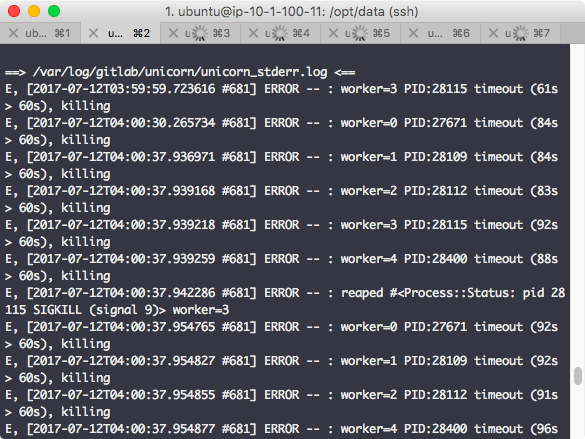
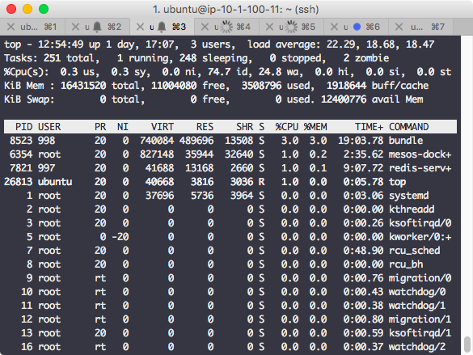
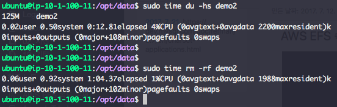
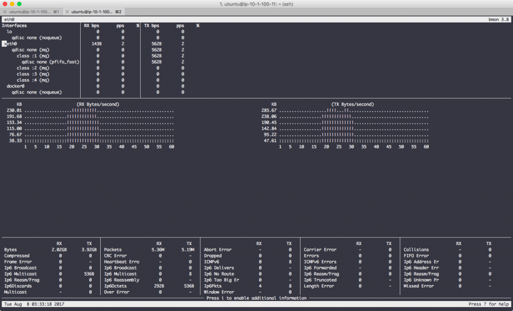
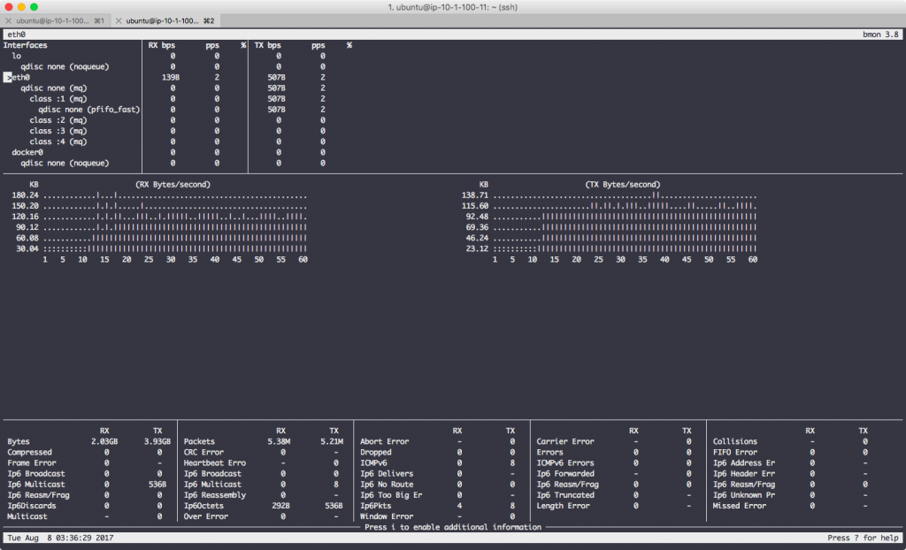
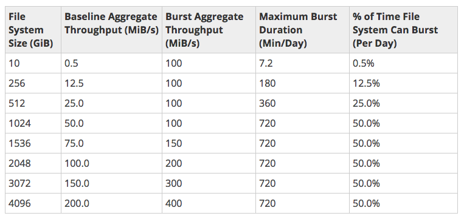

최근에 경험한 장애를 정리한 내용. **내가 뭔가 놓친건지도 모르겠지만** 일단 현상만 봤을 때에는 AWS EFS 사용시 주의는 해야할 것 같다. 이미 만들어져있는 구조를 변경하기는 쉽지 않지만 공용 storage를 다른 걸로 교체하거나 파일 저장을 다른 방식으로 전환할 필요가 있음.

 

### 1\. 사건의 시작

구성되어 있는 시스템을 설명하면 여러개의 VM이 서로 공유할 수 있는 storage가 필요해서 AWS EFS를 이용 NFS로 마운트를 해두었다. AWS의 가이드대로 NFS version은 4.1이고 buffer는 1MB로 설정된 상태.

시스템 위에 gitlab이 docker container로 올라가 있고 마운트 되어있는 EFS를 이용하고 있었는데 갑자기 gitlab 서비스가 죽기 시작했다. 로그를 확인해보니 아래 그림처럼 unicorn의 worker들이 timeout에 걸려서 죽거나 다시 올라오질 못하는 걸 확인

 

### 2\. 왜 이래?

Container니까 서비스 스택은 고정된 형태로 동작하는거라 다시 올리면 살아 돌아오거나 뭔가 다른 반응을 보일거라 생각했는데 1과 같은 현상이 반복되기에 container가 돌고 있는 host에서 top을 찍어봤더니 이랬다.

Load average는 미친듯이 높은데 cpu usage는 좁쌀만하다. 그러니까 cpu는 놀고 있는데 대기 프로세스는 엄청 많다는 얘기. Cpu가 힘들어하는 작업이 많아서 벌어진 문제라면 scale up, out을 하거나 무거운 작업이 뭔지 파악해서 잘게 쪼개는 방법을 생각해보면 되겠는데 이런 상태는 프로세스들이 어딘가에 묶여있을 가능성이 높다고 생각했다. 그리고 EFS가 NFS로 마운트되어 있으니 network i/o가 원인일지도 모르겠다고 의심함

 

### 3\. 측정해보자

EFS를 의심한 이유는 실제 마운트된 경로에 파일을 쓰거나 읽었을 때 느리다는 걸 체감한 경우가 많았기 때문인데 그래서 어느 정도인지 정확히 측정해보기로 했다. 일단 아래 그림처럼 마운트된 특정 디렉토리의 사이즈를 읽고 삭제하면서 동시에 bmon으로 측정. 125MB 짜리 디렉토리 사이즈 측정하는데 12초 정도 걸렸고 삭제하는데에는 1분이 넘게 소요되었다. 체감한 것 만큼 느리다.

아래 그림처럼 디렉토리 사이즈를 확인하는데 RX, TX 모두 초당 300KB를 넘지 못한다. 가운데에 있는 그래프가 종모양으로 시간축 앞뒤로 비어있는 이유는 디렉토리 사이즈 확인 전후로는 별 다른 작업이 없었기 때문.

디렉토리 삭제시에는 어떤지 아래 그림을 보자. 일반적으로 read 보다 write가 느린 것처럼 디렉토리 사이즈 확인할 때 보다 느리다. RX, TX 모두 150KB/s를 넘지 못함.

 

### 4\. AWS EFS의 performance

EFS에서 작업되는게 느리다는 것도 체감했고 실제 측정한 것도 그렇다. 그렇다면 정말 EFS의 performance가 떨어지는 것일까? EFS의 [performance 문서](http://docs.aws.amazon.com/efs/latest/ug/performance.html)를 보니 일반적인 경우에 어떻다라는 내용은 모르겠지만 사용 용량별 burst mode로 동작하는 수치들에 차이가 있음을 알 수 있었다. (아래 그림)

예를 들어, EFS를 10GB 정도 사용하고 있는 경우 베이스라인인 0.5MB/s 보다 낮은 I/O가 발생할 경우 credit이 충전되고 그 credit을 소비하면서 burst mode로 동작할 수 있는 최대 시간은 하루에 7.2분, 그리고 그 시간동안 throughput은 100MB/s 이다. 장애가 발생한 시스템에서 사용중인 EFS의 사이즈는 8GB 정도였는데 맞는 것인지는 모르겠지만 credit을 다 소진한 경우에 AWS에서 베이스라인 정도로 성능을 제한하는 것이라면 어느 정도 설명이 된다고 본다.

 

### 5\. 대응은 어떻게?

다른 사용자들은 어떨까 싶어서 확인해보니 reddit에 이런 thread가 있더라.

https://www.reddit.com/r/aws/comments/6eeu60/terrible\_efs\_performance/

뭐 이런저런 얘기 도중에 재미있는 부분이 눈에 들어왔는데 burst mode를 위해 dummy 파일을 쌓아두고 쓴다는 내용. 1TB를 넣어두면 베이스라인은 50MB/s이니 그것보다 낮게 사용되면 하루에 720분은 100MB/s로 사용 가능하다. 그만큼 비용이 발생하니 문제지만.

 

### 6\. 더 살펴볼 내용

NFS의 buffer size를 조정해볼까 생각을 해봤는데 무작정 size를 크게 한다고 성능이 확연하게 좋아진다거나 하는 것 같지는 않다.

참고 : [https://www.linkedin.com/pulse/nfs-performance-tuning-using-rsize-wsize-rahul-vishwakarma](https://www.linkedin.com/pulse/nfs-performance-tuning-using-rsize-wsize-rahul-vishwakarma)

실험을 더 해본다면 이런게 가능할 것 같다. (시간이 되면)

**(1) EC2 instance 하나를 만들어서 붙어있는 disk를 다른 vm이 NFS로 마운트해서 성능 측정**

**(2) Reddit에 있는 글처럼 dummy 파일을 넣어두고 성능이 어떻게 변하는지 확인**
