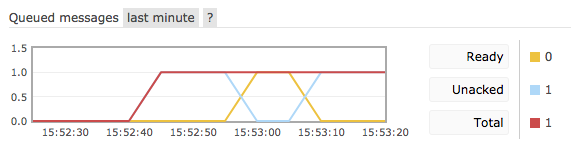

예전에 개발된 모듈을 개선하는 작업을 진행하고 있는데 확장성 및 여러가지 측면에서 고민을 하다가 queue-worker (work queue) 구조를 생각하게 되었다. 코드만으로 어떻게 해볼수도 있겠지만 아래와 같은 이유이었던 것 같다.

1\. 단순 반복작업을 수행하기만 하면 된다.

2\. 빨리 처리될수록 좋지만 그렇다고 실시간 처리가 필요한 것은 아니다.

3\. 특정 시점에 처리할 작업이 늘어날 수 있지만 일반적으로는 적은 수의 service instance만 필요하다.

4\. 서비스할 곳이 많아지면 처리할 작업의 수도 늘어난다.

일단은 요청에 대한 처리를 동기로 맞출 필요는 없기 때문에 작업을 queue에 쌓아두고 여건이 되는대로 worker가 처리하면 될 듯 싶다. 상황에 따라 동일한 로직을 갖는 worker를 늘리거나 줄이면 확장도 편리해질 것 같고.

### AWS SQS vs RabbitMQ

MQ나 message broker로 많이 언급되는건 RabbitMQ와 Kafka인데, 매우 빠른 처리속도가 필요한 것은 아니고 이미 어느정도 알고 있는 RabbitMQ를 써볼까 싶었다. 다시 구축하는게 귀찮아서 찾아보니 SQS가 눈에 들어왔는데 가격도 저렴하고 구축이나 관리 측면에서 편의성은 좋다는 생각이 들었지만 말그대로 너무 심플해서 polling 방식으로만 가능한데다가, worker가 여러개인 경우 message 분배의 문제, message를 가져가서 작업하다 잘못된 경우 message 처리 등을 직접 해야할 것 같아서 고려하지 않기로 했다.

### 보내고 받는다

Queue의 개념이 그러하듯이 RabbitMQ도 단순하게 보면 비슷한 기능을 수행한다.

'Queue로 message를 보내고 (쌓고) queue에서 message 받기 (꺼내기)'

Queue는 하나가 아닐 수 있으므로 '어디로' 보내고 '어디서' 받아오느냐를 지정해야 하는데 RabbitMQ에서는 routing key로 구분하게 된다.

### Acknowledgement

Consumer가 message를 받아가면 잘 받았다고 RabbitMQ에게 알려주는게 ack인데 automatic과 manual 방식을 제공한다. Automatic인 경우 단어의 의미처럼 queue에서 message를 꺼내 consumer에게 전달하면 consumer 쪽에서의 처리와 관계없이 ack를 받은 것처럼 동작하고 message는 삭제할 것으로 분류된다. Manual 방식은 message를 제대로 받았으니 삭제해도 된다고 consumer가 RabbitMQ에게직접 ack를 전달하는 방법이다.

### Worker가 죽는다면?

Worker (consumer)가 message를 받아서 정해진 작업을 수행하는 중에 무슨 문제가 생겨서 죽거나 연결이 끊어지면 어떻게 될까? Automatic ack를 사용하도록 되어있다면 message가 이미 전달된 상태이므로 queue에는 없고, worker에 다른 장치가 되어있지 않다면 message는 유실될 것이다. 이런 경우 worker가 전달받은 message에 대한 작업을 완료하고 ack를 전달하는 방식으로 worker를 구현하면 message 유실을 막을 수 있다. RabbitMQ는 ack를 받기 이전에 message를 전달했던 consumer와의 연결이 끊어지면 re-queue 하도록 되어있기 때문이다. 매우 좋은 기능이라고 생각한다.

\<그림 : message가 전달되고 나서 ack 이전에 consumer가 끊어졌다가 다시 연결된 경우\>

### Message dispatch

이제 확장에 대해서 생각을 해봐야 한다. 처음에 기술했듯이 특정 시점에 동일한 형상의 worker instance를 추가할 필요가 있는데 이 경우 message는 여러개의 worker에 어떤 방식으로 전달되는 걸까? RabbitMQ는 기본적으로 round robin 방식으로 message를 worker에 순차적으로 돌리도록 되어있다. 일반적으로는 round robin 방식으로도 충분할 수 있는데 worker 형태이기 때문에 특정 작업은 시간이 좀 더 걸릴수도 있고, 다른 worker는 놀고 있는데도 불구하고 작업중인 worker에 message가 전달되는 불상사가 생길수도 있다. 이래서 줄을 잘 서야 하는것인가... 이런 비효율을 막기 위해 RabbitMQ에는 QOS 설정이 가능하도록 되어있다. Message가 특정 consumer에만 몰리지 않게 잘 분배해서 전체적으로는 성능을 올리겠다는 의미로 이해하면 되겠다. QOS 설정시 prefetch count를 알려줘야 하는데 (여기서 prefetch count란 ack가 RabbitMQ에 전달되기 전에 - worker 입장에서 보면 message가 다 처리되기 전 - consumer가 받을 수 있는 message의 갯수를 의미), prefetch count를 1로 설정하게 되면 ack 이전에 받을 수 있는 message는 1이므로 현재 작업중인 worker는 건너뛰고 다른 worker에 message 전달을 시도하게 될 것이다. 합리적이다.

### 조건에 따라 여러 개의 queue에 message를 보내고 싶다면?

나의 경우에는 한 번에 queue를 여러개 사용하지 않아도 될 것 같지만 혹시 그럴 필요가 생길지도 모른다. (여러 개의 queue를 사용한다는 것은 consumer를 여러 종류로 구분해서 다른 처리를 하겠다라는 의미로 생각하고 있다. 물론 동일한 consumer 여러개라도 queue를 여럿으로 분리해서 쓰지 못하는 것은 아닐뿐더러 성능 측면에서는 혹시 어떤 이점이 있을지도 모르겠다.) Routing key로 queue를 구분해서 message를 전달하는 방식을 사용하게 되면, 조건에 따라 queue 여기 저기로 보낼 필요가 있을 때 producer의 구현 코드가 좀 지저분해질 수 있을 것 같다. (물론 구조적으로 좀 유연하게 만들수는 있겠지만) 이런 경우 고민없이 exchange를 활용하면 될 것 같다.

### Exchange

RabbitMQ는 기본적으로 no named exchange를 사용하도록 되어있다. 사실 routing key로 queue를 직접 지정해서 message를 전달하고 받는 방식도 그렇다. (direct exchange) RabbitMQ에서 제공하는 exchange는 종류가 direct, topic, headers, fanout 네가지.

Direct exchange는 그림처럼 routing key (명칭은 동일하지만 위에서처럼 queue 이름이 아니라 binding key)에 따라 바인딩 되어있는 queue에 message가 전달된다.

\<출처 : https://www.rabbitmq.com/tutorials/tutorial-four-python.html\>

Topic은 direct 보다는 더 다양한 조건(패턴)으로 queue를 바인딩해서 message를 전달하는 방식 (아래 그림의 패턴에서 \*는 하나의 단어, #은 없거나 하나 이상의 단어와 매핑)

\<출처 : https://www.rabbitmq.com/tutorials/tutorial-five-python.html\>

Headers는 message에 포함될 headers 속성값에 따라 message를 어디로 보낼지 결정하는 방식이다. 마지막으로 fanout exchange를 사용하게 되면, exchange에 binding 되어있는 모든 queue로 message가 전달된다.

RabbitMQ를 열면 마주치게 되는 부분들이기도 해서 몇가지 기본적인 내용에 대해서 살펴보고 그 의미들을 생각해봤다. 사용하면서 기술적인 부분에서 문제가 생기거나 운영상의 이슈가 생긴다면 (아마도 그렇겠지만) 또 정리할 예정.
