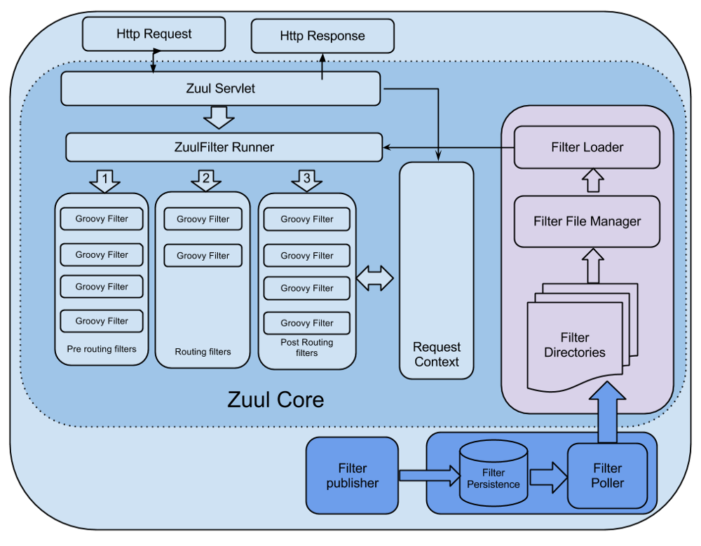
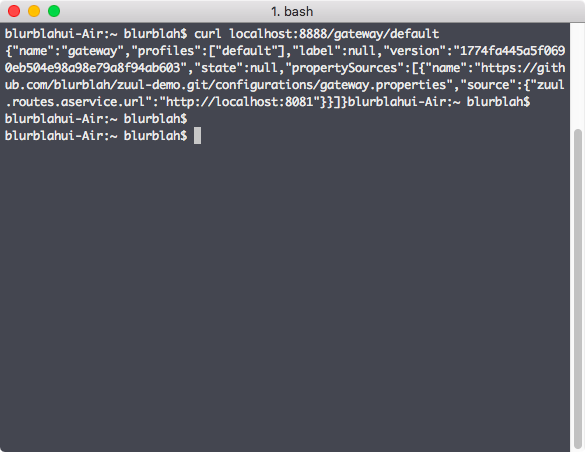
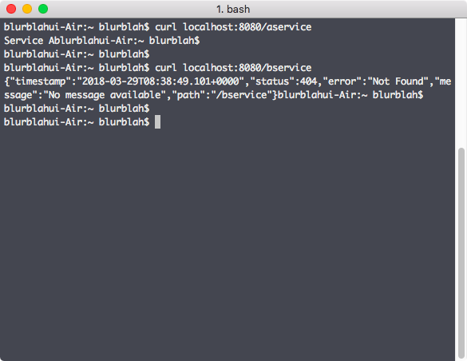
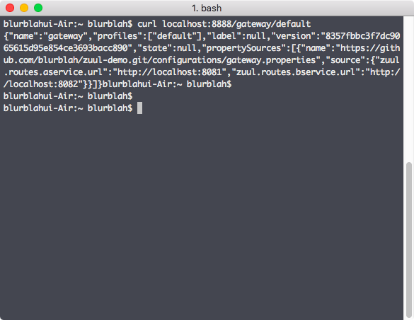
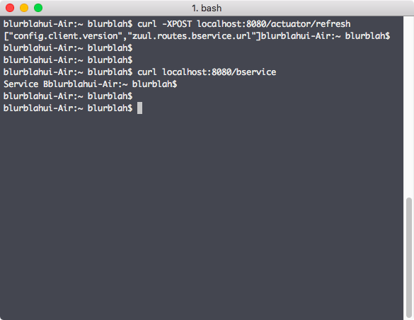

Legacy system을 MSA로 변경하는 작업을 하다보니 흩어져있는 각 application server 들의 인증이나 세션 공유, 그리고 배포와 관련해서 application 추가 혹은 변경시 어떻게 유연하게 대응할 수 있을지 고민을 하게 되었다. 필연적으로 API gateway를 살펴볼 수 밖에 없었는데 그 중 Netflix OSS인 Zuul에 상당히 재미를 느끼게 되었다. 내가 필요한 기능들을 filter로 넣으면 되겠다 싶기도 했고 Netflix tech blog에 기술된 Zuul에 대한 문서([Announcing Zuul: Edge Service in the Cloud](https://medium.com/netflix-techblog/announcing-zuul-edge-service-in-the-cloud-ab3af5be08ee)) 가 그런 느낌을 갖게 만들어 준 듯 하다. 문서에 소개된, Netflix에서 Zuul을 활용하는 사례들만 보면 뭔가 대단히 흥미로운 작업들을 나중에 추가로 해볼 수도 있을 것 같다.

### Zuul은 무엇인가?

고스트 버스터즈 1편을 보면 시고니 위버가 왠 개같이(발음 주의) 생긴 악마한테 빙의되고 나중엔 그걸로 변하는데 그게 Zuul이다. (영화에서는 Zuul로 변하는게 둘인데 하나는 gatekeeper, 하나는 keymaster)

<iframe src="//www.youtube.com/embed/lg7MAacSPNM" width="560" height="314" allowfullscreen="allowfullscreen"></iframe>

Zuul은 문지기 정도의 역할이라 보면 되겠다. 이것과 비슷하지만 또 다르게 Netflix의 Zuul은 dynamic routing 등을 수행할 수 있는 gateway 서비스. Routing 기능뿐만 아니라 http 요청과 응답 사이에서 동작하는 filter를 지원함으로써 filter 구현내용에 따라 더 다양한 기능을 추가할 수 있고 전체적으로 유연한 서비스 구성이 가능하게 될 것 같다. 추가로 Spring boot 에서 몇가지 Netflix OSS (Zuul, Ribbon, Eureka, Feign, ... (Feign은 Netflix OSS project에서 분리된 듯))들을 지원하고 있기 때문에 Spring boot 프로젝트에서 원하는 spring cloud package에 대한 dependency 추가해서 코드 몇 줄 추가하는 것만으로도 간단하게 시작해 볼 수 있다.

### Zuul에서의 filter

Zuul에서 filter의 기능과 역할을 잘 이해하기 위해 Zuul core의 구조를 먼저 확인해보는게 좋을 것 같다.

[](http://13.125.231.217/wp-content/uploads/2018/03/zuul_architecture.png)
\<출처 : https://medium.com/netflix-techblog/announcing-zuul-edge-service-in-the-cloud-ab3af5be08ee\>

참고로 위 그림은 Zuul 1.x의 core 그림으로 servlet을 확장해 사용하는 것처럼 보이지만 Zuul 2.x에서는 Netty 기반으로 수정되었기 때문에 실제 현재의 구조와는 다르겠지만 컨셉을 이해하는데 문제는 없을 것 같다. 그림을 보면 http 요청과 응답에 대한 처리는 servlet이 담당하고 요청과 응답 사이에서 filter를 실행할 수 있게 되어있다. Filter는 servlet과 request context를 공유하기 때문에 request context를 통해 요청과 응답의 내용을 파악할 수 있고 그에 따른 적절한 조치를 취할 수 있다. 또는 여러 filter 간 상태 공유를 위해서도 request context를 사용할 수 있다. Filter는 ZuulFilter를 extends 해서 java나 groovy로 구현하면 되는데, 아래의 4가지는 필수적으로 구현을 해주어야 한다.

**1\. Type (동작 시점과 기능에 따라 pre, route, post, error 네가지 type이 있음)**

**2\. Execution order (같은 종류의 filter 들 사이에서 동작할 순서로 낮을수록 순위가 높음)**

**3\. Criteria (Filter가 동작할 조건. 예를 들어, 특정 request url에 대해서만 동작하도록 할 수 있음)**

**4\. Action (Filter가 수행할 작업)**

그림에도 묘사되어 있지만 재미있는게 특정 디렉토리를 지정해서 주기적으로 해당 디렉토리에 있는 filter 들을 읽어들일 수 있다. 이렇게 되면 runtime에서 filter의 추가, 변경이 가능할 것이다.

### Authentication, dynamic routing

Zuul을 통해서 바로 실험해보고자 했던 기능은 authentication과 dynamic routing이다. API gateway 하위에 있는 backend application으로 요청을 전달하기 전에 인증을 통해 접근 권한에 따라 적합한 처리를 할 수 있는 pre filter를 추가하면 service 전체에 대한 authentication은 편하게 해결할 수 있을 것 같았는데 dynamic routing의 경우 조금 고민을 하게 되었다. Application의 endpoint를 추가, 삭제, 변경할 수 있어야 하는데 복잡하진 않지만 groovy로 처리해야 한다는게 번거롭다 생각되었고 spring-cloud-netflix 에서는 문제가 있는 것 같은 [이슈](https://github.com/spring-cloud/spring-cloud-netflix/issues/223)도 발견. (이슈를 보면 dynamic script reloading은 지원하지 않는다는 내용이 있지만 2015년도. 그 때도 되는 기능이었는지, 안되다가 지원이 된건지 모르겠으나 현재는 zuul의 filter loader를 사용하면 된다. Spring boot 2.0.0 / Spring cloud Finchley.M9)

### Dynamic routing을 좀 더 편하게 할 수는 없을까?

Zuul에서 routing 자체는 Netflix OSS인 Ribbon을 통해 properties 추가만으로도 쉽게 가능하다. (@EnableZuulProxy annotation을 쓰면 설정만 하면 된다) 다만 properties에 routing 경로가 고정되어 있다 보니 추가, 삭제 또는 변경할 경우 restart 혹은 deploy 과정이 필요하고, 어차피 API gateway를 구성한다면 해야하겠지만 이중화 구성이 필수적일 수 밖에 없다. 그러니까 load balancer 아래에 여러개의 gateway를 두고 routing 설정 변경시마다 rolling update 같은 방식을 적용해야만 하는데 spring cloud config를 함께 사용하면 이런 번거로운 과정의 반복을 피할 수 있다. (물론 배포과정을 자동화해버리면 그렇게 번거로울 것도 없겠지만 더 간단한 방법이 있으므로. 그리고 설정 변경만으로 배포를 다시 해야한다는 것도 좀 불편한 일이다)

### 코드로 살펴보자

샘플이기도 하고 비즈니스 로직 같은게 들어있지도 않아서 코드랄 것도 없지만, 또 그만큼 간편해진건 Spring boot과 Netflix 덕분이다. [Repository](https://github.com/blurblah/zuul-demo) 참조.

**1\. Config server**

Config server는 설정 정보를 중앙에서 관리하기 위한 것으로 아래와 같은 spring-cloud-config-server에 대한 dependency 추가가 필요하다. 반대로 설정 정보를 config server에 위임하고자 하는 서비스는 client가 되어야 하므로 spring-cloud-config-client 또는 spring-cloud-starter-config package가 필요.

```
<dependency>
    <groupId>org.springframework.cloud</groupId>
    <artifactId>spring-cloud-config-server</artifactId>
</dependency>
```

그 다음으로는 entrypoint가 되는 Application class에 @EnableConfigServer만 추가하자.

```
@EnableConfigServer
@SpringBootApplication
public class ConfigServerApplication {
	public static void main(String[] args) {
		SpringApplication.run(ConfigServerApplication.class, args);
	}
}
```

지금은 다른 동작을 수행할 필요가 없기 때문에 properties만 조금 추가해주면 완료.

```
server.port=8888
spring.cloud.config.server.git.uri=https://github.com/blurblah/zuul-demo.git
spring.cloud.config.server.git.search-paths=configurations
```

설정에서 중요한 것은 spring.cloud.config.server.git.uri 항목이다. Spring cloud config는 설정 내용을 관리할 수 있는 backend로 git, file system, vault, jdbc 등을 지원할 수 있게 해두었는데 사실 간단한게 시작할 수 있는건 local file이지만 어차피 데모 프로젝트를 저장소에 등록해 두어서 git으로 진행했다. Vault 까지는 필요가 없을수도 있을 것 같은데 DB로 관리하는 건 시도해볼 생각. 저장소나 파일로 설정파일을 관리할 경우 config client가 server에 연결해서 가져가게 될 설정파일은 보통 이렇다.

application.properties (yml 가능)

$\{spring.application.name\}.properties (역시 yml 가능하고 client의 name에 따라 파일명이 달라짐)

여기서 application.properties는 모든 client가 참조하게 되므로 공통 속성들을 넣어두면 좋다. 위 두 가지 이외에도 active profile 이름에 따라서도 달라질 수 있으니 상세 내용은 [문서](https://cloud.spring.io/spring-cloud-static/spring-cloud-config/2.0.0.M9/single/spring-cloud-config.html)를 참고하자. 여기서는 Zuul proxy로 사용할 application만 config client로 동작시킬거라 저장소에는 간단하게 gateway.properties 파일만 추가해두었다.

**2\. Gateway**

Zuul를 사용한 간단한 API gateway도 config server처럼 간단하게 시작해볼 수 있다. 우선 dependency에 아래 두가지를 추가해주고, (위에 기술했듯이 설정을 config server에서 받아올 것이기 때문에 config server 입장에서는 client가 되어야 한다)

```
<dependency>
    <groupId>org.springframework.cloud</groupId>
    <artifactId>spring-cloud-starter-netflix-zuul</artifactId>
</dependency>
<dependency>
    <groupId>org.springframework.cloud</groupId>
    <artifactId>spring-cloud-starter-config</artifactId>
</dependency>
```

Zuul 사용을 위해 @EnableZuulProxy annotation을 추가한다.

```
@EnableZuulProxy
@SpringBootApplication
public class GatewayApplication {

	public static void main(String[] args) {
		SpringApplication.run(GatewayApplication.class, args);
	}
}
```

다음으로는 역시 properties만 추가하면 되는데 보통 기본으로 존재하는 application.properties 대신 bootstrap.properties를 추가해서 사용해야 한다. application.properties는 spring boot application이 로드된 이후에 설정을 읽어오게 되고 application의 bootstrap 과정에서는 bootstrap.properties를 읽어들이게 되기 때문. bootstrap.properties 파일에서 application name을 지정(config server에서 읽어들일 properties 파일을 특정하기 위해 필요)하고 config server의 uri를 추가한다.

```
spring.application.name=gateway
spring.cloud.config.uri=http://localhost:8888

management.endpoints.web.exposure.include=*
```

Config server 역시 같은 host에서 돌릴 것이고 port는 8888로 띄우게 해두었기 때문에 localhost:8888로 config server 위치를 잡아주었다. 마지막에 있는 endpoint exposure 설정은 일반적으로 필요한 것들만 열어두는게 맞지만 테스트 용도이니 모두 열어둔다. Zuul proxy 혹은 spring-cloud-starter-config에 dependency가 걸려있는 것인지 Actuator가 기본으로 포함되어 있는 듯 한데 (없으면 추가하려고 했었음. 나중에 [Spring cloud server 저장소](https://github.com/spring-cloud/spring-cloud-config/blob/v2.0.0.M9/spring-cloud-config-server/pom.xml)를 찾아보니 dependency로 Actuator가 잡혀있다), 나중에 /actuator/refresh 라는 endpoint를 사용할거라 모두 열어두었다. (기본으로는 /actuator/refresh가 매핑되지 않음)

**3\. 기타**

Zuul의 routing 설정이 dynamic 하게 변경되는 걸 실험할거라 routing 할 backend application을 만들어준다. 나의 경우엔 단순하게 Service A라는 문자열을 리턴하는 REST API 하나와 Service B를 리턴하는 API를 제공하는 서비스까지 두 개의 spring boot application을 만들어두었다. 저장소의 a-service 모듈은 8081 port를, b-service 모듈은 8082 port를 listen 하도록 되어있다. 그리고 config server가 관리하는 설정파일 (저장소의 configurations/gateway.properties)에는 우선 a-service만 라우팅하도록 설정.

```
## gateway.properties ##
zuul.routes.aservice.url=http://localhost:8081
#zuul.routes.bservice.url=http://localhost:8082
```

### Run!

Config server를 먼저 실행시키고, gateway와 다른 backend application 2개를 모두 동작시켜본다. 시험삼아 설정파일이 제대로 로드되었는지 확인해보자. 아래 그림처럼 config server에 요청을 보내면 설정에 대한 응답이 날라오게 된다.

[](http://13.125.231.217/wp-content/uploads/2018/03/config-server-properties.png)

Request url은 여러가지 format이 있지만 /$\{spring.application.name\}/$\{spring.profiles.active\} 이런 형태로만 간단히 써도 된다. Application name이 gateway이고 active profile은 따로 지정한게 없으니 default로 넣으면 config server가 관리하는 설정파일 중 gateway.properties의 내용을 보여준다. Properties 파일에는 현재 a-service에 대한 routing 설정만 되어있으므로 Zuul이 제대로 동작하는지 확인하기 위해 zuul에 요청을 보낸다. 현재 routing의 이름이 aservice라고 되어있으니 localhost:8080/aservice를 요청하면 a-service에 정의된 API가 호출되어야 하는게 정상. 아래 그림처럼 Zuul을 통해 a-service routing은 정의된대로 동작하지만 b-service에 대한 요청은 routing 설정이 되어있지 않기 때문에 404 응답이 날라온다.

[](http://13.125.231.217/wp-content/uploads/2018/03/call_a_service-1.png)

위에서 기술한대로 Zuul에 route filter를 추가해서 동적으로 로드되게 하거나, route 설정을 추가해서 처리한다면 gateway를 다시 packaging 해서 배포하는 방법을 써야 한다. (또는 새로운 API를 정의해 사용하는 등의 다른 방법도 있을 수 있다) 하지만 config server를 사용하고 있으므로 간단하게 처리할 수 있다. 우선 config server에서 관리하는 gateway.properties (저장소에 있는) 파일에 b-service에 대한 routing url 정보를 추가해서 commit / push 한다. (Github에 있으므로 browser에서 직접 수정해서 처리해도 된다.) 이후에 config server가 변경된 gateway.properties 파일을 제대로 바라보고 있는지 확인해보자. 아까처럼 config server에 요청을 보내보면 아래 그림처럼 추가된 b-service에 대한 routing url 정보까지 볼 수 있다.

[](http://13.125.231.217/wp-content/uploads/2018/03/config-server-added-routing.png)

Config server에서는 변경된 설정을 갖고 있기 때문에 Zuul 쪽도 바뀐 설정대로 바로 동작하기를 기대할 수도 있지만 실제 동작은 그렇지 않다. 하나의 안전장치로 생각할수도 있는데 actuator를 통한 refresh 요청을 Zuul에 날려줘야 변경된 설정값을 반영하게 된다.

[](http://13.125.231.217/wp-content/uploads/2018/03/zuul-refresh.png)

위 그림처럼 refresh 명령을 POST로 날려주면 변경된 설정에 대한 간략한 정보가 표시되고 그 이후에 Zuul에 b-service에 대한 요청을 보내보면 결과를 확인할 수 있다. Refresh는 Zuul에 따로 정의한 적이 없지만 actuator를 통해 동작이 된다. 일반적으로는 bean이나 원하는 component에 @RefreshScope을 지정해서 원하는 bean만 원하는 시점에 reload 해서 사용한다.

### 정리하면...

Config server를 통해 Zuul의 routing 설정 변경을 package 내의 코드 한 줄 바꾸지 않고 적용할 수 있다. 코드가 바뀌지 않기 때문에 다시 build 할 필요도, 배포할 필요도 없어서 간편하게 사용하기 좋다고 생각한다. 물론 /actuator/refresh를 호출하기 위해 endpoint를 다 열어둔 것도 문제이고 properties 내의 설정에 민감한 내용이 포함될 가능성이 많기 때문에 공개 저장소를 이용하는 방식에도 문제가 있다. Endpoint 노출과 관련해서는 간단한 형태부터 조금 고급진 형태의 인증까지 보완책들이 spring 문서에 기술되어 있고, properties 파일에 대한 관리는 저장소 형태 보다는 다른 방법을 사용하는게 낫겠다는 생각을 하고 있다.

Discovery 서비스에 사용할 수 있는 Eureka (역시 Netflix OSS)를 함께 사용하면 좀 더 재미있고 유용한 기능들을 확인할 수 있는데, config server를 Eureka에 등록해서 사용하는 방법도 있다. Eureka에 config server를 등록하게 되면 config client인 application들이 config server의 uri를 고정할 필요가 사라지는데 중간에 Eureka를 한 번 더 거치게 되는 것에 대한 손해는 있지만 config server의 재배치나 추가, 변경에 따른 client 쪽 추가 작업이 사라지게 되므로 더 유연한 구성이 가능할 수 있다고 생각한다.

Eureka를 Zuul과 함께 사용하는 것에 대해서도 추가로 정리해볼 생각이다.

 

참고 #1 : [https://cloud.spring.io/spring-cloud-static/spring-cloud-config/2.0.0.M9/single/spring-cloud-config.html](https://cloud.spring.io/spring-cloud-static/spring-cloud-config/2.0.0.M9/single/spring-cloud-config.html)

참고 #2 : [https://medium.com/netflix-techblog/zuul-2-the-netflix-journey-to-asynchronous-non-blocking-systems-45947377fb5c](https://medium.com/netflix-techblog/zuul-2-the-netflix-journey-to-asynchronous-non-blocking-systems-45947377fb5c)

참고 #3 : [http://kerberosj.tistory.com/228](http://kerberosj.tistory.com/228)
