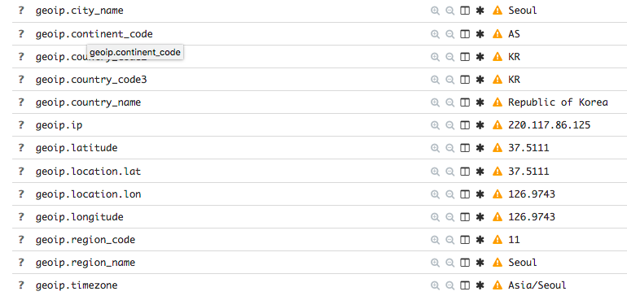
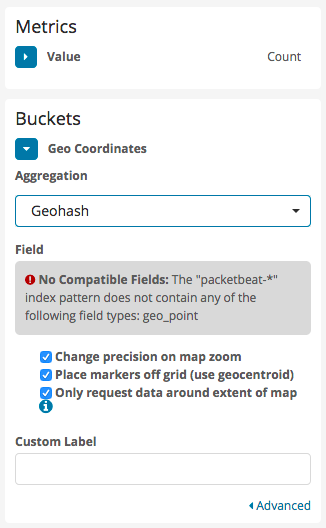
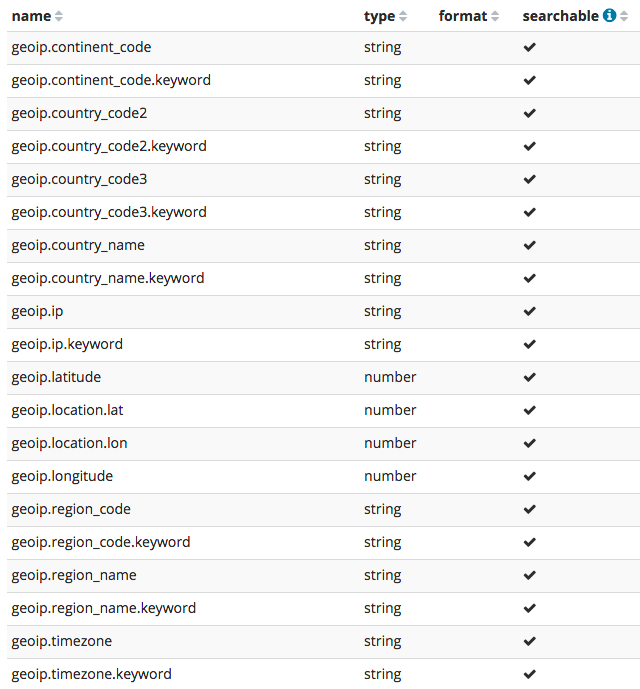
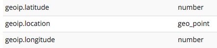
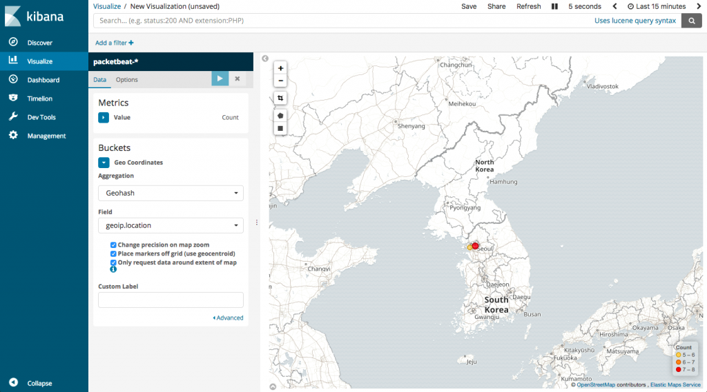
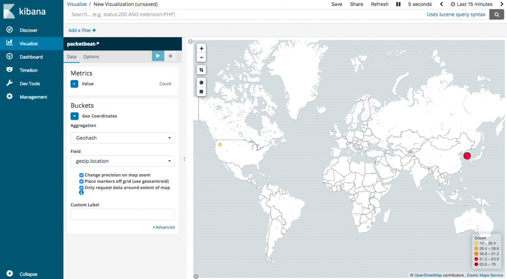

서비스를 구성하면서 살펴보다 보면 어떤 서비스, 어떤 페이지에 request가 많은지 그 요청들은 어느 곳에서 많이 발생하는지 궁금할 때가 있다. 글로벌을 타겟으로 하는 서비스인 경우 특히 그럴 것이고 혹은 의도치 않은 곳에서 이상한 형태의 요청이 빈번할 경우 차단할지 판단하기 위해 필요할 수도 있다. Google Analytics 같은 서비스의 경우 이러한 요구사항을 간편한 방법으로 어느정도 해소할 수 있지만 어차피 여러가지 분석 용도로 ELK를 사용하고 있으니 packetbeat를 이용해보기로 했다.

### Packetbeat?

ELK stack에서 로그 수집용으로 filebeat를 많이 사용하는데 filebeat는 특정 로그파일을 수집해서 logstash나 elasticsearch 등으로 전송하는 역할을 수행한다. Packetbeat는 로그파일 대신 network packet 데이터를 수집해서 전송할 수 있으며, 각종 프로토콜 별로 데이터를 분류해서 수집할 수 있게 되어있다.

### 테스트용 ELK 구성

우선 packetbeat를 사용해서 어느 지역에서 요청이 들어오는지를 보고 싶은 게 1차 목표였는데 실제 운영중인 ELK를 건드리고 싶지는 않아서 새로운 VM에 Ansible로 다시 구성했다. 미리 만들어둔 5개의 role을 clone해서 아래와 비슷한 형태로 playbook을 만들고 실행하면 된다. ELK가 동시에 여러 종류의 beat에서 전달되는 데이터를 받아야하니 다른 문제가 있는지를 보기 위해 filebeat도 같이 구성했다.

#### 1\. Roles

[https://github.com/blurblah/ansible-role-elasticsearch](https://github.com/blurblah/ansible-role-elasticsearch)

[https://github.com/blurblah/ansible-role-logstash](https://github.com/blurblah/ansible-role-logstash)

[https://github.com/blurblah/ansible-role-kibana](https://github.com/blurblah/ansible-role-kibana)

[https://github.com/blurblah/ansible-role-docker](https://github.com/blurblah/ansible-role-docker) (Dependency)

[https://github.com/blurblah/ansible-role-filebeat](https://github.com/blurblah/ansible-role-filebeat)

#### 2\. Playbook

```
- hosts: elk_test
  become: yes
  roles:
    - role: elasticsearch
      cluster:
        name: test-es
    - role: logstash
      logstash_loglevel: debug
    - role: kibana
      server_name: test-kibana

- hosts: elk_test
  become: yes
  roles:
    - role: filebeat
      logstash_host: '{{ ansible_default_ipv4.address }}'
      logstash_port: 5044
      enable_kibana_dashboard: true
      kibana_host: '{{ ansible_default_ipv4.address }}'
      kibana_port: 5601
      prospectors:
        - { type: syslog, files: ['/var/log/auth.log'] }
```

### Packetbeat 구성

Packetbeat도 역시 Ansible role로 만들어서 ELK 구성과 비슷한 형태로 간단히 완료. Role은 [github](https://github.com/blurblah/ansible-role-packetbeat)에서 가져오면 되고 요청을 분석하고 싶은 서버를 대상으로 아래와 같은 형태로 playbook을 만들어서 실행했다.

```
- hosts: test_proxy
  become: yes
  roles:
    - role: packetbeat
      packetbeat_name: test_packetbeat
      packetbeat_protocols:
        - { type: tls, ports: [443] }
      packetbeat_loglevel: debug
      out_logstash:
        host: '{{ hostvars["elk_test"].ansible_host }}'
        port: 5044
```

내가 분석하고자 했던 서버는 nginx로 되어있는 reverse proxy 였는데 인증서가 적용되어 있었기 때문에 type을 tls로 port는 443 하나만 넣어서 지정했다.

### Geoip filter

Packetbeat 까지 구성해서 데이터가 수집되는 것을 확인해보면 (Kibana에서 index pattern 생성까지 한 경우) 요청 ip, url, protocol 등은 표시되지만 위치 정보에 대한 내용은 없다. Logstash의 geoip filter는 수집된 정보 중 ip와 내부 DB에 매핑된 정보를 가지고 geoip라는 field를 생성해주는 역할을 수행한다고 해서 아래처럼 logstash pipeline 경로에 filter를 설정해주었다.

```
filter {
  if [@metadata][beat] == "packetbeat" and [client_ip] and [client_ip] !~ /^10\./ {
    geoip {
      source => "client_ip"
    }
  }
}
```

Filebeat 등 다른 beat들은 geoip filter를 적용하지 않을 것이기 때문에 metadata를 이용해 거르게 했다. Private ip의 경우 위치 정보에 대해서 매핑된 정보가 없기 (알 수도 없고) 때문에 내 환경에서 요청이 발생하는 10.0.0.0/16 대역에 대해서도 적용하지 않기로 했다. Private ip에 대해서 처리를 하게 되면 아래와 같은 오류가 발생한다.

```
[2018-04-18T04:52:51,124][DEBUG][logstash.filters.geoip   ] IP 10.x.x.x was not found in the database {:event=>#<LogStash::Event:0x65726e3c>}
```

Filter 설정은 좀 더 살펴보고 더 효율적으로 수정할 필요는 있을 것 같다.

### Geoip field 인식 문제

Filter 설정 후 logstash를 restart 하고 나서 kibana 쪽에서 살펴보니 없던 geoip field 들이 새로 만들어지는건 확인이 되는데 아래 그림처럼 warning이 발생하는 걸 볼 수 있었다.

[](http://13.125.231.217/wp-content/uploads/2018/04/packetbeat-geoip-warning.png)

이전에 데이터 들어오는걸 보겠다고 index pattern을 생성했는데 그 시점의 index에는 없던 field 들이기 때문에 warning이 발생하는 것이라서 index pattern을 제거하고 다시 생성해주는 걸로 문제를 해결

### geo\_point type

Warning이 없어졌으니 kibana의 visualize 메뉴에 가서 map을 추가해 그려볼까 하고 설정을 해보니 아래와 같은 오류가 뜨면서 그려지질 않는다.

[](http://13.125.231.217/wp-content/uploads/2018/04/packetbeat-map-invalid-fieldtype.png)

무엇이 문제인가 싶어서 index pattern에서 field들의 type을 살펴보니 geo\_point type으로 된 field가 보이질 않는다. 이런 부분은 좀 개선이 필요해 보이는데 field 들이 filter에 의해 자동으로 생성되는 것이라 알아서 처리되면 편할 것 같다.

[](http://13.125.231.217/wp-content/uploads/2018/04/packetbeat-fields.png)

이런 경우 elasticsearch에서 생성하는 index에 대한 변경이 필요한데 이미 존재하는 index를 일괄 변경하는 방법도 있을 것 같고 새로 생성되는 index에 대해서 적용할 template을 추가하는 방법도 있을 수 있다. 나의 경우엔 이미 만들어진 index와 데이터가 거의 없는 상태이기 때문에 존재하는 index는 모두 제거하고 template을 추가해서 이후 생성되는 index에 대해서만 field type이 변경되도록 했다. Template을 적용하기 위해서는 아래와 같은 json 파일을 생성해서 elasticsearch에 밀어넣어야 한다. (이전에 index, index pattern 제거하고 진행함)

```
{
  "template": "packetbeat-*",
  "mappings": {
    "_default_": {
      "properties": {
        "geoip": {
          "properties": {
            "location": {"type": "geo_point"}
          }
        }
      }
    }
  }
}
```

Json 생성 후 elasticsearch에게 보내주자.

```
curl -XPUT -H "Content-Type: application/json" localhost:9200/_template/packetbeat_geoip -d@packetbeat_geoip.json
```

다시 packetbeat 로부터 데이터가 들어오기 시작하면 template이 적용된 index가 생성되고 kibana에서 index pattern을 다시 생성해 확인해보면 아래처럼 geoip.location field가 geo\_point type으로 되어있는 것을 확인할 수 있다.

[](http://13.125.231.217/wp-content/uploads/2018/04/packetbeat-geopoint.png)

### 이제 지도를 그리자

오류가 발생하던 부분을 해결했으니 다시 visualize 메뉴에서 지도를 추가해 설정하면 아래처럼 요청 횟수에 따라 색깔별로 표시되는 걸 볼 수 있다.

[](http://13.125.231.217/wp-content/uploads/2018/04/packetbeat-map-kor.png)

VPN에 연결해서 다른 나라로부터의 요청도 제대로 표시되는지 확인해보니 별 문제없이 된다.

[](http://13.125.231.217/wp-content/uploads/2018/04/packetbeat-map-us.png)

 

Packetbeat로부터 들어오는 데이터들을 간단히 살펴보니 사실 지역에 대한 정보 이외에도 쓸만한 내용들이 많다. 요청 url 별로 분석할 때도 유용할 것 같고 protocol type (service) 별로 구분해서 확인하는 것도 쉽게 가능할 것 같다. 그러나 이런 도구들로 분석할만한 서비스를 만들어내는 건 어려운 문제 :)
