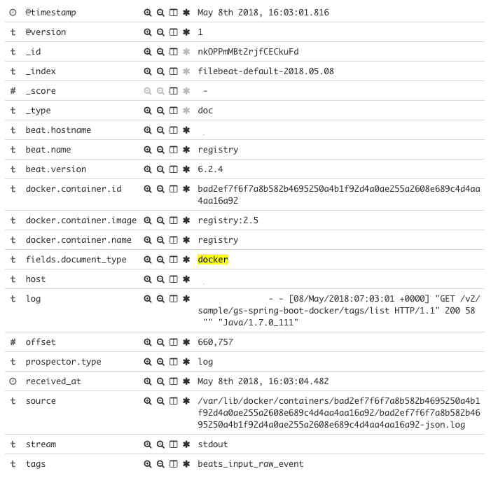
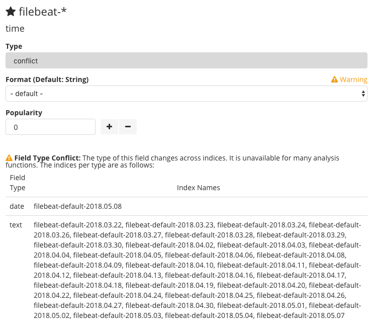

ELK stack을 사용하는 것. 괜찮다고 생각하지만 여전히 쉽지는 않다. 난이도를 떠나서 번거로운 요소들이 있다고 생각되는데 개인적으로 가능한 logstash를 활용하려고 하는게 더 번거롭게 만드는게 아닌가 싶다. 사족이지만.

어찌되었든 Docker container의 로그를 ELK에서 수집하기 위해서는 몇가지 방법을 생각해 볼 수 있을 것 같다.

**1\. Autodiscovery 기능을 활용**

비교적 최근에 만들어진 기능으로 보이는데 내용을 훑어봤을 때 감은 오지만 로그수집 보다는 메트릭 수집의 목적이 강한 것 아닌가 싶다. 결론적으로 잘 되지 않아서 다른 방법을 알아보기로 했다.

https://www.elastic.co/kr/webinars/elasticsearch-log-collection-with-kubernetes-docker-and-containers

**2\. Syslog log driver를 사용하는 방법**

Docker에서 제공하는 log driver 중 syslog가 있는데 syslog를 log driver로 설정한 호스트에서는 container 로그들이 모두 syslog에 쌓이기 때문에 filebeat로 syslog만 수집하면 된다. 하지만 syslog의 다른 로그들과 혼재되면 그걸 골라내는 것도 일일 것 같다.

**3\. Fluentd를 통해 elasticsearch로 로그를 전송하는 방법**

역시 docker의 log driver로 fluentd를 지정해서 모든 container의 로그를 fluentd로 모은 후에 plugin을 이용해 elasticsearch에서 인덱싱하는 방법이 있을 수 있다. Container만 본다면 괜찮은 방법이라고 생각하는데 나의 경우엔 filebeat도 사용해야하는 상황이었기에 기존의 로그수집 방식을 fluentd로 변경해서 통합하거나 두가지를 혼용해야 할 것 같다.

**4\. Volume mount를 이용한 방법**

Docker container 내부에서 로그를 파일로 쌓는 경우 해당 경로를 호스트의 특정 경로와 마운트하고 filebeat가 마운트 된 경로의 로그파일들을 수집하는 방식인데 application을 개발할 때 로그를 파일로 쌓도록 강제해야 하고 로그 경로가 공유되어야 한다는 문제가 있다. 개발 측면에서도 번거롭고 배포 과정에서도 volume 지정을 빼먹으면 안되니 비효율적이라고 생각한다.

**5\. Filebeat에서 add\_docker\_metadata processor를 사용하는 방법**

마지막으로 검토해서 적용한 내용인데 filebeat에서 간단한 설정만으로 기존의 container나 시스템에 변경을 가하지 않고 로그를 수집할 수 있다. [문서(Enriching logs with Docker metadata using Filebeat)](https://www.elastic.co/blog/enrich-docker-logs-with-filebeat)에 의하면 6.0.0 beta1 부터 새로 추가된 기능인 것 같다. Docker container의 stdout 로그들도 실제로는 호스트에 파일로 쌓이고 있기 때문에 해당 파일들을 전송하는 것 같은데 재미있는건 로그외의 container name, image 정보 등도 함께 날라가서 단순히 로그의 내용만 확인하는 데에는 큰 문제가 없다.

### add\_docker\_metadata processor를 사용해보니

위에 링크된 문서를 참고해서 기존에 동작중인 filebeat의 prospector에 몇 줄 추가하고 restart를 하니 언급한대로 로그수집은 간단하게 된다.

```
# Sample prospectors
filebeat.prospectors:

- input_type: log
  paths:
    - /var/log/syslog
  fields:
    document_type: syslog

- type: log
  paths:
    - '/var/lib/docker/containers/*/*.log'
  json.message_key: log
  json.keys_under_root: true
  processors:
    - add_docker_metadata: ~
  fields:
    document_type: docker
```

로그 구분을 위해 사용하던 document\_type이 deprecated 된 field라 custom field에 넣어준 것을 제외하고는 위의 문서의 내용과 동일하다. 로그는 아래와 유사한 형태로 kibana에서 확인할 수 있다.

[](http://13.125.231.217/wp-content/uploads/2018/05/elk-docker-log.png)

Container의 이름도 표시되니 container 이름이나 image로 조회해서 살펴볼 수 있을 것이다. log field에 넘어오는 전체 로그 메세지는 경우에 따라 다시 별도의 field 들로 분류할 필요가 생기겠지만 간단하다.

### time field에서 발생한 conflict

위의 이미지는 이미 문제를 해결하고 난 이후라 문제가 없어보인다. 원래 기본적으로는 time field가 넘어오게 되는데 나의 경우에는 다른 곳에서 filebeat가 보내고 있는 로그가 동일한 인덱스로 생성되고 있는 상황이었고 다른 로그의 time field와 type이 달라서 conflict이 발생하는 걸 볼 수 있었다.

[](http://13.125.231.217/wp-content/uploads/2018/05/elk-docker-log-type-conflict.png)

(기존의 인덱스에 생성되어 있는 time field는 text, docker container 로부터 넘어오는 time field는 date) 이미 만들어진 index의 field type을 변경하는 것은 index 복제, field 변경, re-index 작업 등을 해야하니 무리라고 생각해서 container 로부터 넘어오는 field에만 조작을 가하기로 했다. (이런 경우에는 logstash가 있는게 불편하지만 편하다!?)

```
filter {
    if [fields][document_type] == "docker" {
        mutate {
            convert => { "time" => "string" }
            add_field => [ "received_at", "%{@timestamp}" ]
        }
        date {
            match => [ "time", "ISO8601" ]
            remove_field => "time"
        }
    }
}
```

위와 같이 logstash에 filter를 하나 추가해줬는데 이미 custom field로 document\_type이 날라오고 있으니 구분해서 처리하고 time field를 string으로 변환해봤다. 처음엔 변환만 했는데도 동일한 문제가 생겨서 string으로 변환 후 timestamp로 찍히도록 date filter를 추가하고 time field는 날려버렸다. 차라리 time field를 다른 이름으로 rename 하는게 낫지 않을까도 생각해봤는데 timestamp가 있으니 의미는 없을 것 같다. Convert를 했는데 왜 동일한 문제가 생기는지는 좀 의문.
