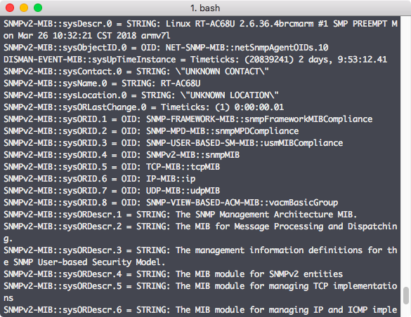

잊을만하면 쏟아지는 T-mobile용 AC1900 짜리 ASUS 공유기. 이쯤이면 'T-mobile 그거'나 'ASUS 그거'라고 불려도 되지 않을까? 대부분 제조사 리퍼제품이거나 open box이거나 그렇지만 성능에 비해 매우 저렴하게 나와서 많이들 주문하는 것 같다. 쳐다보고 있자니 그것들이 쏟아지기 전에 원모델 중 하나(AC68U)를 요즘보다는 비싼 가격으로 구매했던터라 아쉬운 마음 뿐이다.

아무튼 얼마전에 아는 형님이 '그런 공유기' 모니터링 방법을 공유해주셨는데 멀린 펌업 => metric 수집 script 실행 (cron) => influxdb에 저장 => grafana에 표시하는 내용으로 요약할 수 있을 것 같다. 나의 경우 Asus 공식 펌웨어를 쓰고 있기 때문에 멀린 펌웨어로 올리는 과정이 필요한터라 SNMP로 어떻게 해보기로 했다.

### SNMP를 지원하나?

많은 OS, 라우터 등의 장비들이 snmp를 지원하는 것으로 알려져있다. Asus 공유기라고 안될 이유는 없는데 관리 메뉴에는(있을법도 하지만) snmp on/off 라던가 설정에 대한 내용이 없다. 그럼 net-snmp 같은 패키지를 설치해서 돌려야 하는데 공유기가 많이 알려진 배포판 리눅스가 올라간게 아니라서 어떻게 설치할 수 있는지 패키지 이름은 뭔지 알 수가 없다.

### Download master와 ipkg, 그리고 net-snmp의 설치

찾아보니 asus 공유기에서는 debian의 dpkg와 비슷한 ipkg를 사용할 수 있다고 한다. 그런데 이것 역시 기본적으론 설치되어 있지 않고 꼼수를 써야 가능하다. 먼저 공유기 뒷면에 있는 usb 포트에 스틱이든 하드든 꽂아준다. (단, 리눅스이므로 filesystem이 ext4나 ntfs 같은 형태여야 인식 가능) 공유기에서 인식을하면 download master를 설치할 수 있게 되는데 설치를 끝내면 연결한 외부 장치에 ipkg가 설치된다. (mount된 경로에 설치가 되기 때문에 빼면 안된다) ipkg로 net-snmp 설치 후 활성화하면 끝.

```
ipkg update
ipkg install net-snmp
app_set_enabled.sh net-snmp yes
```

### 수집은 어떻게?

SNMP를 통해 정상적으로 정보를 얻을 수 있는지는 간단하게 snmpwalk 등을 이용하면 확인할 수 있겠다.

[](http://13.125.231.217/wp-content/uploads/2018/05/snmp-snmpwalk.png)

지속적으로 정보를 수집해서 db에 쌓아야 하는데 별도로 스크립트를 만들어서 돌리기는 싫고 (이럼 처음부터 스크립트를 만들어 돌리지 굳이 snmp로 할 이유가 없다) 어차피 influxdb를 쓸 생각이었으니 같은 곳에서 만든 telegraf를 써보기로 했다. Telegraf는 docker container로 돌리고 output 설정은 이미 설치되어 있는 influxdb에 맞게, snmp input에 대해서는 아래처럼 해줬다.

```
[[inputs.snmp]]
   agents = [ "xxx.xxx.xx.1:161" ]
   version = 2
   community = "public"

   [[inputs.snmp.field]]
     name = "hostname"
     oid = "RFC1213-MIB::sysName.0"
     is_tag = true
     
   [[inputs.snmp.field]]
     name = "uptime"
     oid = "DISMAN-EXPRESSION-MIB::sysUpTimeInstance"
     
   [[inputs.snmp.table]]
     name = "interface"
     inherit_tags = [ "hostname" ]
     oid = "IF-MIB::ifTable"
     [[inputs.snmp.table.field]]
       name = "ifDescr"
       oid = "IF-MIB::ifDescr"
       is_tag = true
       
   [[inputs.snmp.table]]
     name = "interface"
     inherit_tags = [ "hostname" ]
     oid = "IF-MIB::ifXTable"
     [[inputs.snmp.table.field]]
       name = "ifDescr"
       oid = "IF-MIB::ifDescr"
       is_tag = true
        
   [[inputs.snmp.table]]
     name = "interface"
     inherit_tags = [ "hostname" ]
     oid = "EtherLike-MIB::dot3StatsTable"
     [[inputs.snmp.table.field]]
       name = "ifDescr"
       oid = "IF-MIB::ifDescr"
       is_tag = true
```

이렇게 하고 나니 telegraf의 문제인 것 같은데 IF-MIB라는 OID를 인식못하는 문제가 발생. [Community에서 찾은 글](https://community.influxdata.com/t/cannot-find-module-if-mib/4499)을 참고해 따로 snmp-mibs-downloader를 설치해줬다. (Docker image를 새로 만드는게 나을 것 같긴 한데 제대로 되는지만 보려고 container 내부에 들어가서 설치 후에 container를 restart 해줌. 설정된 persistent volume에 변경된 내용이 저장되는 것인지 restart 해줘도 문제없었다)

### InfluxDB에서의 확인

위와 같이 telegraf 설정을 한 경우 InfluxDB에서 확인을 해보면 (telegraf 기본 설정 중 inputs.cpu, inputs.disk 등을 제거하지 않은 경우) cpu, disk 등의 measurement 이외에 interface, snmp라는 measurement가 있는 것을 확인할 수 있다. 설정대로라면 snmp에는 host와 uptime 정보 정도, interface에는 network interface 별 정보들이 쌓이게 된다.

### Grafana 연결과 dashboard 생성

Grafana에서 data source로 influxdb를 설정하고 나서 쓸만한 dashboard를 찾아보니 마땅한게 없다. SNMP에 대한 것들은 있어도 보통은 cpu, storage 정보 정도라 공유기에서 큰 의미는 없을 것 같아서 직접 추가하기로 했다. SNMP의 OID들을 좀 더 확인해봐야 더 재미있는 것들을 볼 수 있을 것 같은데 일단은 throughput과 uptime만. (지금은 수집해서 쌓는 것도 uptime이랑 interface 별 in/out packet 수 정도뿐)

[](http://13.125.231.217/wp-content/uploads/2018/05/snmp-grafana.png)

### 참고

1\. [How to configure SNMP on Asus RT-AC68U](http://www.mikaelgranberg.se/node/25?language=en)

2\. [Using Telegraf, InfluxDB and Grafana to Monitor Network Statistics](https://lkhill.com/telegraf-influx-grafana-network-stats/)
