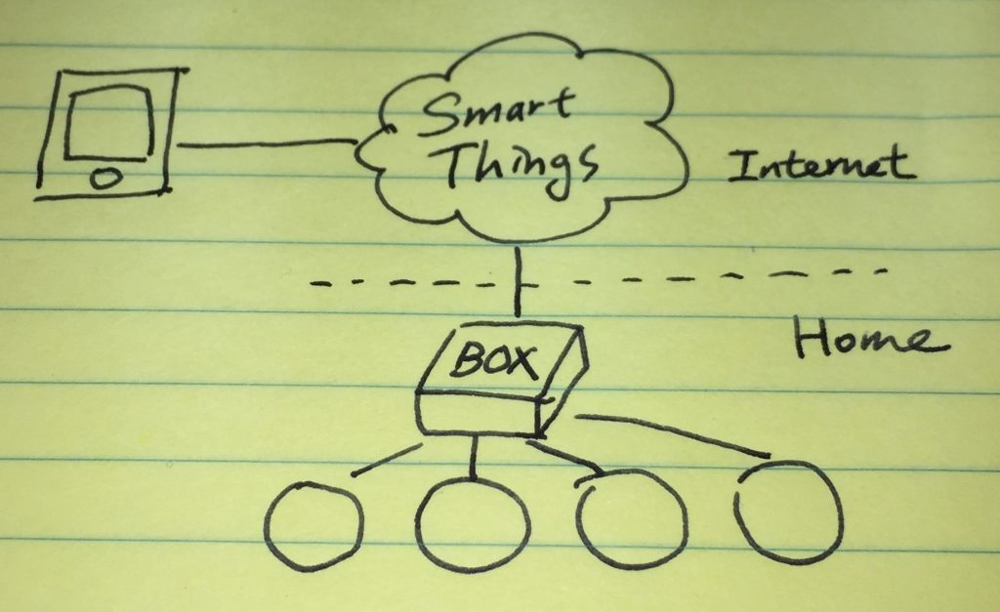
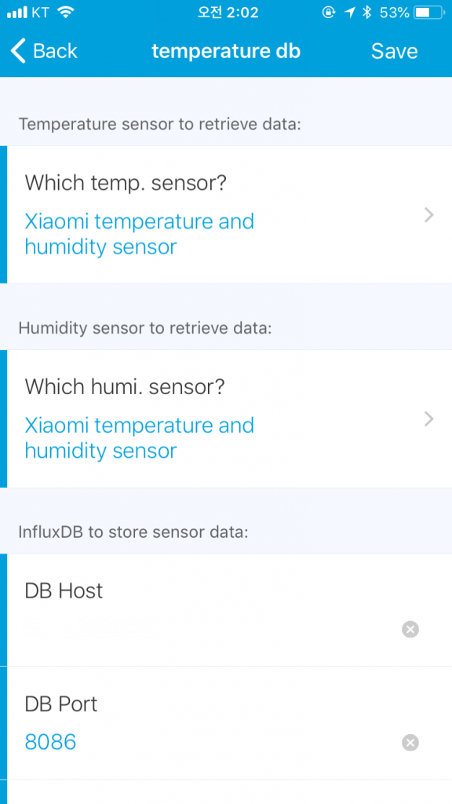
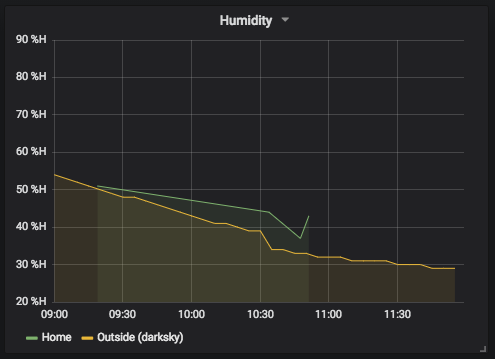
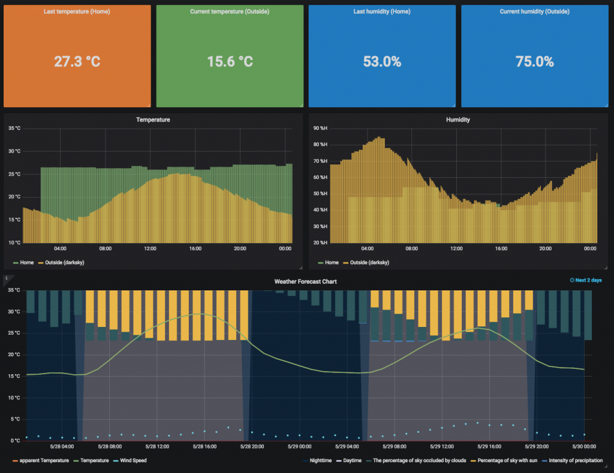

제목은 저렇지만 정확히는 Xiaomi 온습도 센서로 측정한 값을 Smart Things가 받고 그걸 InfluxDB에 저장해서 Grafana로 그린다가 되겠다. 해놓고 나니 이게 큰 의미가 있나 싶지만 준비해 놓은지는 꽤 되었으니 정리하는 차원에서. 성공한 기업가들이 내가 하고 싶은걸 하지 말고 고객이 원하는걸 하라고 했다는데 그 말이 맞다는 생각이 문득 든다.

원래 집안에 이런 저런 장비들을 엮어볼 생각으로 Smart Things를 구매해 놨었는데 zigbee나 zwave를 지원하는 센서 종류는 다 붙일 수 있는 걸로 알려져있다. 물론 공식적으로 지원하는 종류들이 있고 그 외에는 무언가 수를 써줘야만 가능하다. Smart Things는 내부적으로 Device Type Handler 라는걸 만들어줘야 하는데 주변 장치들과 주고받는 데이터의 형태를 정의한 내용 정도로 이해하고 있다. 공식적으로 지원하는 장치들은 그 DTH 라는게 제공되고 그렇지 않은 장치들은 만들어주던가 해야하는데 그 DTH가 정의되어 있지 않아도 Smart Things에서 장치 찾기를 하고 있는 상태에서 해당 장치를 페어링 하려고 시도하면 날라오는 zigbee 기반의 데이터는 볼 수 있다.

### Pairing

그런데 Smart Things에서 공식 지원하는 센서들이 꽤 비싸다. 상대적으로 Xiaomi에서 나오는 센서들은 개당 만원정도로 저렴. Xiaomi 센서들도 zigbee 기반이고 기본은 Xiaomi의 home gateway 뭐 이런 장비들과 붙여 쓰라고 나온거지만 능력자님들께서 Smart Things에 붙일 준비를 다 해놓으셨다. Xiaomi의 gateway는 그네들의 제품들을 붙여 쓰기엔 좋겠지만 다른 제품군은 지원하지 않고 뭔가 내가 제어를 해보려고 하면 전용앱으로만 가능한 듯 해서 일찌감치 gateway는 포기했고 Smart Things로 시도. [Github에 올라가 있는 DTH](https://github.com/bspranger/Xiaomi)만 가져다쓰면 페어링은 어렵지 않다.

### Smart Things의 구조에 따른 데이터 전달

Smart Things는 언뜻보면 요상한데 Box 형태라서 연결된 장치들에 대한 제어나 장치로부터의 데이터 수집은 box에서 이루어질 것 같지만 box 자체에 접근할 방법이나 api 같은게 없다. 그러니까 쉽게 raspberry pi 처럼 생각해서 내부에서 웹서버 같은게 하나 돌고 rest api를 제공하는게 쉬울 것 같은데 전혀 다르게 Smart Things에서 서비스하는 developer console을 통해서만 제어든 뭐든 가능하다. 그것도 application이라는 이름으로 만들어줘야 한다. **쓰다가 생각해보니 Amazon의 echo와 비슷하다.** Box는 거의 깡통이고 받은 데이터는 위로 올리고 (심지로 로그까지), 스마트폰 전용 app에 개인이나 다른 사람이 만들어서 공개한 app (app내 app)을 설치하고 나면 그 app에서의 조작에 따라 Smart Things를 통해 box로 내려오는 걸로 보인다. 단순히 보면 이런 모양.

### 데이터를 가져와야 하나 보내줘야 하나

문제는 DTH를 포함해 app을 만드는 것도 groovy 기반의 DSL을 사용해야만 한다는 사실이다. 이미 정의된 형태의 UI (tile)들이 있고 groovy로 개발할 때 다른 library 들을 불러오는데 제약이 있다. 또 file io 등 시스템 자원에 대한 접근이 불가능하다. 대부분 필요할 것 같은 기능들은 이미 준비되어 있으니 준비해둔 메소드나 클래스를 가져다 쓰라고는 되어있는데 완전 새로운 언어를 익히는 느낌이고 디버깅이 힘든데다가 로그까지 브라우저에서 별도의 메뉴로 진입해 확인해야 하니 불편하다. (이런 방식이 편한 사람이 있을지도 모르겠다) 센서로부터 수집된 데이터들은 (사실 이런 용도로 만들어진 제품이 아니라는 생각도 들지만) box나 Smart Things 내부에 쌓이는게 아니기 때문에 Smart Things 서비스에 접근해서 받아오거나 반대쪽으로 보내줘야만 한다. 구조상 두번째 방법이 가능성이 있어보여서 groovy로 app을 하나 만들었다. Smart Things 모바일 앱 내부에서 보면 아래 그림처럼 이벤트가 발생하는 센서 종류를 선택하고 데이터를 보낼 곳을 지정하게 했다. 그림에는 보이지는 않지만 InfluxDB에 저장할거라 db 이름과 username, password까지.

### 데이터를 저장했는데 주기가 문제

InfluxDB에 데이터가 저장되기 시작하면서 Grafana를 붙여 차트를 그려봤는데 문제가 생겼다. Xiaomi 센서가 주기적으로 측정하지 않고 주기를 조정할 방법이 없어서 차트가 볼품이 없다. 온도나 습도가 어느 정도 수준 이상의 변화가 있을 때만 측정한다고 알려져있는데 빠르면 몇 분만에 측정하는 경우도 있지만 3시간 정도 측정하지 않는 경우도 생기기 시작했다. 센서 사이즈가 작고 전지를 쓰는 형태라 전력소모 문제로 그렇게 되어있는 듯 한데 도저히 조절할 방법이 안보여서 비싸지만 Smart Things의 센서로 교체해볼까도 생각해봤으나 그것도 동일하다고 해서 패스. 그래서 측정 문제로 해결할게 아니라 원본 데이터를 크게 왜곡하지 않는 선에서 볼품 없는 차트를 그럴듯하게 만들어보기로 했다. 어느 정도로 볼품이 없는지는 아래 그림이면 설명이 될 것 같다.

녹색 라인이 측정된 값으로 그려진 차트인데 좌측과 우측이 비어있다. 이전 3시간을 그린 건데 4번 정도 측정한 것으로 보이고 없는 구간은 찍힌 점이 없어서 그렇다. 이런 상태를 개선하기 위해서 5분 단위로 데이터를 grouping 하고, 그럼 데이터가 없으니 평균값을 사용해봤는데 그래도 개선은 안되고 (5분 단위로 쪼개려고 한 것은 위 그림의 노란색 라인이 다른 곳에서 받아오는 외부 온습도 데이터인데 5분 단위로 받아와 저장하기 때문에 맞춰주려고 시도한 것) InfluxDB의 fill 기능을 사용해서 빈 값을 이전 값으로 채워줬다. 이것도 문제는 있는게 이전 값으로 채우기 때문에 보여지는 time range에서 이전 값이 없는 경우 (시간 구간 중 초기 값)에는 여전히 비어있게 된다. 다음 값으로 채우는 옵션도 있으면 좋겠다 싶다. (관련된 내용은 [InfluxDB 문서](https://docs.influxdata.com/influxdb/v1.3/query_language/data_exploration/#group-by-time-intervals-and-fill)에도 이슈로 달려있음) 추가로 차트 종류도 변경했더니 처음보다는 보기가 훨씬 나아졌음.

### Raspberry pi + sensor가 낫지 않나?

이런 생각을 잠깐 해봤는데 이렇게 하면 측정 주기 같은건 내 맘대로 할 수 있다. 복잡하게 Smart Things에서 app 같은거 안만들어도 되고. 그런데 이렇게 할 경우 여러개의 센서를 쓰려면, 예를 들어 방마다 센서를 두겠다 하면 raspberry pi도 센서 수만큼 필요해질 것 같다. 작게라도 보드를 만들어야 할 수도 있고, 전원 문제도 신경을 써야 한다. 역시 만들어진 걸 사서 쓰는게 그나마 편하다.
