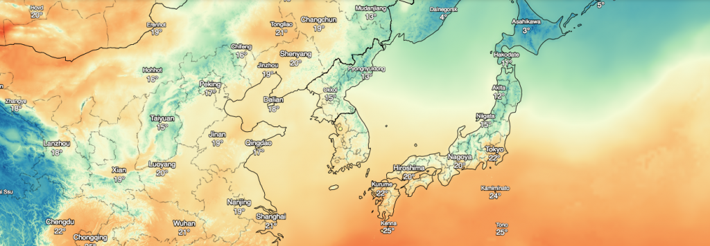

종종 집을 나서기 전에 날씨앱을 열어서 그 날의 날씨를 살펴보곤 한다. 그런데 그나마도 귀찮게 느껴질 때가 많다. 그냥 눈에 띄는 곳에 일기예보가 디스플레이 되고 있으면 훨씬(?) 편할 것 같기도 하고 집을 나서기 전에 Alexa든 뭐든 나에게 알려주면 좋을 것 같다는 생각을 가끔 하게 된다. 귀찮음을 해결할 방법이 몇가지 떠오르곤 했지만 그 것들을 실행하는 것도 귀찮아서 그냥 생각만 하고 있던 터였다.

지난번에 실내 온도와 습도를 차트로 그려보면서 생각해봤던 것들을 실행해볼까 했는데 최종 목표는 뭐뭐뭐가 있지만 일단은 외부의 온도와 습도, 강수량, 예보 정보에 대해서 다시 고민해봐야 했다. 당시에 실외 날씨와 예보 정보를 darksky라는 해외 서비스를 통해 받아오게 해두었었는데 정보를 얻어오는 방법은 간단했지만 해외 서비스이다보니 정확하지 않은 듯 보였다. 예보 정보도 좀 다르다는 느낌이었고 현재 날씨에 대한 것도 국내 기상청 정보와는 차이가 있었다. 역시 내부 상황은 내부자들이 잘 아는 것인가 싶어서 국내 서비스나 기상청 정보를 이용해야겠다는 생각에 이르게 되었다.

### 날씨 정보 서비스들

몇년 전 기상청 동네예보 서비스를 가지고 놀았을 때 뭔가 복잡하다는 인상을 받았기 때문에 기상청은 제일 뒤로 미뤄놨고 다른 서비스들이 있나 찾아봤더니 케이웨더, 웨더아이 뭐 이런데가 있는 것으로 보였다. 두 서비스들은 각각 일반 업체가 서비스하는 것 같았는데 케이웨더는 뭔가 내부 사정에 의해 날씨 정보 제공서비스를 접었다! (업체 게시판에는 탈퇴할거니 개인 정보를 삭제해달라는 글들이 가득하다. 이미 개인 정보들은 공공재 아니던가?!) 그리고 웨더아이는 유료. 내가 뭐 대단한 걸 할 게 아닌데 유료로 이용할 수는 없는 노릇. (날씨 정보 말고도 돈 나갈 곳은 많다) 그래서 어쩔 수 없이 다시 기상청을 기웃거리게 되었다.

[](http://13.125.231.217/wp-content/uploads/2018/06/darksky.png)
\<그림 출처 : darksky.net (이렇게 예쁜 지도와 API를 제공할 수는 없는 것일까?)\>

### 기상청 동네예보 서비스

기상청 동네예보 서비스(API)를 다시 천천히 살펴보니 철저히 '정보 제공자' 입장에서의 서비스라는 느낌이 강하게 들었다. 문서에서 사용되는 용어 자체도 언뜻 구분이 안된다. 예를 들어, '초단기실황조회'와 '초단기예보조회' 라는 이름을 보면 실황과 예보라는건 알겠는데 실황에 '초단기' 라는게 왜 붙어있는 건지(실황이면 그냥 현재인 것 아닌가?) 초단기라면 얼마나 초단기라는 건지 모르겠다. API를 호출하는 입장에서 보면 날씨정보를 원하는 시점에 대한 정보를 보내줘야 하는데 그 시점에 대한 정보가 사용자 입장에서는 애매하다. 오전 11시의 날씨 정보를 얻고 싶다면 11시에 해당 정보를 요청하면 안된다. 발표되는 시각이 있기 때문에 문서상에 기술된 시간 이후에 요청해야 한다. '초단기실황'의 경우 매시간 30분에 정보가 생성된다고 되어있기 때문에 11시의 날씨 실황을 얻고 싶다면 11시 30분 이후에 요청해야 한다는 얘기. 동네예보의 경우는 더 복잡하다. 3시간 단위로만 예보정보가 생성되는 것 같은데 요청은 해당 시간보다 10분 뒤에 요청해야 한다. (오전 2시 시점의 예보 정보는 2시 10분 이후에 요청 가능) 그리고 요청했을 때 제공되는 정보 항목 중 '아침 최저기온'과 '낮 최고기온' 이런 것들은 요청 시점에 따라 데이터 항목이 비어있을 수도 있다. 해보니 오전 일정 시간대에는 아침 최저기온 정보가 제공되고 낮 최고기온은 제공되지 않으면 일정 시간대 이후에는 반대로 낮 최고기온만 제공되는 것 같다. 문서에도 표로 기술되어 있기는 하지만 잘 이해가 안된다. 내 이해력의 문제인지도 모르겠다.

### 내가 원하는 것들

내가 원하는 것, 어쩌면 사용자들이 원하는 형태는 어느 시점이든 정보를 요청하면 그게 언제 측정된 것이든 가장 최근 정보를 보내주는게 아닐까 싶다. 기상청 내부에서는 몇시간 단위로 측정하든 분 단위로 측정해서 저장해놓든 그것은 내부에서 정책이나 상황에 맞게 처리할 일이다. 어쨌든 내가 원하는 방향으로 만들어진 라이브러리 같은게 혹시 있나 찾아봤더니 없는 것 같아서 만들어보기로 했고 일단 기본적으로 원하는 기능은 구현했다. 나도 복잡한 걸 다시 찾아보느라 시간을 또 쓰기는 귀찮은 일이니 여러가지 면에서 도움이 되리라 생각했다.

### Sources

[https://github.com/blurblah/kma](https://github.com/blurblah/kma)

### 구현하면서 문제가 된 내용들과 해결책

'초단기 실황'과 '동네예보' 공통으로 위에서 언급한 특정 시간에 대한 계산이 필요했다. 요청하려는 시점에서 가장 최근 공개된 요청 가능한 시간을 찾는 내용. 더 깔끔하게 하고 싶은 욕구도 있지만 그 욕구는 미래의 나에게 던지는 떡밥으로 남겨둠. 그 다음 동네예보는 명칭에서 풍기는 냄새처럼 원하는 동네에 대한 위치 정보를 요구한다. 그런데 위치 정보는 흔히 사용되는 위경도 정보가 아니다. 위경도를 펼쳐서 일정한 크기의 구역으로 쪼개놓고 그 구역의 x, y 좌표를 넘겨줘야 한다. 그리고 그 동네별 x, y 좌표값은 엑셀 문서로 제공하고 있다. (그냥 사용자가 위경도 정보를 넘기면 알아서 정보를 주면 안되나?) 아무튼 기상청 어느 곳에 위경도를 x, y 좌표로 변환하는 jsp 페이지가 있길래 페이지 소스를 보니 친절하게도 javascript로 달려있어서 python으로 옮겨버렸다.

### 좀 더 편하게

pypi에 패키지로 올려버렸다. 그러므로 pip로 패키지 설치가 가능하다. 이제 날씨 정보가 필요할 때 요청 가능한 시간, 좌표 확인 이런 걸 할 필요가 없다. 그냥 발급받은 서비스키만 넣어주고 호출만 하면 끝.

```
from kma import Weather

w = Weather('SERVICE_KEY')
curr = w.get_current()
forecast = w.get_forecast()
```
