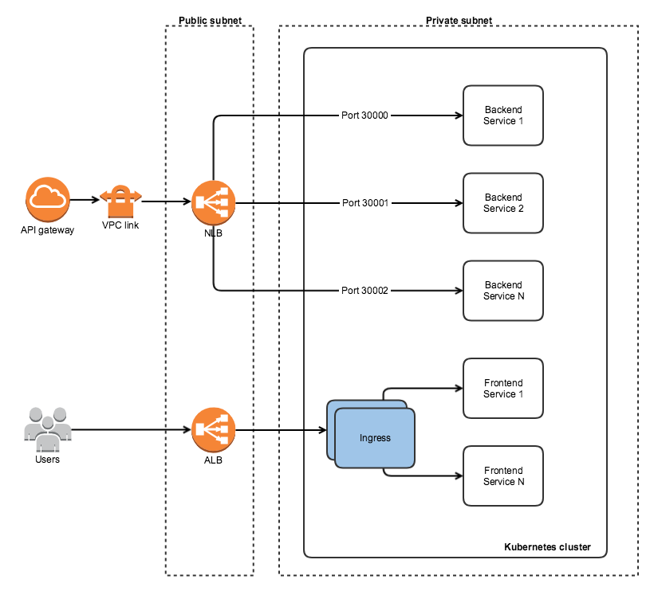

Docker container + AWS API gateway로 개발환경이 구성되어 있는 상태에서 Kubernetes 도입을 검토하게 되었다. Image build나 배포를 위해 Jenkins와 Ansible을 이용하고 있기는 했지만 원래의 구성이라면 배포나 배포 후의 작업들이 번거롭기도 하고 배포의 편의성이나 유연함과는 거리가 멀다고 느껴졌기 때문이다. 예를 들어 같은 기능을 갖는 backend service가 가용성을 위해 여러개 떠있다고 가정했을 때 update를 진행한다 생각하면 기존의 방식으로는 머리가 아플 것이 분명하다.

### AWS API gateway의 특징

Kubernetes를 도입하기 전에 AWS API gateway을 살펴보지 않을 수 없는게 API gateway와 service의 연결 측면에서 managed service 로서의 특징이 존재하기 때문이다. 어쩌면 기존에 사용하던 AWS API gateway를 계속 유지해야 할 것 같다는 생각이 강하게 들어서 이 모든게 복잡해진 것일지도 모르겠다. AWS API gateway는 하위 서비스들과의 연결 방식으로 Lambda, AWS service, HTTP, VPC link를 제공하고 있다. (Mock도 있지만 제외) 일반적인 API gateway처럼 HTTP 연결은 기본으로 되어야 하는 것인데 AWS API gateway는 최근에 나온 private endpoint를 통한 외부 인터넷으로부터의 연결 제한을 제외하고는 public으로 오픈되어 있기 때문에 HTTP를 통해 하위 서비스와 연결하려면 서비스 역시 public이어야 한다는 제약이 발생한다. 그렇다면 private subnet에 있는 서비스와는 연결이 불가능한 것일까? 이런 경우를 위해 VPC link 라는 것을 제공하고 있다. VPC link는 아래 그림처럼 특정 VPC내에 NLB를 두고 NLB가 VPC 내의 target group을 설정함으로써(public이든 private이든 관계없음) API gateway와의 연결을 만들 수 있도록 되어있다.

### External access to Kubernetes

기존에는 위의 그림처럼 container들이 올라가있는 instance 들을 target group으로 지정해서 연결했었는데 Kubernetes를 도입한다면 연결 대상이 Kubernetes 내의 service 들이 될 것이다. 그러므로 역시 Kubernetes에서 제공하는 외부 접근방식에 대해 따져보아야만 한다. Kubernetes에서 제공하는 외부 접근방식은 proxy를 제외하고 크게 세가지로 볼 수 있을 것이다.

**1\. NodePort**

가장 기본으로 서비스를 외부에 노출시킬 수 있는 방법으로 서비스가 올라간 host의 port를 통해 접근하는 방식이다. Cluster를 구성하는 모든 worker node에는 kube-proxy라는 컴포넌트가 존재하고 kube-proxy는 cluster 내의 서비스가 매핑된 port 정보 등을 공유하고 있기 때문에 어떤 node를 통하더라도 동일한 port로 동일한 서비스에 접근이 가능하다. Cluster를 구성하는 컴포넌트들을 제외하고 서비스의 연결 측면에서만 바라본다면 아래 그림처럼 묘사할 수 있을 것 같다.

**2\. LoadBalancer**

Cluster에 service를 배포할 때 LoadBalancer type을 지정하게 되면 LB까지 자동으로 구성된다. (kops 기준) 자동 구성되는 내용들을 살펴보면 이 방식도 서비스를 host의 특정 port와 매핑하고 해당 port 정보를 LB로 묶게 된다. LB는 기본으로 Classic ELB가 올라가게 되지만 AWS 환경이라면 option으로 NLB를 선택할 수도 있다. 다만 Classic ELB든 NLB든 배포할 경우 service당 하나의 LB가 할당된다.

이 부분에서 고민을 좀 해봐야 하는데, 아무리 물리적인 LB를 들이는 것보다 저렴하고 전반적으로 가격이 많이 내려갔다고 하더라도 서비스 당 LB를 하나씩 넣어야 하는 것은 문제가 될 수 있다고 본다. LB를 통한 외부와의 연결을 해야한다면 노출할 서비스의 갯수를 줄이던가 아예 다른 방식을 찾아야만 한다.

**3\. Ingress**

Ingress는 LoadBalancer type과는 다르게 여러 서비스를 하나의 컴포넌트로 외부에 노출시킬 수 있다. 설정을 통해 특정 도메인과 서비스를 연결하거나 path를 통해 서비스 분기가 가능하다. 그렇기 때문에 여러개의 서비스를 하나의 Ingress만으로 접근 가능하게 할 수 있고 부가적으로 cluster 외부에 ALB를 두고 외부로부터의 접근을 가능하게 할 수 있다.

Ingress에 NLB를 붙일 수 없게 되어있는데, NLB는 TCP로 특정 port를 가진 target을 대상으로 로드밸런싱을 하도록 되어있고, Ingress를 위해 사용되는 ALB는 HTTP를 통해 밸런싱하고 path 지정 등이 가능하기 때문에 사실 Ingress에는 ALB가 가장 적합하다고 볼 수 있겠다.

### AWS API gateway와 연결하려면 어떻게 해야하나?

AWS API gateway에서 제공되는 연결 방식 중 하나를 사용해야만 하므로 Lambda, HTTP, VPC link를 가지고 생각해야만 한다. 이 중 Lambda를 사용하게 되면 전체 서비스 구성상 하나의 컴포넌트를 더 통해야 하므로 지연의 문제가 추가로 발생할 수 있고 호출에 따른 비용문제도 고려해야 한다. HTTP로 묶게 될 경우 Kubernetes cluster 전체가 public으로 올라오던가 ALB만 외부에 노출시키는 방법을 생각해 볼 수 있을 것 같다. 하지만 이 경우 외부에서 접근 가능한 경로에 ALB가 추가되기 때문에 ACL 같은 걸 적용해서 API gateway를 통해서만 접근할 수 있도록 하면 좋은데 방법이 없어 보인다.

VPC link를 통한다면 전체 cluster를 private subnet에 넣어서 보다 안전하게 관리할 수 있을 것 같은데 위에서 기술한 것처럼 VPC link는 NLB만 지원하고, 서비스를 자동으로 배포할 경우 서비스 당 NLB가 하나씩 붙게 되기때문에 비용 측면에서 좋은 방법은 아닌 것 같다. 개인적으로는 API gateway를 꼭 사용해야만 한다면 AWS API gateway 대신 다른 API gateway를 사용해서 Kubernetes cluster 내부에 넣어버리는게 가장 좋은 방법이 될 거라고 생각하고 있다. 아래 그림처럼 되면 되지 않을까?

하지만 AWS API gateway를 꼭 사용해야만 한다면 (그래서 이런 고민들을 했던 거지만), 서비스 별로 NodePort를 지정하고 (지정하지 않으면 random으로 할당되니) 배포하되 미리 NLB를 생성해서 지정된 port 들을 가리키고 API gateway는 VPC link로 해당 NLB를 연결하는게 어떨까 싶다.

