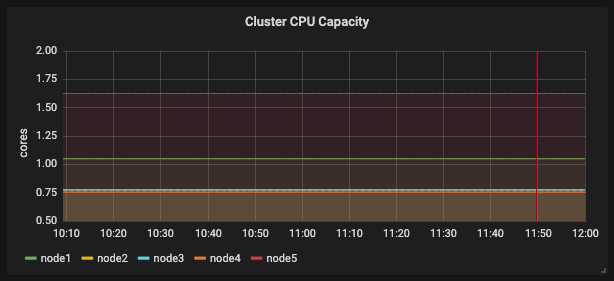
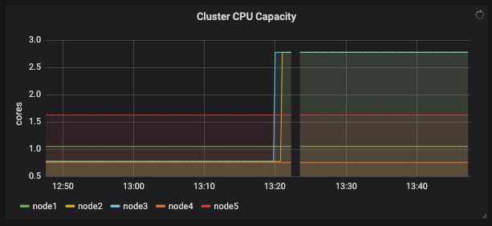

최근에 특정 node 한두개에 심한 부하가 걸리면서 kubelet을 포함한 대부분의 process들이 제대로 동작하지 못하고 그로 인해 cluster에서 해당 node 들이 빠지는 현상이 발생했다. Load average 값을 관찰했을 때 core 수 대비 10배 이상의 부하가 걸리면 node 들이 빠지고 있었는데 의심할만한 disk와 network i/o, 관련된 여러 지표를 모니터링 해보니 수치들이 같이 치솟기는 했으나 cpu 부하에 의한 결과로 벌어지는 문제였지 다른 요소들이 cpu 부하를 야기하는 것은 아니었다.

그래서 왜 cpu 부하가 높아지는지에 대해 꽤 오랜 시간을 들여서 살펴보니 보통 신규 pod가 배포될 때 많이 발생한다는 것을 알 수 있었다. 내 환경에서 문제가 발생하는 node들은 무거운 pod 들이 이미 배포되어 있는 상태였는데 (cassandra cluster가 node selector로 특정 node 2개가 선택되어 배포된 상태) 신규 pod 들이 안그래도 무거운 node 들에만 배포되면서 부하를 가중시키는 것으로 보였다.

Pod가 배포되면서 특정 node에 배포되는게 어느 정도로 치우치게 되는지 알아보기 위해 임시로 nginx를 20개 배포해보니 아래 그림처럼 한두개를 제외한 대부분이 부하가 높은 node에 배포된다.

### 이런 문제가 왜 발생하는 것일까?

Kubernetes에서 pod를 어디에 배치할 것인지를 담당하는 component는 scheduler이다. Scheduler는 pod에 지정된 속성들과 node의 상태를 확인하는데 1차적으로는 filtering을 해서 가능한 node list를 뽑고 2차로 node 마다 점수를 매겨서(scoring) 가장 높은 점수를 가진 node에 pod를 배포하라는 명령을 내리게 되어있다. Scoring 부분을 좀 더 자세히 살펴보면 기본으로는 [공식문서에 기술된 방법](https://v1-15.docs.kubernetes.io/docs/concepts/scheduling/kube-scheduler/#scoring)으로 점수를 매기게 된다. (SelectorSpreadPriority, InterPodAffinityPriority, LeastRequestedPriority 등. [Scheduler의 소스코드](https://github.com/kubernetes/kubernetes/blob/release-1.15/pkg/scheduler/algorithmprovider/defaults/defaults.go)를 살펴봐도 마찬가지)

Scoring 방식 각각을 살펴보고 종합해보면 대략적으로 이런 내용이 될 것 같다.

1. Node 전반에 리소스를 분산시킨다.
2. 같은 서비스를 참조하거나 replicaset 등으로 묶인 pod 들도 왠만하면 같은 node에 두지 않는다.
3. 리소스를 가능한 덜 쓰는 곳으로 배치한다.

Node에 문제가 생기더라도 배포된 서비스에 영향을 가능한 덜 주려고 하거나 특정 node에 부하를 가하지 않고 가능한 골고루 분산하려는 의도는 알겠는데 나와 같은 경우는 의도와 다른 방향으로 흘러가고 있었기 때문에 이런 scoring 방식이 제대로 동작하고 있는지 알아볼 필요가 있었다.

### Node 상태

Scoring priority에 영향을 줄만한 지표들을 뽑아본 상태는 아래 그림과 같다.

<figure>

<figcaption>

pod capacity

</figcaption>

</figure>

<figure>

<figcaption>

requested cpu

</figcaption>

</figure>

<figure>

<figcaption>

requested memory

</figcaption>

</figure>

<table class="wp-block-table has-fixed-layout is-style-stripes"><tbody><tr><td></td><td>pods</td><td>cpu (cores)</td><td>mem (GB)</td></tr><tr><td>node1</td><td>38</td><td>1.05</td><td>4.81</td></tr><tr><td>node2</td><td><strong><em>12</em></strong></td><td><strong><em>0.775</em></strong></td><td><strong><em>0.968</em></strong></td></tr><tr><td>node3</td><td><strong><em>25</em></strong></td><td><strong><em>0.775</em></strong></td><td><strong><em>5.42</em></strong></td></tr><tr><td>node4</td><td>35</td><td>0.755</td><td>3.2</td></tr><tr><td>node5</td><td>26</td><td>1.625</td><td>3.47</td></tr></tbody></table>

위에서 테이블로 정리한 것처럼 node2, node3 (cassandra cluster가 배포되어 있는 node로 실제 부하가 많이 발생해서 문제가 생기는 node임)의 pod 갯수가 다른 node에 비해 상대적으로 낮고 requested cpu의 값도 낮다.

Scoring이 priority에 따라 복합적으로 작동하겠지만 위의 값들만 봤을 때는 부하가 상대적으로 작거나 덜 사용하고 있는 node가 2, 3번으로 보인다. 하지만 실제 cpu / memory usage는 위의 수치들과 다르다. 모니터링을 해보면 cassandra가 실제로 많은 자원을 사용하고 있다. (memory는 보통 10GB 정도, cpu usage의 대부분)

Scoring priority를 보면 scheduler가 scoring을 할 때 resource와 관계된 수치는 node의 capacity, allocatable, requested인데 capacity와 allocatable은 거의 변하지 않는 수치로 (allocatable이 단어 자체의 의미와 달라서 오해의 여지가 있다) 사용자 입장에서 조정이 가능한 부분은 requested 값이 유일하며 이 값은 실제 사용량과는 다르다.

이게 scheduler가 특정 node에 신규 pod들을 배포하는 이유라는 생각이 들어서 왜 requested cpu, memory 값이 낮은지를 봤다. 당연하겠지만 실제로 가장 많은 resource를 차지하는 cassandra에 request resource 지정이 되어있지 않은 상태였고 새로 지정해보기로 했다. (2core, 8Gi)

Resource request 지정 후 node의 상태는 아래와 같다.

<figure>

<figcaption>

설정 후 requested cpu

</figcaption>

</figure>

<figure>

<figcaption>

설정 후 requested memory

</figcaption>

</figure>

<table class="wp-block-table has-fixed-layout is-style-stripes"><tbody><tr><td></td><td>pods</td><td>cpu (cores)</td><td>mem (GB)</td></tr><tr><td>node1</td><td>38</td><td>1.05</td><td>4.81</td></tr><tr><td>node2</td><td><strong><em>12</em></strong></td><td>0.775<strong><em>&nbsp;=&gt;&nbsp;2.775</em></strong></td><td>0.968<strong><em>&nbsp;=&gt;&nbsp;9.56</em></strong></td></tr><tr><td>node3</td><td><strong><em>25</em></strong></td><td>0.775<strong><em>&nbsp;=&gt;&nbsp;2.775</em></strong></td><td>5.42<strong><em>&nbsp;=&gt;&nbsp;14.01</em></strong></td></tr><tr><td>node4</td><td>35</td><td>0.755</td><td>3.2</td></tr><tr><td>node5</td><td>26</td><td>1.625</td><td>3.47</td></tr></tbody></table>

설정 후 처음 실험했던 것처럼 nginx를 20개 배포해보기로 했고 아래 그림처럼 실제 부하가 높은 node2, 3 이외에 다른 node 들에도 배치되는 것을 확인할 수 있었다.

### 결론

이 문제를 겪으면서 새로 알게 된 내용이나 필요하다고 생각되는 내용은 이렇다.

1. Kubernetes scheduler가 실제 node 부하를 반영해서 scheduling 하지는 않는다. (이런 기능이 필요할 것 같다. 또는 좋은 방법이 있을까?)
2. 배포될 pod 마다 resource request 값 지정하는게 사실 번거롭다. 어떻게 편하게 할 수는 없을까?
3. 모든 pod 마다 request 지정이 번거롭더라도 최소한 무거운 것들은 지정해주자!
